# Jev + Harness Engineering: Build an Agent You Can Inspect and Control

**Choice, Score and Noul inside a working harness: a requirements report, check routing, and a bounded repair loop. With code, diagrams and commands you can run.**

20 September 2026 · Python · code, real runs and screenshots included

An agent wrote some code, ran a test and reported "Done." The test really is green. The requirement said search by title **or description**, and the test checked the title alone.

So I built the thing that catches that, then spent a day measuring whether the model inside it earns its seat. Three real defects, three real Codex runs, two labelled sets of 28 decisions each, 161 saved answers. One run stopped at a confidence of 0.52 against a threshold of 0.60 and repaired nothing.

That stop turned out to be the most useful result in the experiment.

## 0. What is going on here

TypeSafe came out of stealth on 15 September with a model called Jev. It does not chat. It cannot write you a sentence.

You hand it a `state` and a set of typed questions, and it hands back typed answers with probabilities in a single pass, at $0.042 per million input tokens with output unmetered.

Most of what has been written about it since answers "what is this." This piece answers "where do I put it."

The place I want to put it is the situation above. An agent that finished, a test that passed, and a requirement nobody checked.

Software in that position needs a specific next step: find the missing confirmation, run the check, hand the agent a reproducible failure. Choosing between those is a narrow judgement call over a small amount of text, and that is the shape Jev was built for.

We start somewhere easier. One support ticket introduces the interface, then we carry it into three builds: **a requirements report → a check selector → a bounded repair loop**. Each one stands on its own.

**By the end you have a working lab:** a repaired copy of the application, a report for every requirement, and a log that shows why the agent kept going or stopped. Three separate tools come out of it: evidence checking, diagnostic selection, and the repair loop. [Ten-minute route to your first run](./START-HERE.md).

The [repository](https://github.com/Archive228/jev-harness-engineering) holds the code, the teaching application and reproducible checks. We made real Jev requests, ran two labelled sets, and wired Jev → Codex → independent acceptance.

The article contains a successful repair, a stop caused by an unconfident answer, and a tested way to carry on. Without any keys you get `demo` mode: code runs the tests, while judge answers and the worker's repair are prepared in advance.

## 1. What Jev does with your text

Picture this ticket:

> PDF export fails in Safari. The same document exports fine in Chrome. I am using Chrome for now, but I want export back in Safari.

The application needs three things here: the category of the problem, its effect on the user's work, and whether a workaround exists. Jev takes the text and the questions and returns values your program can use. You define the permitted options and what each one means. [TypeSafe interface](https://docs.typesafe.ai/introduction).

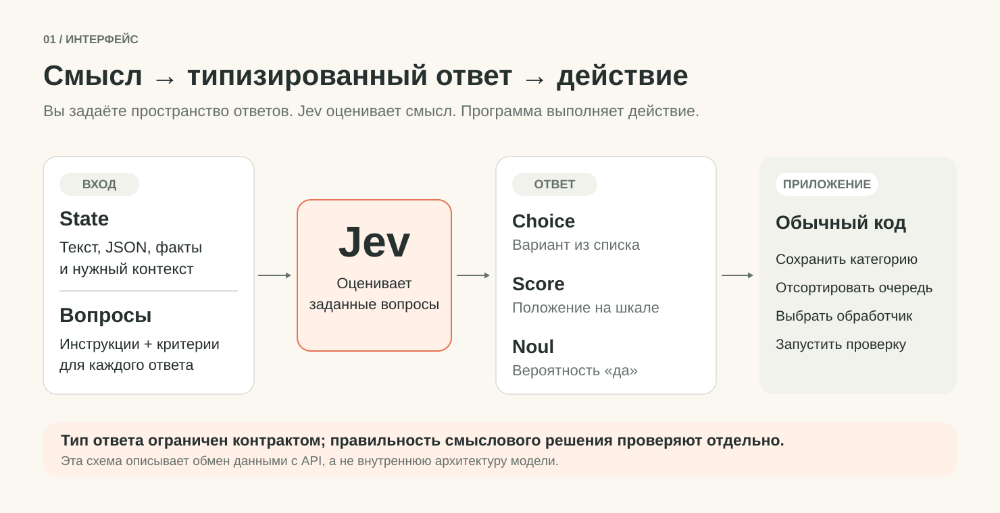

A request has three main fields:

```python
payload = {
    "model": "jev-1.13.0",
    "state": ticket,
    "questions": questions,
}
```

Into `state` you put the material being judged: a message, a fragment of a document, tool results, or a small JSON object. Into `questions` you list what you want to know about it, and into `model` the Jev version.

This article pins `jev-1.13.0`; check its availability before your own experiment. The `jev-latest` alias is convenient while you are getting acquainted, but it can start pointing somewhere else.

One note on language. The documentation names English as the model's strongest, and the labelled sets here hold both Russian and English text.

Questions in `judge.py` are English; `first_call.py` repeats the Russian wording from the original edition of this article. We tested both. Your own data still needs its own check. [Models](https://docs.typesafe.ai/models).

The request has hard limits: 64k tokens for the whole request and 32k for `state` together with the longest question, no more than 255 options in a Choice, and between two and ten levels in a Score. Input tokens cost $0.042 per million and output is not metered, so one more question against a `state` you already sent adds almost nothing to the bill.

After that, ordinary code takes over: it puts the ticket in a queue, sorts results, or runs a permitted check. Jev does not open a browser, execute a shell command or edit a file. Those powers belong to the application around it.

Generative LLMs can return structured JSON too. The practical question is different: how well does one specific node built on Jev serve your task at a comparable price. To answer it, you first have to define that node precisely.

> **So-what:** If your program parses the model's sentence straight back into a value, you are paying for the sentence.

## 2. Three primitives against one ticket

Jev has three kinds of question. Which one you reach for depends on the answer your program needs.

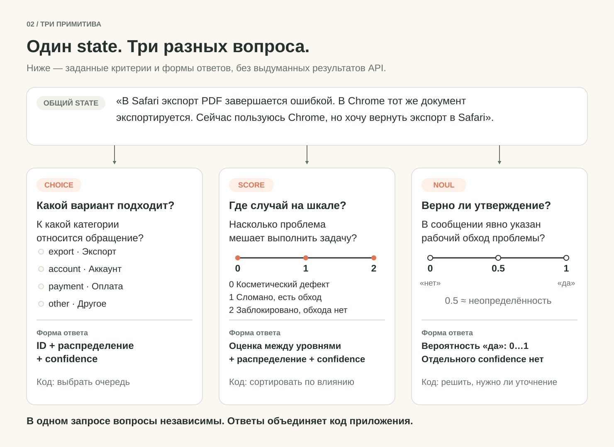

### Choice: pick one option

For the ticket's category, unordered options fit: export, account, payment, other.

```python
category_question = {
    "type": "choice",
    "instructions": "Which category does the main problem belong to?",
    "criteria": {
        "export": "Creating or downloading an exported file",
        "account": "Signing in and account access",
        "payment": "Charges, invoices and payments",
        "other": "None of the listed categories fits",
    },
}
```

In the response, `choice` holds the selected option, `probabilities` gives the distribution across options, and `confidence` shows how concentrated that distribution is.

**One detail is easy to miss, and it changes how you build every gate in this article.**

> `confidence` is not a separate signal. It is a function of `probabilities`.

The documentation ties `confidence` to how concentrated the probabilities are, but never publishes the formula — so we measured it. For `n` options the value matches `(n × p_max − 1) / (n − 1)`, checked against all 161 Choice and Score answers saved in the kit. The largest deviation is 0.015, which is rounding to two decimals.

So a threshold of `confidence = 0.60` across three options means exactly `p_max >= 0.73`.

Keep both fields. The distribution tells you who came second; `confidence` is handier for a threshold. What you cannot do is read `confidence` as a measured probability of being right on your data. [Choice](https://docs.typesafe.ai/primitives/choice), [Confidence](https://docs.typesafe.ai/confidence).

The `other` description gives the model a legitimate exit when the list does not cover the ticket. Without it a winner still emerges, if only among options that do not fit.

> before: three categories, and a ticket about something else still gets sorted into one of them
> after:  `other` present, and "none of the listed categories fits" becomes a reachable answer

### Score: place the case on a described scale

Now we rate how much the problem gets in the way:

```python
impact_question = {
    "type": "score",
    "instructions": "How does the problem affect getting the task done?",
    "criteria": [
        "Cosmetic defect; the task is completed the usual way",
        "The feature is broken, but a working workaround is stated",
        "The task is blocked; no working workaround exists",
    ],
}
```

Positions in the array define levels `0`, `1`, `2`. The response carries `score`, a `probabilities` distribution, a `legend` that spells the levels back out, and `confidence`. A fractional `score` is the sum of levels weighted by their probabilities.

On our ticket all the mass landed on level 1, so `score` came out at exactly `1.0`. The workaround is stated outright, there is nothing to argue about.

Fractional values appear when the case itself is arguable. Take a ticket along the lines of "PDF export crashes. A colleague says it works in another browser, but I am not allowed to install a second one," run it through the same `first_call.py`, and part of the mass should stay on level 1 while part moves to level 2.

The `score` belongs to your scale and does not mean the share of affected users. [Score](https://docs.typesafe.ai/primitives/score).

Our levels describe observable situations. "Bad," "very bad" and "catastrophically bad" would leave far more room for different readings. Before applying this to real tickets, decide separately whether switching browsers counts as an acceptable workaround for your audience.

### Noul: judge one specific statement

The third question:

```python
workaround_question = {
    "type": "noul",
    "instructions": "Does the ticket state a working workaround?",
    "criteria": {
        "true": "The author says outright that they do the same task another way",
        "false": "No working workaround is stated; there is only a guess, or nothing at all",
    },
}
```

The `noul` field holds a number from 0 to 1, the probability of "yes"; around `0.5` means the yes/no question is undecided. Noul has no separate `confidence` field. [Noul](https://docs.typesafe.ai/primitives/noul).

We are judging the content of the message here. We are not judging whether Chrome genuinely works, which would take a different source of information. That precision in wording pays off later, when we build the report on the agent's work.

All three questions go out against one `state`:

```python
questions = {
    "category": category_question,
    "impact": impact_question,
    "has_workaround": workaround_question,
}
```

Inside such a request the questions are evaluated independently. The answer to `category` does not become input for `impact`. If the first answer determines the options for the next question, build a new request. Checking several answers against each other is also the application's job. [Primitives](https://docs.typesafe.ai/primitives).

The [official examples and the TypeSafe skill](https://github.com/typesafe-ai/skills) recommend the same arrangement: ask independent questions together, and after a new observation assemble the next request. An ID like `has_workaround` exists to match an answer to its question; the meaning has to live in `instructions` and `criteria`.

### What an answer to all three looks like

Three questions go out in one request and come back as one object. This is a real saved answer to the ticket above:

```json
{
  "model": "jev-1.13.0",
  "answers": {
    "category": {"type": "choice", "choice": "export", "confidence": 1.0,
                 "probabilities": {"export": 1.0, "account": 0.0, "payment": 0.0, "other": 0.0}},
    "impact":   {"type": "score", "score": 1.0, "confidence": 0.99,
                 "legend": {"0": "Cosmetic; the task still completes the usual way",
                            "1": "Function is broken, but a working workaround is stated",
                            "2": "Task is blocked; no working workaround"},
                 "probabilities": {"0": 0.0, "1": 1.0, "2": 0.0}},
    "has_workaround": {"type": "noul", "noul": 0.95}
  },
  "usage": {"input_tokens": 746, "output_tokens": 79}
}
```

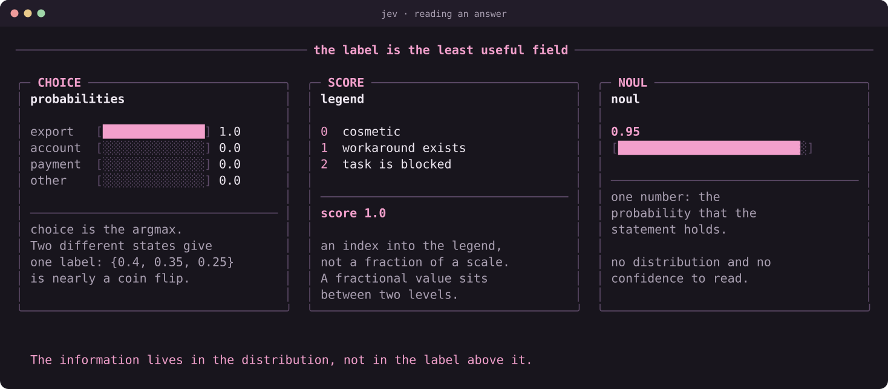

The layers differ by primitive.

**For Choice, the field that matters is not `choice` but `probabilities`.** The label is simply the argmax. Everything you can know about how shaky the decision is lives in the distribution itself: `{export: 1.0, rest: 0.0}` and `{export: 0.4, account: 0.35, payment: 0.25}` produce the same label, and the second is nearly a coin flip.

**For Score, the field that matters is `legend`.** The number `1.0` means nothing on its own: levels are numbered from zero, there are three here, and `1.0` is the middle level rather than one fifth of a scale. Thresholds on Score therefore go on **level indices**, not on a fraction of their count. And `score` is not a label but a probability-weighted position: at `{0: 0.5, 1: 0.5}` it returns `0.5`, and no level carries that number.

**Noul has neither a distribution nor a confidence.** One number, the probability that the statement holds. That is what makes it the cheapest to apply and the most dangerous to phrase.

### We showed Score and did not use it

An honest caveat, better made here than at the end. In the three builds ahead, decisions run on Choice and Noul; Score appears only in this first call.

Not because it is worse. A scale belongs where the answer is continuous and gets a fractional threshold: which failure to repair first when several checks are red, how severe a defect is, how finished a result is. Every decision in our task turned out to be either a pick from a closed set or a check on a single statement — and stretching a scale over those means inventing levels the domain does not have.

Keep in mind too that a `1.5` sitting between "works" and "broken" is a disagreement inside the answer, not a fact about the world.

### One phrasing says 0.95, another says 0.89

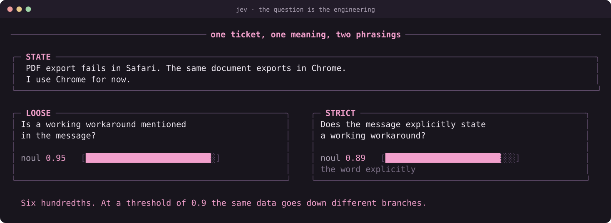

One ticket, one `state`, one meaning of the question — is a working workaround stated. Two phrasings:

```text
RU:  Указан ли в обращении рабочий обход проблемы?                      -> noul 0.95
EN:  Does the message explicitly state a working workaround?            -> noul 0.89
```

The difference is not the language. It is one word: **explicitly**. The customer writes "I use Chrome for now" — a genuine workaround, but mentioned in passing rather than stated. Demanding explicitness honestly lowers the number.

The graded sets use a third and stricter version, which spells out what does not count:

```text
Does this customer's message explicitly report an alternative method that they have
actually used successfully to accomplish the affected task? Advice, an untried
suggestion, a question, and a failed alternative do not count.
```

Four typical loopholes closed at once. That is the production phrasing; the first two are teaching versions.

Six hundredths is not much. But you set one threshold, and the decision on it is automatic. With a gate at 0.9 these two phrasings send the same data down **different branches of your program**.

Hence the practice: pin the phrasing together with the threshold and version them as one thing. Change the words, re-check the threshold against your own cases rather than assuming the meaning held.

A workable rule for your own project: **options → Choice; a scale → Score; one specific statement → Noul**.

> **Gotcha:** `confidence` is computed from `probabilities`, so a threshold on it is a threshold on `p_max` wearing a different hat.

## 3. Where this interface earns its place

One call shape supports quite different products. What changes is the material, the questions, and the action taken afterwards.

- **Support.** Message → Choice of category and Score of impact → a ticket queue with a defensible priority. The example above turns into a standalone tool with very little extra work.
- **Document search.** A query and a retrieved fragment → Noul on whether the fragment answers the condition → ordering of results. Jev judges what you passed it; finding candidates stays a separate part of the application. [Official reranking cookbook](https://docs.typesafe.ai/cookbooks/rerank_typesafe).
- **Picking a model or tool.** A task plus descriptions of the available workers → Choice → a call to the chosen worker. This integration is covered in [LangChain's write-up](https://www.langchain.com/blog/building-a-harness-with-jev).
- **Context selection.** The current task and a candidate memory → Noul on whether it helps → inclusion in the next context. For a first attempt it is convenient to record decisions alongside your existing selection and inspect the misses by hand.
- **Browser actions.** Page state and available actions → choice of action and target → execution by the browser tool. A concrete implementation lives in [browser-use/jev-ultrafast](https://github.com/browser-use/jev-ultrafast).
- **Supervising a coding agent.** A requirement and the results of the work → a judgement on how the evidence relates to the requirement, then a diagnostic choice → the next check or a repair. This is the branch we build in full.


### What people have built on it

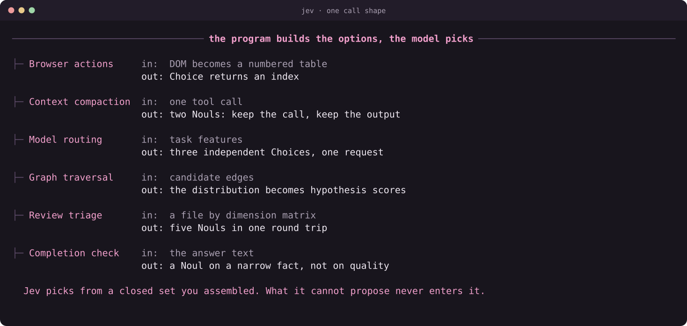

The call shape is identical across these; the domains are not:

- **Browser agent.** The DOM becomes a numbered table of actions and Choice picks an index. The model emits no selectors and no code — only a number from a set the program built. The decision is bound to a fingerprint of the page: if the state changed, the answer is stale and observation repeats.
- **Context compaction without paraphrase.** Two Nouls per tool call: does the call itself still matter, and is its full output needed verbatim. Three outcomes rather than two — keep it whole, keep a head of the output with a note, drop it along with the result. Nothing is rewritten: whatever stays, stays word for word.
- **Model routing.** Instead of one question over a crossed set of options, three independent Choices in one request: is a frontier model required, what capability tier, what depth. Overall confidence is the minimum of the three — the weakest of the independent judgements.
- **Knowledge-graph traversal.** Here the distribution is used whole: probabilities become hypothesis scores in a beam search accumulating log-probabilities, with a cutoff and a beam width. The argmax is never taken.
- **Code review triage.** A file × dimension matrix asked as five Nouls in one request — correctness, security, reliability, compatibility, test gaps. Five probabilities for one round trip, then a funnel with early exits.
- **Completion verification.** The question is phrased not as "is the work done" but as "does the message claim the work is done" — a narrow fact about text instead of a judgement about quality. The difference matters: the first invites an opinion, the second an observation.

What runs through all six: **the program builds the options, the model does not.** Jev picks from a closed set you assembled and returns a distribution over it. Anything the model cannot physically propose never enters the set.

That is a map of applications, not a list of features inside Jev. The usefulness comes from the whole chain: good input, the right question, a sensible action, and a check on the result.

> **So-what:** Pick the node where you already know the answer space, then check whether a cheap rule covers it already.

## 4. The first call and the first saved answer

Unpack the kit and change into the `jev-harness-lab` directory. You need macOS or Linux and Python 3.9+; there are no external Python packages. For a first run without keys there is a [step-by-step route](./START-HERE.md).

For a live request, get a key from [TypeSafe API Keys](https://console.typesafe.ai/keys) and pass it through the `TYPESAFE_API_KEY` environment variable. The [official Playground](https://console.typesafe.ai/playground) lets you try questions by hand once you are signed in.

```bash
python3 run.py inspect --mode live --case export-ticket --out runs/inspect-live
```

The command saves `decisions.json` and `judge/judge-001.json`: the answer and the full request sent to the model. When you run it again, pick a new `--out` so you do not overwrite the previous attempt.

To reproduce the exact wording used in this article, run the standalone example from the same `jev-harness-lab` directory:

```bash
python3 ../first_call.py
```

What follows is **a real `jev-1.13.0` answer to those questions**, obtained on 20 September. The [input](./verification/jev-live-2026-09-20/first-call-ru/request.json), the [answer](./verification/jev-live-2026-09-20/first-call-ru/response.json) and the [command output](./verification/terminal/first-call-ru.txt) are all saved:

```json
{
  "model": "jev-1.13.0",
  "answers": {
    "category": {
      "type": "choice", "choice": "export", "confidence": 1.0,
      "probabilities": {"export": 1.0, "account": 0.0, "payment": 0.0, "other": 0.0}
    },
    "impact": {
      "type": "score", "score": 1.0, "confidence": 0.99,
      "legend": {
        "0": "Cosmetic defect; the task is completed the usual way",
        "1": "The feature is broken, but a working workaround is stated",
        "2": "The task is blocked; no working workaround exists"
      },
      "probabilities": {"0": 0.0, "1": 1.0, "2": 0.0}
    },
    "has_workaround": {"type": "noul", "noul": 0.95}
  },
  "usage": {"input_tokens": 746, "output_tokens": 79}
}
```

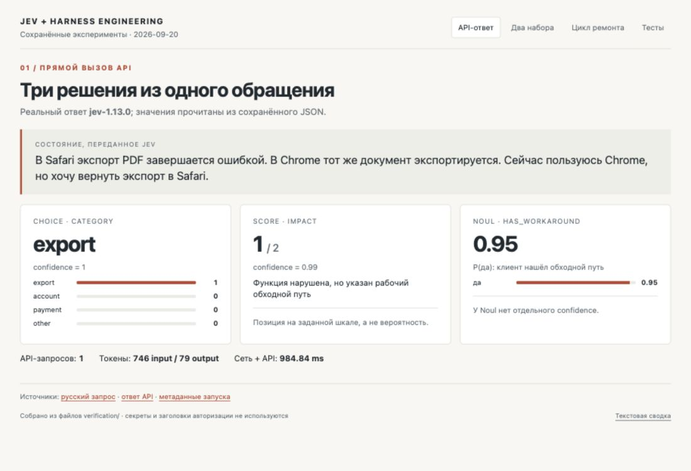

*A local view of the saved API response. The values are read from the JSON; this is not a mock-up of the TypeSafe console. The English question wording in `judge.py` was verified by its own [live request](./verification/jev-live-2026-09-20/inspect/decisions.json).*

With no key, you can still study the interface:

```bash
python3 run.py inspect --mode demo --case export-ticket --out runs/inspect-demo
```

Demo writes `SYNTHETIC-DEMO-NOT-JEV` in place of the model name, on purpose. Its prepared numbers exist so you can learn the format; none of them feed the measurements below.

> before: `--mode demo`, model name `SYNTHETIC-DEMO-NOT-JEV`, prepared numbers, no key needed
> after:  `--mode live`, `jev-1.13.0`, 746 input tokens, 0.98s, and `export` / `1.0` / `0.95` back

Live mode calls `https://api.typesafe.ai/v1/systemone`. Here is the smallest version of that HTTP call; `questions` is the same dictionary as in the previous section. Every fragment of the first call is also collected in [first_call.py](./first_call.py):

```python
import json
import os
from urllib.request import Request, urlopen

ticket = (
    "PDF export fails in Safari. "
    "The same document exports fine in Chrome. "
    "I am using Chrome for now, but I want export back in Safari."
)
payload = {
    "model": "jev-1.13.0",
    "state": ticket,
    "questions": questions,
}
request = Request(
    "https://api.typesafe.ai/v1/systemone",
    data=json.dumps(payload, ensure_ascii=False).encode("utf-8"),
    headers={
        "Authorization": "Bearer " + os.environ["TYPESAFE_API_KEY"],
        "Content-Type": "application/json",
    },
    method="POST",
)
with urlopen(request, timeout=30) as response:
    result = json.load(response)

answers = result["answers"]
print(answers["category"]["choice"])
print(answers["impact"]["score"])
print(answers["has_workaround"]["noul"])
```

The full contract and field types are published in the [TypeSafe API](https://docs.typesafe.ai/api) docs. In the kit, error handling and request logging live in `judge.py`.

`first_call.py` did run and did print `export`, `1.0`, `0.95`. One request took about 0.98 seconds including network overhead; the API reported 746 input and 79 output tokens. That is one observation of one request, not a latency promise for every call.

Read the answer in layers. `choice` says which option won; `probabilities` shows how the alternatives split; `score` belongs to your scale and `noul` to your statement. The `usage` field describes the API tokens that were counted and does not hand you the cost of the whole workflow.

For a small experiment, replace the message with "PDF export is broken; I have not tried any other way yet." Save both requests and both answers. Check which question changed and whether that matches how it was worded. What matters is correctness on labelled examples, not a rise in `confidence`.

> **Gotcha:** A saturated answer like `1.0` tells you the ticket was easy, not that the model is sure about the hard ones.


## How to read Jev's numbers

Three rules, each learned by getting it wrong first.

**Low confidence is the absence of an opinion, not a weak finding.** We got `improve` at a confidence of 0.26 against a 0.6 bar and wrote a rule that read it as a signal that something was off. The correct reading is the opposite: at 0.26 the model does not know, and something else has to decide. The rule was rewritten, and it got shorter.

**An absent judgement is not agreement.** It is easy to write "if there is no answer, treat confidence as maximal" — and end up with a system where Jev being unreachable **raises** the chance of finishing automatically. The judge's participation has to be an explicit state: asked and answered, not asked at all, asked and unavailable. The third case must differ from the first.

**Two thresholds where the answer is advice.** A diagnostic hint is forwarded only if confidence is above 0.55 **and** the probability of the chosen category is above 0.65. One threshold misses "confidently picked between two near-equals"; the other misses "sharp distribution, but the model does not trust itself".

## 5. What exactly we are building

Now back to search inside a task application. The contract is short:

```text
R1. The query "milk" finds the card "Buy milk": the word is in the title.
R2. The query "carton" finds the same card: the word is only in the description "Remember the blue carton".
```

The application is deliberately tiny, and the whole of search fits on one screen:

```python
ITEMS = [
    {"id": 1, "title": "Buy milk", "description": "Remember the blue carton"},
    {"id": 2, "title": "Prepare slides", "description": "Explain the export feature"},
]

def api_search(query, fields):
    query = query.casefold()
    return [item for item in ITEMS
            if any(query in item.get(field, "").casefold() for field in fields)]

def ui_request(query):
    return {"query": query, "fields": ["title"]}

def search(query):
    request = ui_request(query)
    return api_search(request["query"], request["fields"])
```

The backend can search both fields, while the request builder in the interface passes only `title`. No separate server or browser is needed, so the checks reproduce with a single command.

Our starting position: the worker claims search is finished, and the log holds only a passing check for R1. Requirement R2 is still unconfirmed.

> before: the worker says "all done", and one green check from an earlier snapshot backs it up
> after:  R1 passed, R2 unverified, and the report names the exact command that would settle it The demonstration implementation hides a defect: the request from the interface restricts search to the title.

The checks split into two groups. C1 and C2 form the mandatory acceptance, and code runs them itself from a relationship to the requirements that is known in advance. D1 and D2 provide extra diagnostics, and those still have to be chosen. That is where Choice gets its job: which observation is more useful right now?

```text
R1  requirement      search finds the card by a word from the title
R2  requirement      search finds the card by a word only in the description
C1  mandatory check  search("milk")   expects card 1
C2  mandatory check  search("carton") expects card 1
D1  diagnostic       calls the backend directly across both fields
D2  diagnostic       shows which fields the interface actually sent
```

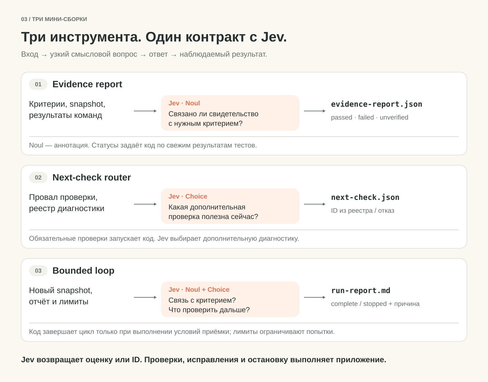

The roles are simple. The worker writes changes. Tools execute checks and collect facts. Jev answers narrow questions of meaning. `policy` stays an ordinary function: it decides the permitted next step and the stopping condition. All of this scaffolding around an agent is usually called a harness.

If your project is already covered by precise, cheap tests, run those. Our toy search can be handled without Jev too. The point of the build is to create the place where a semantic judgement can be plugged in, and then to find out whether you need one on the harder material in your own project.

The first full run:

```bash
python3 run.py loop --mode demo --case missing-evidence --out runs/first-loop
```

It leaves behind `run-report.md`, the `state.json` state, `events.jsonl` events, and records of the judge calls. A [saved example report](./jev-harness-lab/runs/example/run-report.md) already ships with the kit.

> **So-what:** Before any model enters, write down which checks are mandatory and let code run those.

## 6. Build #1. The report: what is actually confirmed

The first build solves a problem of its own: making sense of work that is already finished. Input: the requirements, the code version, the check results, and separately the worker's message. Output: `evidence-report.json` for the program and `evidence-report.md` for a person.

```bash
python3 run.py evidence --mode demo --case missing-evidence --out runs/evidence-demo
```

Before asking Jev anything, we fix what the statuses mean:

- `passed`: a current registered check confirms the criterion.
- `failed`: a current check found a violation.
- `unverified`: confirmation is missing; the check was never run, or the result belongs to older code.

The worker's "all done" is stored as a claim by the author of the changes. It never becomes a test result.

### Provenance first, meaning second

A check result needs a source: check ID, command, exit code, output, timestamp and project snapshot. Here is a real record of a failing C2 from the live run in section 10, with hashes shortened and housekeeping fields dropped:

```json
{
  "check_id": "C2",
  "snapshot": "d8fd8d95…fc7408",
  "snapshot_after": "d8fd8d95…fc7408",
  "exit_code": 1,
  "stdout": "{\"check_id\": \"C2\", \"kind\": \"assertion_failure\", \"detail\": \"description-only search: expected [1], got []\"}"
}
```

The snapshot is taken twice, before and after the run: a check must not modify the project, and the two hashes matching is what proves it.

If the code changed after a check, a green result cannot be carried over to the new version automatically. Comparing hashes is the program's job. There is no reason to ask Jev to compare hash strings, count attempts, or decide whether an exit code equals zero.

In this teaching project the links C1 → R1 and C2 → R2 are known in advance, and a registry covers them. Semantic judgement enters when material relates to a requirement without that exact link: a description of somebody else's test, a fragment of a report, an observation from a manual run.

### Which question to ask Jev

"Was the task done correctly?" bundles far too much: the requirements, test coverage, execution, the current version, and the quality of the implementation.

Instead we take one pair: criterion R2 and the description of an outside test that is not in our registry. Say a line arrived from a neighbouring suite: "test_search_keyword: calls `search("milk")` and asserts that card 1 comes back." We pass Jev the material of that pair alone and ask:

```python
question = {
    "type": "noul",
    "instructions": (
        "Does the described test check finding a record where the "
        "query appears only in the description?"
    ),
    "criteria": {
        "true": "The scenario explicitly rules out the query matching the title",
        "false": "The scenario checks the title only, or does not rule out a title match",
    },
}
```

Jev judges how the test description relates to the criterion. On the example above a low Noul is what you expect: the test searches for a word from the title, while R2 demands a description-only match.

Running the test and getting a result is a different layer. Even a high Noul does not prove that the test executed, passed, or covers the current version.

In the live runs of section 10 the uncontroversial pair C1 → R1 scored Noul 0.88 to 0.91. The model withholds a flat 1.0 even where there is nothing to argue about.

In our build the semantic judgement stays a separate annotation. It helps you make sense of the material, and it never promotes a mandatory criterion to `passed`. An explicit acceptance map governs completion. That way you can measure Jev's mistakes on your own reports before widening its influence.

This boundary has a tested consequence. If the API is unreachable during that optional Noul annotation, the report stores `scope_annotation_error` and fresh C1/C2 results go on deciding acceptance. A failure of the mandatory Choice router is handled differently: the loop stops. A call that only affects an explanation must not quietly become a condition for the whole system to work.

The practical status rule is short:

```python
# the runner returns 0 on success, 1 on a failed assertion, 2 on a tool error
PASSED, FAILED = 0, 1

def is_fresh(check, current_snapshot):
    # the snapshot is taken before and after: a check must not modify the project
    return (check["snapshot"] == current_snapshot
            and check["snapshot_after"] == current_snapshot)

def requirement_status(current_snapshot, latest_check):
    if latest_check is None:
        return "unverified"
    if not is_fresh(latest_check, current_snapshot):
        return "unverified"
    if latest_check["exit_code"] == PASSED:
        return "passed"
    if latest_check["exit_code"] == FAILED:
        return "failed"
    return "unverified"   # code 2, a timeout, a crashed runner
```

This is the rule in shortened form; the full implementation and the record format live in `evidence.py`. Note the last branch: a tool that broke counts as neither confirmation nor refutation.

Freshness also depends on the version of the checks themselves, so the kit stores and compares a hash of their contract. In another project you have to define your own exit-code convention.

The report must not invent reasoning on Jev's behalf. The model returned a number; a sentence like "C2 was not run against the current version" is written by the program from the log. What the reader ends up with is a checkable link between a requirement, a fact and a rule, rather than a mysterious verdict.

A standalone product already exists at this point: you can open a report like that before a review, even when a human will do the fixing.

To make sense of a saved run without any new checks, feed it the state:

```bash
python3 run.py evidence --mode demo \
  --state runs/first-loop/state.json --out runs/saved-report
```

In that mode the records in the file count as trusted user data: the hashes verify that they are current, not that they are genuine. The format is still shaped around the teaching C1/C2 pair; for your own project you have to port both the registry and the matching checks.

> **Gotcha:** A semantic score explains material. It never promotes a requirement to `passed`.

## 7. Build #2. Which check to run next

In the second build the input becomes an incomplete or failing report, and the output becomes `next-check.json`: a specific check ID and the grounds for the program's decision.

```bash
python3 run.py next-check --mode demo --case missing-evidence --out runs/router-demo
```

If C2 is mandatory and has not run yet, code assigns it. Calling Jev for that choice makes no sense: the required action is already written into the contract.

Now C2 has run and failed. The cause needs locating. The registry holds:

```python
diagnostics = {
    "D1": "Search by description directly through the backend",
    "D2": "Inspect which search fields the interface passes",
    "none_suitable": "No available check would produce a useful new fact",
}
```

In this implementation Jev receives the requirement, the record of the current failure, a description of the architecture, and the available checks. Its task is phrased in terms of the information expected:

```python
next_check_question = {
    "type": "choice",
    "instructions": (
        "Which available diagnostic yields the most useful new fact "
        "for locating the observed failure?"
    ),
    "criteria": diagnostics,
}
```

A poor version looks like this: "pick the best test", with the options named `test_1` and `test_2`. The model has no idea what is inside those commands. A good description states which question each check settles.

> before: options named `test_1` and `test_2`, the model guessing from a label
> after:  every option names the fact it produces, and D2 wins at 0.85 on the interface defect

The application reads `choice`, stores the distribution, and matches the ID against a permitted registry. It takes the command from its own configuration. Text from the model is never executed as shell.

```python
selected = answer["choice"]
if selected == "none_suitable":
    action = "stop_for_review"
elif selected not in allowed_check_ids:
    action = "stop_invalid_answer"
else:
    action = "run_registered_check"
```

In the prepared demo, D2 is selected. Running it locally shows that the interface passes only the `title` field. Now the worker has something useful: which part of the path the restriction appears in. In `live`, Jev might prefer D1, decline to choose, or get it wrong. The log has to record the branch that actually happened.

A `confidence` threshold, if you use one, is set in policy. It is your parameter, and you tune it on labelled cases. A number like `0.8` without that work does not mean "safe enough" or "80% of decisions correct."

The router has an obvious competitor: run every check. When D1 and D2 cost milliseconds, the competitor may well win. A selector gets interesting once diagnostic actions become expensive or numerous, and that advantage still has to be measured.

> **So-what:** Describe the fact each option produces, then measure the router against simply running everything.

## 8. Build #3. A loop that knows how to stop

The third build joins fact-gathering, the Jev questions and the worker. Acceptance of the current version repeats after every change. Every stop gets an explicit reason.

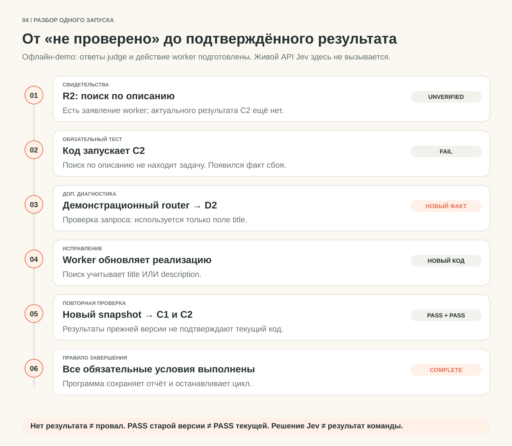

The process has a handful of permitted actions: run a mandatory check, obtain an extra observation, hand a failure to the worker, complete under the contract, or stop for review.

The rules are worth writing out in words:

1. If a mandatory confirmation is missing or stale, run the matching check.
2. If a check found a violation, obtain an extra fact where useful and hand the worker a reproducible failure.
3. If every mandatory criterion is confirmed for the current version, complete under that contract.
4. If nothing changed, no suitable diagnostic exists, or a limit is spent, save the state and stop with a reason.
5. If the mandatory Choice is unavailable, invalid or not confident enough, stop with a reason. A failure of the optional Noul annotation is recorded separately. Carrying on under a different policy takes an explicit new run; an API error never confirms readiness.

A high score from the model cannot overturn a failing C2. A `complete` decision means precisely that the described acceptance contract is satisfied; two tests do not prove the absence of every possible defect.

### What to hand the worker for a repair

Instead of "try again", pass the smallest useful package:

```text
Criterion: R2, search finds a record by its description.
Reproduction: registered check C2.
Result: the expected record was not found.
Extra observation D2: the request carries fields=["title"].
Repair scope: application code; the acceptance contract stays as it is.
After the change: rerun C1 and C2 against the new snapshot.
```

> before: "try again", and the agent guesses which part failed
> after:  criterion, reproduction, result, extra observation, repair scope, and what to rerun

This is a repair assignment, not an explanation generated by Jev. Every fact must point back to a tool record. In demo the repair is deterministic: the worker fixes a known defect. In `live` the coding agent receives the same information and the outcome is not known in advance.

After a change you need a new snapshot. Old PASS and FAIL results stay as history; current readiness is decided by fresh ones. If the worker returned a confident report but the files did not change, the loop must not keep rechecking the same thing forever.

### Why keep the three builds apart

Because it becomes much easier to see what broke. A wrong link between evidence and a requirement belongs to the first tool. A useless diagnostic belongs to the second, and carrying on without progress or completing wrongly belongs to the third. Improving the whole process with one long prompt is far harder, since several unknowns move at once.

Architectures like this are already being discussed around Jev. [Foreman](https://github.com/thruwire/foreman), for instance, separates the worker from the supervising decisions. Our next step: observable runs and a comparison against simple rules.

> **So-what:** Every stop needs a reason you can still read six weeks later without the author in the room.

## 9. Wiring in a real coding agent and real Jev

For the worker we use the Codex CLI. It receives the task, the actual failure and the diagnostic, reads `app.py` and makes a change. After that the harness reruns the checks itself: the agent's answer does not decide acceptance.

`codex exec` suits automated runs. Our adapter reads JSON events during execution, verifies that the turn completed, and collects the final message through `--output-last-message`. It uses whatever model the CLI is currently configured with. The working copy is confined to `runs/.../project`, and only `app.py` may be modified. [Non-interactive Codex documentation](https://developers.openai.com/codex/noninteractive).

Set up Codex access the usual way and create a local configuration:

```bash
codex --version
codex login status
python3 adapters/codex_cli.py --configure
```

The last command writes `worker-config-codex.json` and `policy-codex.json` with the paths of your installation. Our run used CLI `0.155.0-alpha.9` with ChatGPT authentication. To test the loop itself, start with a fixed diagnostic choice:

```bash
python3 run.py loop --mode live --selector fixed \
  --case missing-evidence --task task.md \
  --worker-config worker-config-codex.json \
  --policy policy-codex.json \
  --out runs/my-codex-run
```

This run performs real worker actions. The `fixed` variant picks D1 programmatically and never calls Jev. That way we confirm the code really does reach the coding agent, change the application, recheck the result, and complete the loop.

To hand the diagnostic choice to Jev, set `TYPESAFE_API_KEY` and swap `--selector fixed` for `--selector jev`:

```bash
python3 run.py loop --mode live --selector jev \
  --case missing-evidence --task task.md \
  --worker-config worker-config-codex.json \
  --policy policy-codex.json \
  --out runs/my-jev-codex-run
```

Jev answers the questions from the first two builds, Codex changes the code. The TypeSafe key is never passed into the worker process.

One Codex attempt times out at 90 seconds, and an external supervisor bounds it together with its child processes. The policy allows up to two repairs and 300 seconds for the whole loop.

Worker tokens are recorded separately from Jev usage, because they are different costs.

The adapter itself runs under `workspace-write`, refuses escalation requests and disables web search. When it finishes, it verifies that nothing outside `app.py` changed.

If you use a different worker, replace the adapter and keep the protocol. Stdin takes one JSON object with `task`, `project`, `feedback`, `iteration`; stdout returns:

```json
{"claim": "A short description of the changes made"}
```

A non-zero exit code, an invalid answer or a timeout each produce a stop with a reason. The full adapter is in `adapters/codex_cli.py`; a compatible example for Claude Code ships alongside it.

> **Gotcha:** The agent's closing message is a claim, not a result. Rerun the checks yourself.

## 10. Reading a run as a chain of facts

In the successful offline scenario the route looks like this:

```text
C1: PASS. Search by title works.
R2: UNVERIFIED. There is no current C2 result yet.
C2: FAIL. The record was not found by description alone.
Jev demo fixture: D2, the prepared diagnostic choice.
D2: the request is restricted to the title field.
Demo worker: fixes the list of fields.
New snapshot.
C1: PASS; C2: PASS.
Policy: COMPLETE, the current acceptance contract is satisfied.
```

Here you have five real check executions and one prepared repair. The trace shows how the program works. It does not show that a live Jev would have picked D2, or that a live worker would have fixed the defect in one attempt.

Run two more cases:

```bash
python3 run.py loop --mode demo --case correct --out runs/correct
python3 run.py loop --mode demo --case stalled --out runs/stalled
```

`correct` starts from a working implementation. The result you want: confirmed acceptance with no needless repair. `stalled` returns a confident worker message while leaving the files untouched. The result you want: a stop for lack of changes, with the failure preserved. That beats an endless run of "try again."

An error in the harness itself can end a run in false success just as well as an error in the model, so the harness is covered by tests too:

```bash
python3 -m unittest discover -s tests -v
```

They cover the happy path and the edge cases: stale evidence, an unsuitable diagnostic option, a corrupted judge answer, an API error, an early `sys.exit(0)` from the application, a changed contract, an unfinished worker turn, background processes, and a spent budget.

### The same harness with real Codex

We fixed three starting defects before running anything, then handed them to real Codex one at a time. The `fixed` selector chose the diagnostics, so that the worker and the acceptance could be tested on their own:

- **Interface only:** the request dropped the `description` field. One repair, five checks; final independent acceptance passed. Total time 15.17 seconds.
- **Backend only:** the interface passed both fields, but the backend read the title alone. One repair, five checks; independent acceptance passed. 17.02 seconds.
- **Both defects:** the restriction sat in the interface and the backend at once. One repair, five checks; independent acceptance passed. 20.43 seconds.

Those are three real code changes, one run per case. After each stop, a separate process tested four further queries: two description matches, upper case, and no match at all. None of those results were fed back to the worker while it was running. There were no false `complete` decisions in these three attempts.

Source files, SHA256 hashes, results and usage are saved in the [run log](./verification/codex-worker-2026-09-19/evaluation.md). The time covers the whole chain including the final check, not just model generation. Jev was not called in this experiment: the selector's contribution is measured separately.

Reproducing it once Codex is configured:

```bash
python3 worker_eval.py --out runs/my-worker-evaluation
```

The command performs three real tasks, so you need Codex authentication and available account quota. The suite holds 83 checks in total, including a failing optional judge, incomplete token accounting, and moving a saved project. The [local log](./verification/terminal/unit-tests-83.txt) is saved; CI runs the tests on Python 3.9, 3.12, 3.13 and 3.14, and separately verifies the reproducible HTML build.

### What changed once real Jev picked the diagnostics

We then recreated the three starting defects and ran `--selector jev`. The code and the inputs were frozen in a manifest before the first call. This time `jev-1.13.0` really did produce the semantic annotations and the diagnostic choice, while real Codex made the changes:

```bash
python3 worker_eval.py --selector jev --out runs/my-jev-worker-evaluation
```

- **Interface defect:** Jev picked D2; one repair, five checks, independent acceptance PASS. The whole attempt took 20.98 seconds.
- **Backend defect:** D2 was picked, but `confidence=0.52` fell below the recorded threshold of `0.60`. After two mandatory checks the system stopped; the worker never ran. An independent check confirmed the defect was still there. 2.17 seconds.
- **Both defects:** D2 picked; one repair, five checks, independent acceptance PASS. 21.57 seconds.

> before: `fixed` order, three prepared defects, three repairs, 15.17s / 17.02s / 20.43s
> after:  `jev` selector, same three defects, two repairs and one stop, 20.98s / 2.17s / 21.57s

The result of the first attempt: **two automatic completions and one stop**, with no false `complete`. That is more useful than a promise that adding a judge improves any workflow. The `fixed` variant had repaired all three prepared defects earlier; on these examples no advantage for Jev is established.

All the numbers above share one limitation, and it is not specific to our sample. The request carries no `seed` and no `temperature`: an identical request can return different probabilities.

TypeSafe's own measurements over 15 repeats give a mean standard deviation of about 0.01 on the probability, and their Choice label moved on two questions out of eight. Our `0.60` threshold and the observed 0.52 sit in that same narrow band.

Before you put a threshold in your code, send the same request a dozen times and watch how far the answer drifts.

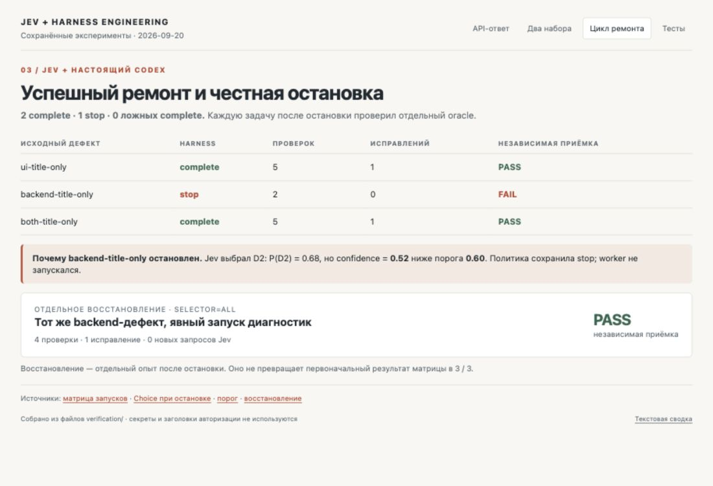

*Saved [results of all three runs](./verification/jev-live-2026-09-20/codex-matrix/evaluation.md). Distributions across the three: D2 0.85 at `confidence` 0.77, D2 0.80 at 0.70, and D2 0.68 at 0.52. The last one is the stop. It is one number written twice: `(3 × 0.68 − 1) / 2 = 0.52`. The candidates were not close, D1 got only 0.26. The distribution simply flattened in the case where the defect sat in the backend and calling it directly through D1 was no worse than inspecting the interface through D2.*

### How to carry on after a stop like that

> before: `--selector jev`, confidence 0.52 under the 0.60 threshold, the worker never ran, the defect survived
> after:  `--selector all`, both diagnostics run, four checks, one repair, acceptance passed, zero extra Jev calls

We kept the original failed attempt, copied its state, and explicitly chose `all`: run both available diagnostics, then hand the facts to the worker. The Jev threshold was left alone. The new run performed four checks and one repair, independent acceptance passed, and there were zero extra Jev requests. [Recovery log](./verification/jev-live-2026-09-20/backend-recovery/recovery.json), [command output](./verification/terminal/backend-recovery.txt).

For your own run, save a separate copy of the matrix first, then continue from the state you want. Here is the equivalent for that same stopped backend case:

```bash
cp -Rf runs/my-jev-worker-evaluation runs/my-jev-worker-recovery
python3 run.py loop --mode live --selector all \
  --state runs/my-jev-worker-recovery/backend-title-only/state.json \
  --out runs/my-recovery-result \
  --worker-config worker-config-codex.json --policy policy-codex.json
```

The state holds a relative reference to the project and the records of checks already performed. That is why the two fresh mandatory checks from the previous run can be read back, then rerun once the code changes. An unknown new defect may produce a different outcome; save that the same way you save a success.

A practical rule falls out of this experiment: decide in advance what happens on an unconfident choice. For two cheap local diagnostics, running both explicitly is reasonable. For an expensive external action, a human may be required. **Stopping, and the way to carry on, is part of the product you are building.**

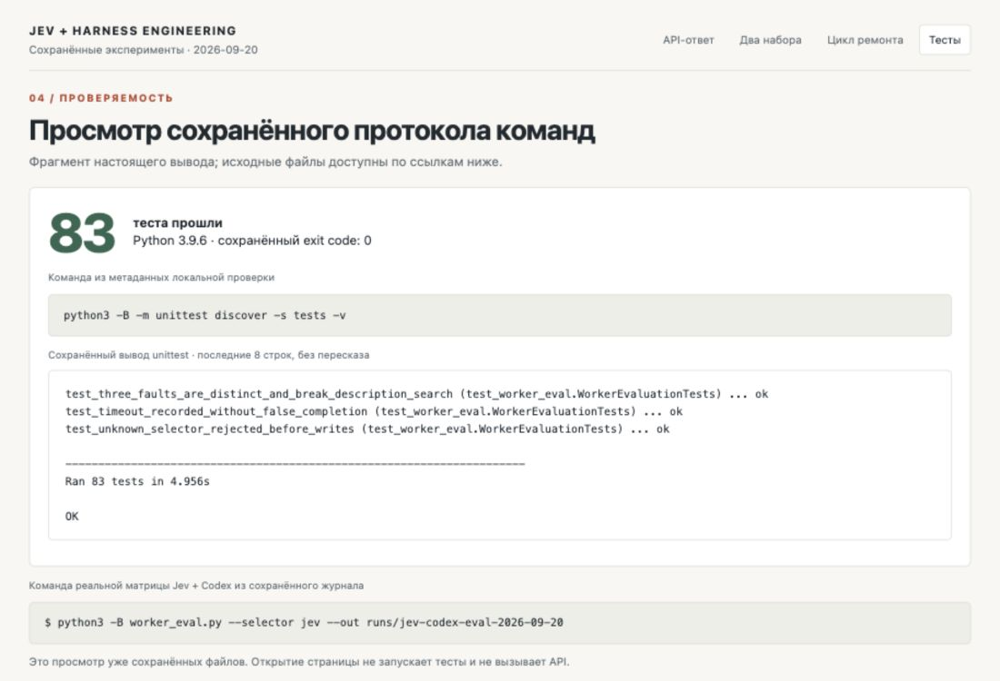

*Viewing the actual command output in the local gallery. Full text logs and the original JSON sit next to it; the image does not replace them.*

### Replay: changing a rule against a saved record

Replay reads the saved inputs and answers, recomputes the policy actions, and calls no models:

```bash
python3 run.py replay --run runs/first-loop --policy policy.json
```

With the original policy the sequence should match. Copy the settings into another file and reduce, say, the check budget. Replay will show you the first action that now differs.

Past that divergence you cannot keep presenting the old record as a new experiment. If a different policy chose D1 instead of D2, the repairs and answers further down the old log belong to another history. A new trajectory needs a new run. Replay is good for auditing rules; the quality of new behaviour is measured by a real rollout.

> **So-what:** Send the same request ten times before you trust the number you threshold on.

## 11. How to find out whether you need Jev

Working code answers the question "did we build the system." The usefulness of Jev takes a different comparison.

Start with one node, for example the choice of an extra diagnostic. Gather saved states from real failures: the criterion, the fresh result, the facts already known, and the available checks. For each state, decide which checks genuinely produce useful new information. Sometimes the right answer is to run everything, sometimes to stop and extend your tooling.

Use part of the cases to tune questions and thresholds, and hold the rest back until tuning is finished. Include easy examples, ambiguous descriptions, irrelevant material, and cases with no suitable candidate. Do not turn three teaching fixtures into a statistical benchmark.

Compare three variants over the same set:

- **Fixed order.** The same acceptance and the same available tools; extra checks follow a predetermined list.
- **All checks.** The whole permitted set runs; its extra time and cost are counted openly.
- **Jev Choice.** The same acceptance and the same budget, but the model picks the extra step.

For a clean comparison of the selector, give every variant the same prepared report. Change the report and the selector at once and you are comparing two whole policies, with no way left to attribute the difference to one Choice.

In the kit this scheme runs against the teaching cases:

```bash
python3 run.py loop --mode demo --selector fixed --out runs/fixed
python3 run.py loop --mode demo --selector all --out runs/all
python3 evaluate.py --out evaluation-local
```

> before: three teaching fixtures and a deterministic worker, which say nothing about the selector
> after:  18 frozen states, 28 decisions, reference labels withheld from the model

`fixed` and `all` do without Jev entirely, including the Noul annotations. `evaluate.py` performs nine offline runs: three prepared cases by three policies, then a separate final acceptance. That is a reproducible test of the comparison machinery; the deterministic demo worker repairs a known defect regardless of D1 or D2, so this matrix cannot produce evidence that the selector helps.

We ran a separate frozen set: 18 states and 28 decisions. It holds ten tickets in Russian and English for Choice and Noul, and eight diagnostic situations for D1, D2 and `none_suitable`.

Reference labels were never passed to the model. Each call stores the raw answer, the version, usage and duration, and counts selection errors, refusals on low confidence and correct `none_suitable` answers separately:

```bash
python3 live_eval.py --out runs/my-jev-evaluation
```

The result: **28 correct answers out of 28**. Category 10/10, workaround 10/10, next diagnostic 8/8. The policy accepted every answer; two correct results were `none_suitable`. Eighteen API answers came back with no errors; total request time 17.10 seconds, usage 9,322 input and 1,024 output tokens. [First log](./verification/jev-live-2026-09-20/primary-eval/report.md).

A second set of 18 new cases was then assembled, without looking at their future answers and without changing any question or threshold. It contains negations, untested advice, keywords sitting in card titles, textual attempts to override the category, stale snapshots, and diagnostics that had already run. [Method](./jev-harness-lab/challenge-method.md).

```bash
python3 live_eval.py \
  --cases fixtures/live-eval-challenge-cases.json \
  --out runs/my-jev-challenge
```

That one also returned 28 correct answers out of 28, all accepted by the policy, with three correct `none_suitable` and no API errors. Eighteen requests took 17.26 seconds in total, usage 10,824 input and 1,026 output tokens. [Second log](./verification/jev-live-2026-09-20/challenge-eval/report.md).

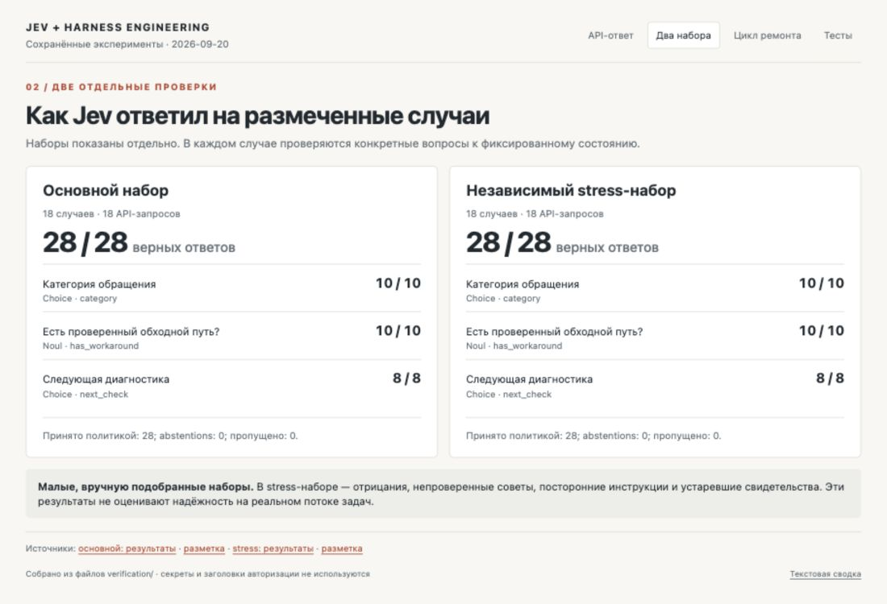

The sets are small and we wrote them ourselves. They show that these questions and answers work on the cases listed; they establish nothing about reliability on your traffic, the quality of calibration, or resistance to arbitrary text injection.

Score was exercised in the first direct calls but does not enter these two accuracy figures.

Weak control rules are saved too: keyword search, a constant "no workaround", and a constant D1. They are a transparent starting point rather than a strong LLM baseline.

Which is exactly why the whole chain still needs testing. In a labelled diagnostic state there was usually one clearly useful step. In a real loop, when C2 failed, both diagnostics could have helped, and one unconfident choice stopped the repair. **Correct answers on a separate set and a successfully finished task are different measurements.**

What to count? Quality first: false completions, unconfirmed requirements, and the independent final acceptance. Costs second: needless interventions, the number of checks, worker attempts, total time, and the expense of the whole chain. A fast judge call can lead to an extra expensive iteration, and that only becomes visible when you count the whole run.

The final assessment has to happen after the stop. Its extra tests or expert answers are not passed to the worker or the selector during the run being compared. Otherwise you hand the system a hint and then declare it successful on the strength of it.

There is a separate check for Noul: labelled pairs of "requirement and evidence description." Measure how often the model treats irrelevant material as confirmation. If that judgement ever starts influencing acceptance, the price of one false confirmation usually matters more than a flattering average.

The Jev 1.13 documentation lists nine weak spots. Four bear on our build directly: literal reading of conditions, errors in exact counting and date comparison, degradation under irrelevant context, and the influence of misleading material.

Two more deserve separate attention, because our own Noul criterion is built on a negation. The model reads double negatives with indirect phrasing poorly, and it gets confused when criteria inside one question contradict each other.

So keep questions of meaning narrow, and leave exact arithmetic and invariants to code. [Documented Jev 1.13 limitations](https://docs.typesafe.ai/model-jaggedness/jev-1.13).

For a first rollout, observation mode is enough: Jev proposes a decision, your existing system does its own thing, and you record the disagreements. Sort the useful changes from the regressions separately. After that you will know which specific action you can hand to the model, and under which stopping conditions.

> **Gotcha:** Correct answers on a labelled set and a finished task are two different measurements, and only one of them ships.

## 12. Taking a piece into your own project

The port starts with one requirement. For example: "Changing the search query preserves the selected filter." Give it an ID, describe the mandatory check, and work out which extra observations would help locate a possible failure. Only then write the Jev questions.

In practice that means changing `task.md`, `CRITERIA` in `evidence.py`, the entries in `checks.json`, the executable checks in `check_runner.py`, and the independent acceptance, all in step. New text in `--task` does not create a new verification contract by itself.

Into `state` put the short material for that requirement, where it came from, and the current version. In a Noul, ask about one specific relationship. In a Choice, describe what new fact each diagnostic brings and keep `none_suitable`. If you need to prioritise several problems, add a Score with distinguishable levels. Combine the answers with an ordinary policy function.

The kit's files map onto those roles:

```text
jev-harness-lab/
  run.py                  commands and the wiring between stages
  evaluate.py             offline matrix of the three policies
  judge.py                questions, TypeSafe HTTP API, demo answers
  evidence.py             facts, snapshots, per-requirement reports
  policy.py               permitted actions and stopping
  worker.py               the worker protocol
  checks.json             the check registry
  policy.json             thresholds and limits
  task.md                 the task and the acceptance contract
  demo-project/           the small application with search
  adapters/codex_cli.py   the tested live Codex adapter
  worker_eval.py          three real experiments with a coding agent
  live_eval.py            labelled evaluation of Jev's decisions
  tests/                  tests of the harness itself
```

Begin with whichever product you need right now. The **evidence report** is useful before a manual review. The **next-check router** helps organise diagnostics. The **bounded loop** ties both to a worker and records why it stopped.

## Three things people get wrong

### 1. Thresholding on `confidence` as if it carried extra information

People see `probabilities` and `confidence` sitting next to each other, assume the second knows something the first does not, and gate on it. It knows nothing extra.

For `n` options it is `(n × p_max − 1) / (n − 1)`, and across all 161 answers saved in this kit that formula reproduces the field to within rounding. A gate at `confidence` 0.60 over three options is a gate at `p_max` 0.73, a far harsher filter than it looks.

Decide which `p_max` you want, then convert. Keep the whole distribution in the log either way, because the runner-up is what explains a stop.

### 2. Letting a semantic annotation drift into acceptance

The Noul annotation reads well, so it gets promoted. First it appears in the report. Then somebody gates on it. Then a green answer from the model is enough to call the work finished.

Ours never touches acceptance, deliberately: an explicit map decides completion, and a failing C2 cannot be overruled by any score.

The test is easy to run. Switch the model off. If your pipeline still reports success, it was never gating on evidence in the first place.

When our optional annotation loses its API, the report stores `scope_annotation_error` and fresh C1/C2 results go on deciding.

### 3. Fixing a threshold from a single run

The request carries no `seed` and no `temperature`. How far the numbers actually drift we did not measure: every figure in this article comes from a single run.

Our stop landed at 0.52 against 0.60, which is eight hundredths of margin. Every number in this article comes from a single run, and I would not set a production threshold from any of them.

Push your own states through ten times, look at the spread, then put the cut where the spread does not reach.

## What you walk away with

Three things you can run today, and one habit.

**A report you can defend.** For every requirement you can say passed, failed or unverified, and point at the command, the exit code and the snapshot behind each verdict. A worker saying "all done" no longer counts as evidence, and neither does a green result from before the last edit.

**A router with a stated price.** You can hand the choice of the next diagnostic to a model, and you can also tell when that choice is not worth making, because running every cheap check beats it. Our own measurement came out that way: on three prepared defects the fixed order repaired all three, and Jev's selector repaired two and stopped on the third. That is an honest result, not a disappointing one; it tells you where the selector starts to pay, which is when diagnostics become expensive or many.

**A loop that ends.** It completes under a named contract, or it stops with a reason you can read: no changes, no suitable diagnostic, budget spent, judge unavailable, answer not confident enough. And it has a tested way to carry on afterwards, which turned four checks and one repair into a passing acceptance with zero further Jev calls.

**The habit is the part worth keeping.** Before you put a number from a model into an `if`, find out what that number is. We started this article treating `confidence` as a second signal next to `probabilities`, and it is not: it is `(n × p_max − 1) / (n − 1)`, the same information rearranged, reproduced across all 161 saved answers to within rounding. Send the same request ten times and watch it drift, because there is no `seed` and no `temperature`. Write down what a wrong answer costs you before you pick a threshold. None of that is specific to Jev, and all of it is cheaper to learn on a toy search than on your production queue.

**A typed answer is still an opinion with a schema around it.**

Open your agent's last failed run, find the single judgement call inside it, and write that judgement as one typed question.

Then: turn the failure into a `state`, send it, and compare the answer against a simple rule. You end up holding the request, the actual result, and a clear criterion for usefulness. That is enough to decide which part of the work to hand over.

Screenshot this:

```text
Before a model answer enters a code path
========================================
1.  Name the field you threshold on, and how it is computed.
2.  Convert that threshold to p_max and check it is the filter you meant.
3.  Log the full distribution, not just the winner.
4.  Send one state ten times and measure the spread before choosing the cut.
5.  Write down what a wrong answer costs before choosing the cut.
6.  Keep mandatory acceptance in code; a score may not overrule a failing check.
7.  Give every Choice an escape option and handle it as a real branch.
8.  Rerun the checks yourself; the agent's final message is a claim.
9.  Pin the model version whenever a threshold is tuned against it.
10. Switch the model off once. Still reporting success? It was never gating on evidence.
```

---

If you want a finished agent rather than a bench — built from these same three pieces — it sits right here: [the JEVIS terminal agent](./terminal-agent/README.md), one command to install and runnable with no keys at all in demo mode.

Everything behind this text sits next to it: [code and instructions](./jev-harness-lab/README.md), [the standalone first call](./first_call.py), [the reader's first steps](./START-HERE.md), [diagrams](./assets/README.md), [source verification](./source-check.md). Jev requests and answers, the original defect variants, command output, Codex answers and the independent acceptance are saved together: [results gallery](./verification/evidence-gallery.html), [terminal summary](./verification/terminal/evidence-summary.txt). Versions, commands and the final log are collected in [VALIDATION.md](./VALIDATION.md), and the automated checks run in [GitHub Actions](https://github.com/Archive228/jev-harness-engineering/actions).
