# The agent said "done." The code checks that; the model does not

**Three builds on Jev: a requirements report, diagnostic selection, a bounded repair loop. Working code, real runs, 28 correct decisions out of 28 across two labelled sets.**

20 September 2026 · Python · code and saved runs included

An agent wrote some code, ran a test and reported "Done." The test really is green.

Except the requirement was search by title **or description**, and the test checked the title alone.

Restating the problem does not help. Software in that position needs a specific next step: find the missing confirmation, run the check, hand the agent a reproducible failure. This is work for Jev, the TypeSafe model that returns decisions in a shape you set in advance.

One support ticket introduces the interface. Then the same interface carries over into three builds: **a requirements report → a check selector → a bounded repair loop**. Each one stands on its own.

The [repository](https://github.com/Archive228/jev-harness-engineering) holds all the code, the teaching application and the saved runs.

The article contains a successful repair, a stop caused by an unconfident answer, and a tested way to carry on.

Without any keys everything runs in `demo` mode: the tests execute real code, and the model's answers come from canned fixtures. [Ten-minute route to your first run](./START-HERE.md).

## Jev returns a decision instead of text

Picture this ticket:

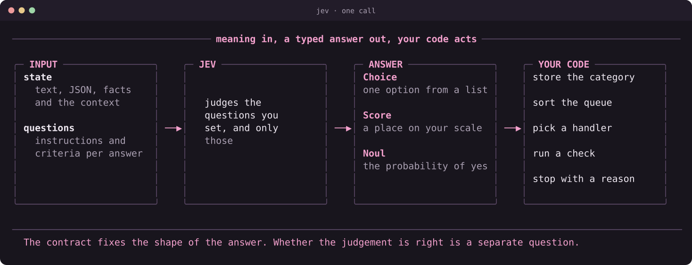

> PDF export fails in Safari. The same document exports fine in Chrome. I am using Chrome for now, but I want export back in Safari.

The application needs three things here: the category of the problem, its effect on the user's work, and whether a workaround exists.

Jev takes the text and the questions and returns values your program uses next. You define the permitted options and what each criterion means. [TypeSafe interface](https://docs.typesafe.ai/introduction).

> **Before:** the model hands back a paragraph of text, and the application parses it and guesses at the meaning.
> **After:** the model hands back a value from your list, and the application branches on it right away.

A request has three main fields:

```python
payload = {
    "model": "jev-1.13.0",
    "state": ticket,
    "questions": questions,
}
```

Into `state` you put the material being judged: a message, a fragment of a document, tool results, or a small JSON object. Into `questions` you list what you want to know about it, and into `model` you put the version.

This article pins `jev-1.13.0`. The `jev-latest` alias is convenient while you are getting acquainted, but one day it will start pointing at a different version.

The request has hard limits: 64k tokens for the whole request, 32k for `state` together with the longest question, no more than 255 options in a Choice, and between two and ten levels in a Score.

Input tokens cost $0.042 per million and output is not metered. So one more question against a `state` you already sent adds almost nothing to the bill.

Jev itself does nothing beyond answering. The browser, the shell command and the file write all belong to the application built around the model.

> **In short:** Jev hands back the decision itself instead of text about the decision, in a shape code accepts without parsing.

## Three primitives: option, scale, statement

The shape of the answer you need decides which kind of question to ask.

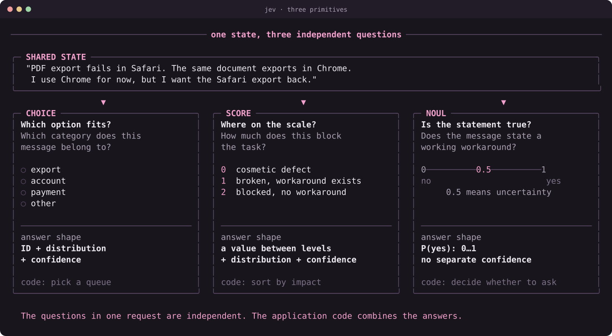

**Choice** fits when there are several options and no order between them. **Score** fits when the answer is a position on a described scale. **Noul** fits when you need to judge one specific statement.

All three questions go out in one request:

```python
questions = {
    "category": {
        "type": "choice",
        "instructions": "Which category does the main problem belong to?",
        "criteria": {
            "export": "Creating or downloading an exported file",
            "account": "Signing in and account access",
            "payment": "Charges, invoices and payments",
            "other": "None of the listed categories fits",
        },
    },
    "impact": {
        "type": "score",
        "instructions": "How does the problem affect getting the task done?",
        "criteria": [
            "Cosmetic defect; the task is completed the usual way",
            "The feature is broken, but a working workaround is stated",
            "The task is blocked; no working workaround exists",
        ],
    },
    "has_workaround": {
        "type": "noul",
        "instructions": "Does the ticket state a working workaround?",
        "criteria": {
            "true": "The author says outright that they do the same task another way",
            "false": "No working workaround is stated; there is only a guess, or nothing at all",
        },
    },
}
```

The `other` option in Choice gives the model a legitimate exit when the list does not cover the case. Without it a winner still emerges, if only among options that do not fit.

Score levels are set by positions in the array: `0`, `1`, `2`. Our levels describe observable situations. "bad", "very bad" and "catastrophically bad" would leave far more room for different readings.

Inside one request the questions are evaluated independently: the answer to `category` does not become input for `impact`. If the first answer determines the options for the next question, build a new request. [Primitives](https://docs.typesafe.ai/primitives), [official examples](https://github.com/typesafe-ai/skills).

### A label is not an answer

The real saved answer to the ticket above:

```json
{
  "model": "jev-1.13.0",
  "answers": {
    "category": {"type": "choice", "choice": "export", "confidence": 1.0,
                 "probabilities": {"export": 1.0, "account": 0.0, "payment": 0.0, "other": 0.0}},
    "impact":   {"type": "score", "score": 1.0, "confidence": 0.99,
                 "legend": {"0": "Cosmetic defect; the task is completed the usual way",
                            "1": "The feature is broken, but a working workaround is stated",
                            "2": "The task is blocked; no working workaround exists"},
                 "probabilities": {"0": 0.0, "1": 1.0, "2": 0.0}},
    "has_workaround": {"type": "noul", "noul": 0.95}
  },
  "usage": {"input_tokens": 746, "output_tokens": 79}
}
```


For Choice, the field that matters is `probabilities`, not `choice`. The label is simply the most likely option, and there is nothing else in it.

> `{export: 1.0, rest: 0.0}` → label `export`
> `{export: 0.4, account: 0.35, payment: 0.25}` → the same label `export`, though it is nearly a coin flip

For Score, the field that matters is `legend`. The number `1.0` means nothing on its own: levels are numbered from zero, there are three here, and `1.0` lands on the middle one.

The number is an index into the legend. Set a Score threshold on those indices, because a fraction of the level count is the wrong unit.

And `score` comes back as a probability-weighted position rather than a label: at `{0: 0.5, 1: 0.5}` it returns `0.5`, and no level carries that number.

Noul has neither a distribution nor a `confidence`. One number, the probability that the statement holds.

It is the cheapest to apply and the most dangerous to phrase. [Choice](https://docs.typesafe.ai/primitives/choice), [Score](https://docs.typesafe.ai/primitives/score), [Noul](https://docs.typesafe.ai/primitives/noul).

### `confidence` is the same distribution in a single number

The documentation ties `confidence` to how concentrated the probabilities are, but does not publish the formula, so we measured it.

For `n` options the value matches `(n × p_max − 1) / (n − 1)`. Checked against all 161 Choice and Score answers saved in the kit, with a maximum deviation of 0.015, which is rounding to two decimals.

In practice: a threshold of `confidence = 0.60` on three options means exactly `p_max >= 0.73`. The filter is stricter than it looks.

You still cannot read `confidence` as a measured probability of being right on your data. [Confidence](https://docs.typesafe.ai/confidence).

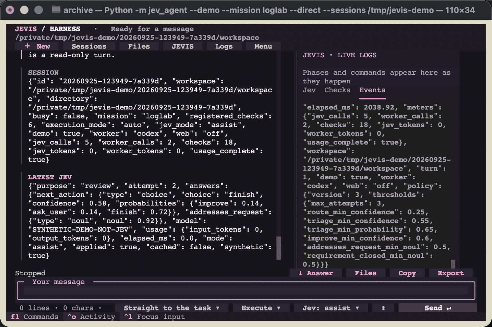

That is the agent showing one saved answer. The label says `finish`, and the line under it is the whole reason the label is not enough: `0.72` against `0.14` and `0.14`. The model is named `SYNTHETIC-DEMO-NOT-JEV`, because without a key nothing pretends to be Jev.

### We showed Score and did not use it in the builds

From here on every decision runs on Choice and Noul. Score appears only in the first call.

Not because it is worse. A scale belongs where the answer is continuous and gets a fractional threshold: which failure to repair first, how severe a defect is.

Every decision in our task turned out to be either a pick from a closed set or a check on a single statement. Stretching a scale over those means inventing levels the domain does not have.

A `1.5` sitting between "works" and "broken" reports a disagreement inside the answer. It says nothing about the state of the world.

### The phrasing of the question changes the answer

One ticket, one meaning of the question: is a working workaround stated. Two phrasings:


```text
RU:  Указан ли в обращении рабочий обход проблемы?             → noul 0.95
EN:  Does the message explicitly state a working workaround?   → noul 0.89
```

The difference is not the language. It is one word: **explicitly**.

The customer writes "I use Chrome for now". The workaround is genuine, but mentioned in passing rather than stated. Asking for explicitness legitimately lowers the number.

The labelled sets use a third version, stricter again. It spells out what does not count as a workaround:

```text
Does this customer's message explicitly report an alternative method that they have
actually used successfully to accomplish the affected task? Advice, an untried
suggestion, a question, and a failed alternative do not count.
```

Six hundredths is not much. But you set one threshold, and with a gate at 0.9 these two phrasings send the same data down different branches of your program.

Hence the practice: pin the phrasing together with the threshold and version them as one thing.

> **In short:** the primitive is chosen by the shape of the answer you need. The decision comes from the distribution under the label and from the phrasing you used to ask, and never from the label alone.

## The program builds the options, not the model

The same call shape yields different products. What changes is the material, the questions, and the action taken after the answer.


- **Support.** Message → Choice of category and Score of impact → a ticket queue with a priority you can explain.
- **Document search.** A query and a retrieved fragment → Noul on whether the fragment answers the condition → ordering of results. Finding candidates stays a separate part of the application: [reranking cookbook](https://docs.typesafe.ai/cookbooks/rerank_typesafe).
- **Browser actions.** The DOM becomes a numbered table of actions and Choice picks an index. No selectors, no code: [browser-use/jev-ultrafast](https://github.com/browser-use/jev-ultrafast).
- **Picking a model or tool.** A task plus descriptions of the workers → Choice → a call to the chosen worker: [LangChain's write-up](https://www.langchain.com/blog/building-a-harness-with-jev).
- **Checking a coding agent.** A requirement and the results of the work → a judgement on how the evidence relates to the requirement, then a diagnostic choice. This is the branch we build in full.

Four more products on the same call shape, from the open-source code of people who have already built it for themselves.

**Context compaction.** Two Nouls per tool call: is the call itself needed, and is its output needed verbatim. Whatever stays, stays word for word.

**Knowledge-graph traversal.** The distribution is used whole: probabilities become hypothesis scores in a beam search. The argmax is never taken at all.

**Code review triage.** A file × dimension matrix is asked as five Nouls in one request. Five probabilities for the price of one round trip.

**Completion verification.** The question asks whether the message claims the work is done. It does not ask whether the work is done. A narrow fact about text instead of a judgement about quality.

What runs through all of them: **the program builds the options.** Jev picks from a closed set you assembled, and anything the model cannot physically propose never enters the set.

Three rules about the numbers themselves, each learned by getting it wrong first.

**Low confidence means the absence of an opinion.** We got `improve` at a confidence of 0.26 against a 0.6 threshold and wrote a rule that read it as a signal that something was off.

> Before: 0.26 against a 0.6 threshold reads as "something is off".
> After: 0.26 reads as "the model does not know", and something else decides.

**An absent judgement is not agreement.** In code it is easy to write "if there is no answer, treat confidence as maximal", and end up with a system where Jev being unreachable raises the chance of finishing automatically.

The judge's participation has to be an explicit state: asked and answered, not asked at all, asked and unavailable. The third case must differ from the first.

**Advice needs two thresholds.** A hint is applied only if confidence is above 0.55 and the probability of the chosen category is above 0.65. One threshold misses "confidently picked between two near-equals"; the other misses "sharp distribution, but the model does not trust itself".

> **In short:** the product comes from a closed set of options you built yourself and from an honest reading of the number attached to it. Model cleverness is not the source.

## The bench: a search where half the requirements are confirmed

You need macOS or Linux and Python 3.9+, and there are no external packages. A key for a live request comes from [TypeSafe API Keys](https://console.typesafe.ai/keys) and is passed through `TYPESAFE_API_KEY`. You can check the questions by hand in the [Playground](https://console.typesafe.ai/playground).

The first call:

```bash
python3 run.py inspect --mode live --case export-ticket --out runs/inspect-live
python3 ../first_call.py     # the Russian wording from the article
```

The command saves `decisions.json` and the full request sent to the model. When you run it again, pick a new `--out`.

A live call is a single POST built on the standard library:

```python
request = Request(
    "https://api.typesafe.ai/v1/systemone",
    data=json.dumps(payload, ensure_ascii=False).encode("utf-8"),
    headers={
        "Authorization": "Bearer " + os.environ["TYPESAFE_API_KEY"],
        "Content-Type": "application/json",
    },
    method="POST",
)
with urlopen(request, timeout=30) as response:
    result = json.load(response)
```

`first_call.py` did run and did print `export`, `1.0`, `0.95`.

The request took about 0.98 seconds, and the API reported 746 input and 79 output tokens. That is one observation of one request, and it promises nothing about latency. [The full API contract](https://docs.typesafe.ai/api), [the saved answer](./verification/jev-live-2026-09-20/first-call-ru/response.json).

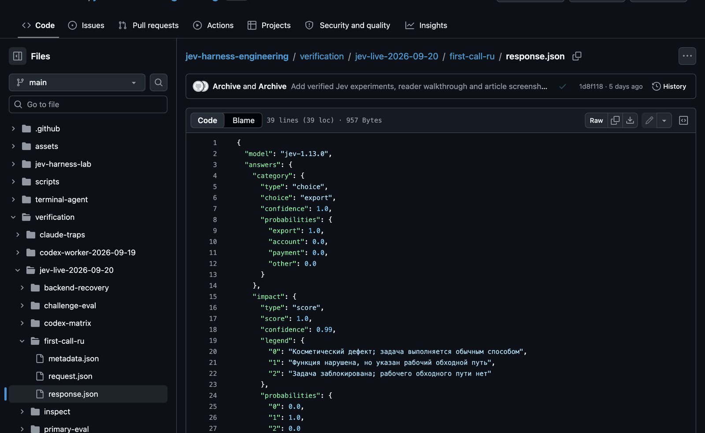

Every number in this article is a file you can open. That one is the response of the first call, exactly as it came back.

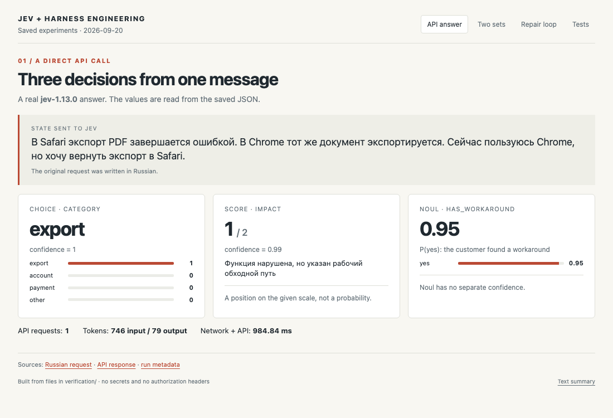

*A local view of the saved API response. The values are read from the JSON.*

With no key, you can study the same interface in `demo`. It writes `SYNTHETIC-DEMO-NOT-JEV` in place of the model name, on purpose, and its canned answers are not included in the measurements below.

### The application where the defect hides at the seam between layers

Now the teaching application itself. The contract is short:

```text
R1. The query "milk" finds the card "Buy milk": the word is in the title.
R2. The query "carton" finds the same card: the word is only in the description.
```

The entire search fits on one screen:

```python
ITEMS = [
    {"id": 1, "title": "Buy milk", "description": "Remember the blue carton"},
    {"id": 2, "title": "Prepare slides", "description": "Explain the export feature"},
]

def api_search(query, fields):
    query = query.casefold()
    return [item for item in ITEMS
            if any(query in item.get(field, "").casefold() for field in fields)]

def ui_request(query):
    return {"query": query, "fields": ["title"]}

def search(query):
    request = ui_request(query)
    return api_search(request["query"], request["fields"])
```

> the backend can: search by `title` and by `description`
> the interface asks for: only `title`

Our starting position: the worker claims search is finished, and the log holds only a passing check for R1.

The check registry splits the checks into mandatory and diagnostic:

```text
R1  requirement      search finds the card by a word from the title
R2  requirement      search finds the card by a word only in the description
C1  mandatory check  search("milk")   expects card 1
C2  mandatory check  search("carton") expects card 1
D1  diagnostic       calls the backend directly across both fields
D2  diagnostic       shows which fields the interface actually sent
```

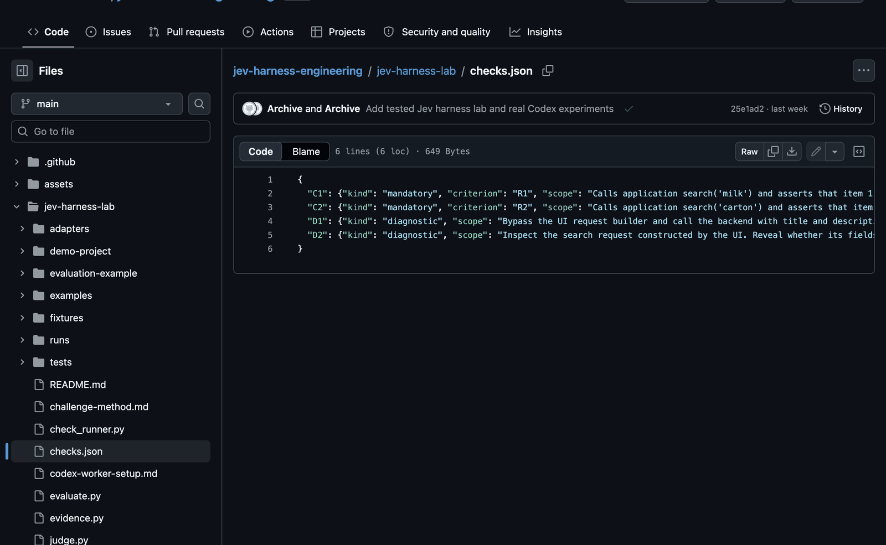

Code runs C1 and C2 itself: their relationship to the requirements is known in advance. D1 and D2 still have to be chosen, and that is where a place for Choice appears.

If your project is already covered by precise, cheap tests, run those; you do not need Jev here. The point of the bench is to create the place where a semantic judgement plugs in, and then to find out whether you need one on your own material.

> **In short:** the bench is built so that code decides the mandatory checks, and exactly one choice is left to the model: which diagnostic to ask for.

## Three builds: report, check selection, loop

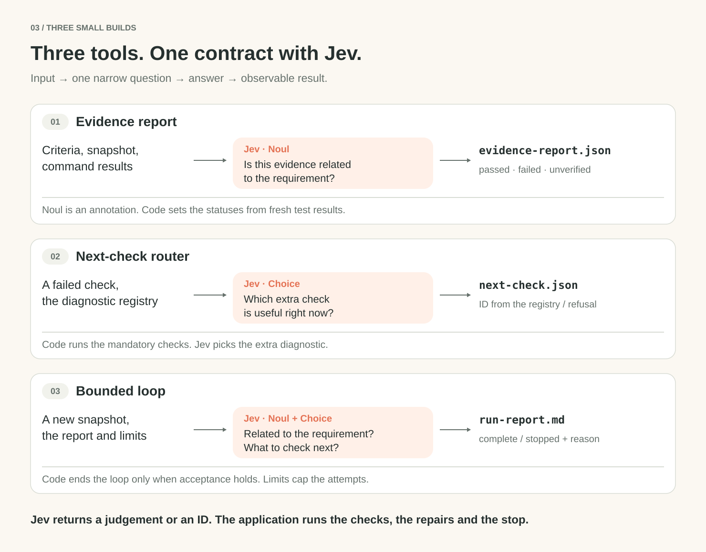

The process splits into three tools, each with its own input and output. That makes it clear what broke: a wrong link between a fact and a requirement belongs to the first tool, a useless diagnostic to the second, a wrong completion to the third. Improving all of it with one long prompt is harder, since several unknowns move at once.

### Build 1: the fact is separate from the claim

Input: the requirements, the code version, the check results, and separately the worker's message. Output: `evidence-report.json` for the program and `evidence-report.md` for a person.

```bash
python3 run.py evidence --mode demo --case missing-evidence --out runs/evidence-demo
```

There are three statuses: `passed` (a current check confirms the criterion), `failed` (a current check found a violation), `unverified` (confirmation is insufficient). The worker's "all done" is stored as a claim by the author of the changes. It never becomes a test result.

Every fact has a provenance: check ID, command, exit code, output, timestamp and project snapshot. A real record of a failing C2:

```json
{
  "check_id": "C2",
  "snapshot": "d8fd8d95…fc7408",
  "snapshot_after": "d8fd8d95…fc7408",
  "exit_code": 1,
  "stdout": "{\"check_id\": \"C2\", \"kind\": \"assertion_failure\", \"detail\": \"description-only search: expected [1], got []\"}"
}
```

The snapshot is taken twice, before and after the run: a check must not modify the project, and the two hashes matching is what proves it. If the code changed after a check, a green result cannot be carried over to the new version.

The status logic is entirely programmatic. Jev is never asked to compare strings or decide whether an exit code equals zero:

```python
def requirement_status(current_snapshot, latest_check):
    if latest_check is None:
        return "unverified"
    if not is_fresh(latest_check, current_snapshot):
        return "unverified"
    if latest_check["exit_code"] == 0:
        return "passed"
    if latest_check["exit_code"] == 1:
        return "failed"
    return "unverified"   # code 2, a timeout, a crashed runner
```

A tool that broke counts as neither confirmation nor refutation.

Semantic judgement enters when material relates to a requirement without an exact link to it: a description of somebody else's test, a fragment of a report, an observation from a manual run. We ask narrowly, one pair at a time: a criterion and a description of the evidence. We never ask "was the task done correctly?".

In live runs the uncontroversial pair C1 → R1 scored Noul 0.88 to 0.91. The model withholds a flat 1.0 even where there is nothing to argue about.

The main limit: such an annotation stays an annotation and never promotes a criterion to `passed`. Only an explicit acceptance map grants clearance to complete.

Hence the different cost of an API failure:

> **Optional call:** the API is unreachable during the Noul annotation, the report stores `scope_annotation_error`, and acceptance is still decided by fresh C1/C2 results.
> **Mandatory call:** a failure of the Choice router stops the loop.

The report does not invent reasoning on Jev's behalf. The model returned a number; a sentence like "C2 was not run against the current version" is written by the program from the log. The report is already a standalone product: you open it before a review, even when a human will do the fixing.

### Build 2: the diagnostic is chosen by the information expected

Input: an incomplete or failing report. Output: `next-check.json` with a specific check ID and the grounds for the decision.

```bash
python3 run.py next-check --mode demo --case missing-evidence --out runs/router-demo
```

Code assigns C2 when it is mandatory and has not run yet. Once C2 has failed and the cause needs locating, the choice goes to the model:

```python
next_check_question = {
    "type": "choice",
    "instructions": ("Which available diagnostic yields the most useful new fact "
                     "for locating the observed failure?"),
    "criteria": {
        "D1": "Search by description directly through the backend",
        "D2": "Inspect which search fields the interface passes",
        "none_suitable": "No available check would produce a useful new fact",
    },
}
```

The phrasing decides the outcome:

> **Bad:** "pick the best test", with the options named `test_1` and `test_2`. The model has no idea what is inside those commands.
> **Good:** every description states which question that check settles.

The application reads `choice`, stores the distribution, and matches the ID against the registry of permitted checks. It takes the command from its own configuration, and text from the model is never executed as shell:

```python
selected = answer["choice"]
if selected == "none_suitable":
    action = "stop_for_review"
elif selected not in allowed_check_ids:
    action = "stop_invalid_answer"
else:
    action = "run_registered_check"
```

The router has a simple competitor: run every check. When D1 and D2 cost milliseconds, the competitor may well win. A selector gets interesting once diagnostics become expensive or numerous.

### Build 3: every stop has a reason

Input: the requirements and the current state of the run. Output: completion under the contract, or a stop with a named reason.

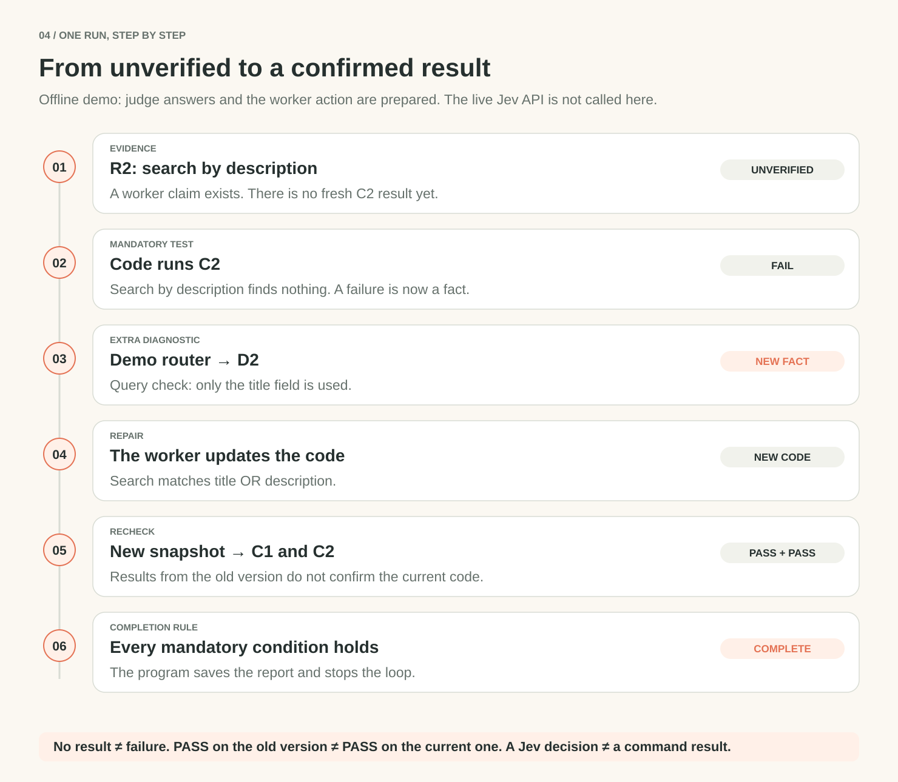

The rules in words:

1. A mandatory confirmation is missing or stale: run the matching check.
2. A check found a violation: obtain an extra fact if needed and hand the worker a reproducible failure.
3. Every mandatory criterion is confirmed for the current version: complete under that contract.
4. Nothing changed, no suitable diagnostic exists, or a limit is exhausted: save the state and stop with a reason.
5. The answer to the mandatory Choice is missing, invalid or below the confidence threshold: stop with a reason. An API error never confirms readiness.

A high score from the model cannot overturn a failing C2. A `complete` decision means precisely that the described acceptance contract is satisfied; two tests do not prove the absence of every possible defect.

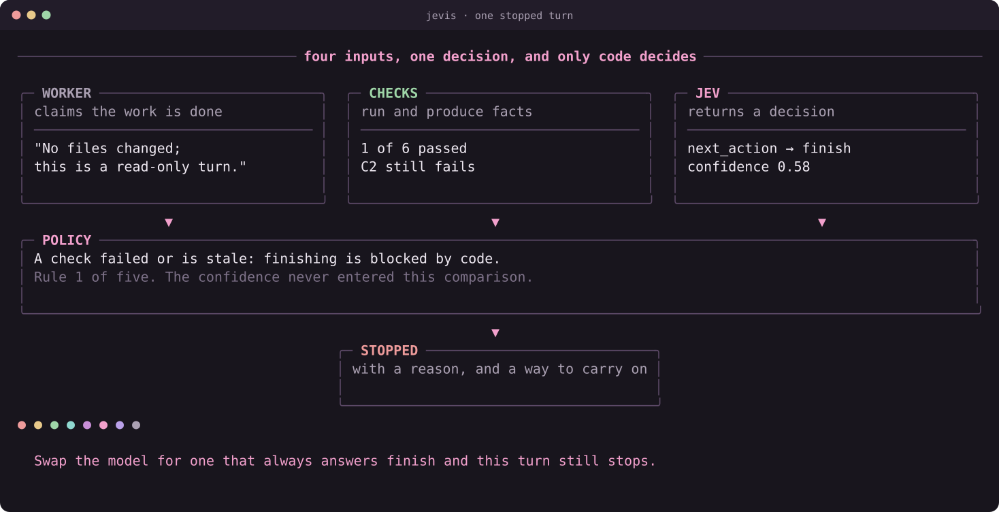

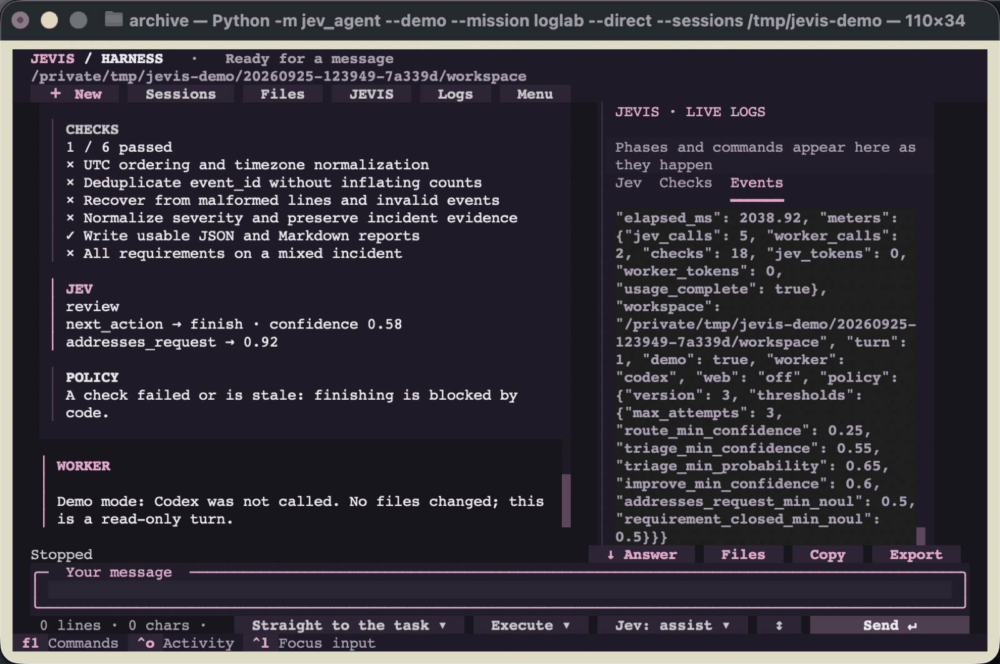

Rule 1 in a real run. The model chose `finish`. One check of six had passed, so the policy wrote `A check failed or is stale: finishing is blocked by code` and the turn stopped. The number the model produced never entered the decision.

Instead of "try again", the worker gets a minimal package where every fact points back to a tool record:

```text
Criterion: R2, search finds a record by its description.
Reproduction: registered check C2.
Result: the expected record was not found.
Extra observation D2: the request carries fields=["title"].
Repair scope: application code; the acceptance contract stays as it is.
After the change: rerun C1 and C2 against the new snapshot.
```

After a change you need a new snapshot. Old PASS and FAIL results stay as history; current readiness is decided by fresh ones. If the worker returned a confident report but the files did not change, the loop must not keep rechecking the same thing forever.

Similar architectures are being built elsewhere: [Foreman](https://github.com/thruwire/foreman) also separates the worker from the supervising decisions.

> **In short:** readiness is decided by fresh results from registered checks, and the model only answers narrow questions whose answers cannot be derived from the log.

## What the live runs showed

For the worker we use the Codex CLI. It receives the task, the actual failure and the diagnostic, reads `app.py` and makes a change. The harness then reruns the checks itself, and the agent's answer does not decide acceptance.

The working copy is confined to the run's directory, and only `app.py` may be modified.

The adapter runs under `workspace-write`, forbids privilege escalation and disables web search. One attempt times out at 90 seconds, and the policy allows up to two repairs and 300 seconds for the whole loop.

Our run used CLI `0.155.0-alpha.9`. [Non-interactive Codex documentation](https://developers.openai.com/codex/noninteractive).

```bash
python3 run.py loop --mode live --selector fixed \
  --case missing-evidence --task task.md \
  --worker-config worker-config-codex.json \
  --policy policy-codex.json \
  --out runs/my-codex-run
```

With a different worker the adapter changes and the protocol stays the same: stdin takes one JSON object with `task`, `project`, `feedback`, `iteration`, and stdout returns `{"claim": "..."}`. A non-zero exit code, an invalid answer or a timeout each produce a stop with a reason.

**The fixed diagnostic choice first.** We froze three starting defects before running anything, then handed them to live Codex one at a time:

- Interface only: the request dropped the `description` field. 15.17 seconds.
- Backend only: the interface passed both fields and the backend read the title alone. 17.02 seconds.
- Both defects at once. 20.43 seconds.

Each case closed with one real code change: one repair, five checks, and the final independent acceptance passed.

After the stop, a separate process tested four further queries the worker never saw. There were no false `complete` decisions. [Run log](./verification/codex-worker-2026-09-19/evaluation.md).

**Then the same set with Jev making the choice.** The code and the inputs were frozen in a manifest before the first call:

```bash
python3 worker_eval.py --selector jev --out runs/my-jev-worker-evaluation
```

- Interface defect: D2 picked, one repair, five checks, acceptance PASS, 20.98 seconds.
- Backend defect: D2 again, with `confidence=0.52` below the recorded threshold of `0.60`. The run stopped after two mandatory checks, the worker never ran, and an independent check confirmed the defect was still there. 2.17 seconds.
- Both defects: D2, one repair, five checks, PASS, 21.57 seconds.

> before (`fixed`): three prepared defects, three repairs.
> after (`jev`): **two automatic completions and one stop**.

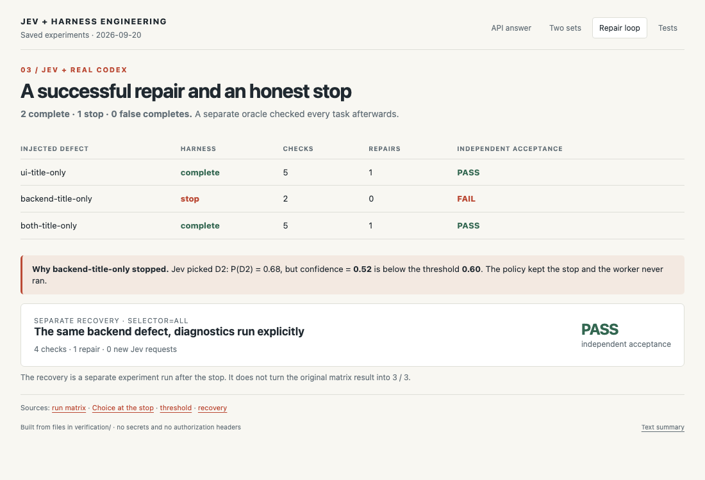

*Distributions across the three runs: D2 0.85 at `confidence` 0.77, D2 0.80 at 0.70, D2 0.68 at 0.52. The last one is the stop. The candidates were not tied: D1 got only 0.26. The distribution was still flatter than in the other two runs, because the defect sat in the backend, where calling it directly through D1 was no worse than inspecting the interface through D2. [Results of all three runs](./verification/jev-live-2026-09-20/codex-matrix/evaluation.md).*

Again no false `complete`. On these examples no advantage for Jev is established, and that is more honest than a promise that adding a judge improves any workflow by itself.

The limitation is general: the request carries no `seed` and no `temperature`, so an identical request can return different probabilities. The margin to the threshold is eight hundredths, and one resample eats it. Before you put a threshold in your code, send the same request ten times and watch the spread.

### A stop needs a way to carry on

We kept the failed attempt, copied its state, and explicitly chose `all`: run both available diagnostics, then hand the facts to the worker. The Jev threshold was left alone.

The new run: four checks, one repair, independent acceptance passed, zero extra Jev requests.

```bash
cp -Rf runs/my-jev-worker-evaluation runs/my-jev-worker-recovery
python3 run.py loop --mode live --selector all \
  --state runs/my-jev-worker-recovery/backend-title-only/state.json \
  --out runs/my-recovery-result \
  --worker-config worker-config-codex.json --policy policy-codex.json
```

The state holds a relative reference to the project and the records of checks already performed. That is why the two fresh mandatory checks from the previous run are read back as they are, then rerun once the code changes. [Recovery log](./verification/jev-live-2026-09-20/backend-recovery/recovery.json).

Decide in advance what happens on an unconfident choice. For two cheap local diagnostics, running both is reasonable. For an expensive external action, a human may be required.

### Labelled sets: 28 out of 28, twice

Working code answers the question of whether we built the system. The usefulness of Jev takes a separate comparison, and one node is the place to start it.

```bash
python3 live_eval.py --out runs/my-jev-evaluation
```

The first set: 18 states, 28 decisions. Ten of the states are tickets in Russian and English for Choice and Noul; the other eight are diagnostic situations for D1, D2 and `none_suitable`. Reference labels were never passed to the model.

**28 correct answers out of 28**: category 10/10, workaround 10/10, next diagnostic 8/8. The policy accepted every answer, and two correct results were `none_suitable`. 18 requests, no API errors, 17.10 seconds, 9,322 input and 1,024 output tokens. [First log](./verification/jev-live-2026-09-20/primary-eval/report.md).

A second set of 18 new cases was assembled without looking at the future answers and without changing any question or threshold: negations, untested advice, keywords in card titles, textual attempts to override the category, stale snapshots, and diagnostics that had already run. [Method](./jev-harness-lab/challenge-method.md).

Again **28 out of 28**, all accepted by the policy, three correct `none_suitable`, no API errors. 17.26 seconds, 10,824 input and 1,026 output tokens. [Second log](./verification/jev-live-2026-09-20/challenge-eval/report.md).

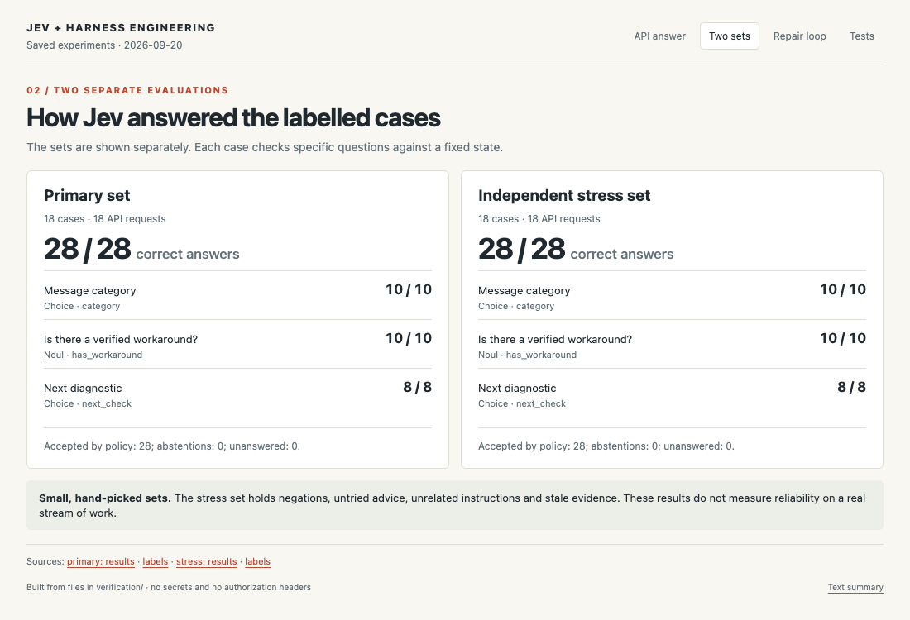

The sets are small and we picked the cases ourselves. They speak to the cases listed. They establish nothing about your traffic, your calibration, or robustness to arbitrary text injection.

Accuracy on a set does not equal a finished task:

> **on a labelled state:** one clearly useful step
>
> **in a real loop when C2 failed:** both diagnostics were useful, and one unconfident choice stopped the repair

So count the whole chain. Quality first: false completions, unconfirmed requirements, the independent final acceptance. Costs second: needless interventions, the number of checks, worker attempts, total time and expense.

The final assessment happens after the stop, and its tests and expert answers never reach the worker or the selector inside the run. Otherwise you hand the system a hint and then declare it successful on the strength of it.

An error in the harness produces a false success just as readily as an error in the model, so the harness is covered by tests too: 83 checks in total, including a failing optional judge, incomplete token accounting, and moving a saved project. CI runs them on Python 3.9, 3.12, 3.13 and 3.14.

```bash
python3 -m unittest discover -s tests -v
python3 run.py replay --run runs/first-loop --policy policy.json
```

Replay reads the saved inputs and answers, recomputes the policy actions, and calls no models. Reduce the check budget in a copy of the settings and it will show you the first action that differs. Past that divergence you cannot present the old record as a new experiment: if a different policy chose D1 instead of D2, the repairs further down the old log belong to another history.

The Jev 1.13 documentation lists nine weak spots, and four bear on our build directly: literal reading of conditions, errors in exact counting and date comparison, degradation under irrelevant context, and the influence of misleading material. Two more matter because our Noul criterion is built on a negation. [Documented limitations](https://docs.typesafe.ai/model-jaggedness/jev-1.13).

Hence the rule: keep the question about semantic relevance narrow, and leave exact arithmetic and invariants to code.

> **In short:** a labelled set shows that the model answers correctly. It does not show that the chain reaches a result.

## How to carry this into your own project

Three mistakes people hit first.

`confidence` looks like a second signal sitting next to `probabilities`. It is the same distribution in another form. Decide which `p_max` you want first and convert it to `confidence` by hand, and keep the whole distribution in the log either way: the winner does not explain a stop, the runner-up does.

A Noul semantic annotation grows into acceptance. First it appears in the report, then somebody gates on it, then a green answer from the model is enough to call the work finished. One move tests it: switch the model off, and if your pipeline still reports success, it was never gating on evidence in the first place.

A threshold fixed from a single run. Eight hundredths is less than a spread you have not measured yet.

Carrying this over starts with one requirement. Take one, for example "Changing the search query preserves the selected filter." Give it an ID, describe the mandatory check, and work out which extra observations would help locate a failure.

Only then write the Jev questions. Put the short material for that requirement into `state`, along with where it came from and its current version.

In a Noul, ask about one specific relationship. In a Choice, describe what new fact each diagnostic brings and keep `none_suitable`.

In the files, that means editing `task.md`, `CRITERIA` in `evidence.py`, the entries in `checks.json`, the executable checks in `check_runner.py`, and the independent acceptance in step with each other. New text in `--task` on its own does not create a verification contract.

```text
jev-harness-lab/
  run.py                  commands and the wiring between stages
  judge.py                questions, TypeSafe HTTP API, demo answers
  evidence.py             facts, snapshots, per-requirement reports
  policy.py               permitted actions and stopping
  worker.py               the worker protocol
  checks.json             the check registry
  policy.json             thresholds and limits
  task.md                 the task and the acceptance contract
  demo-project/           the small application with search
  adapters/codex_cli.py   the tested live Codex adapter
  worker_eval.py          three real experiments with a coding agent
  live_eval.py            labelled evaluation of Jev's decisions
  evaluate.py             offline matrix of the three policies
  tests/                  tests of the harness itself
```

Begin with whichever build you need right now. The **report** is useful before a manual review, the **router** organises diagnostics, and the **loop** ties them to a worker and records why it stopped.

None of this is specific to Jev. And all of it is cheaper to learn on a toy search than on your production queue.

> **In short:** before you put a number from a model into an `if`, find out what that number is and what a wrong answer costs you.

Open your agent's last failed run, pull a `state` out of it, and ask Jev one narrow question. Compare the answer against the decision a simple rule makes: you end up holding the request, the actual result, and a clear criterion for usefulness.

**A typed answer is still an opinion. A check decides readiness.**

---

If you want a finished agent rather than a bench, built from these same three builds, it sits right here: [the JEVIS terminal agent](./terminal-agent/README.md), one command to install and runnable with no keys.

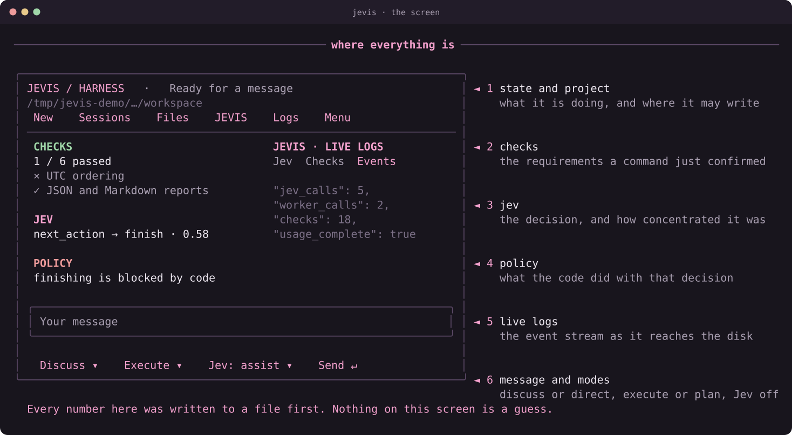

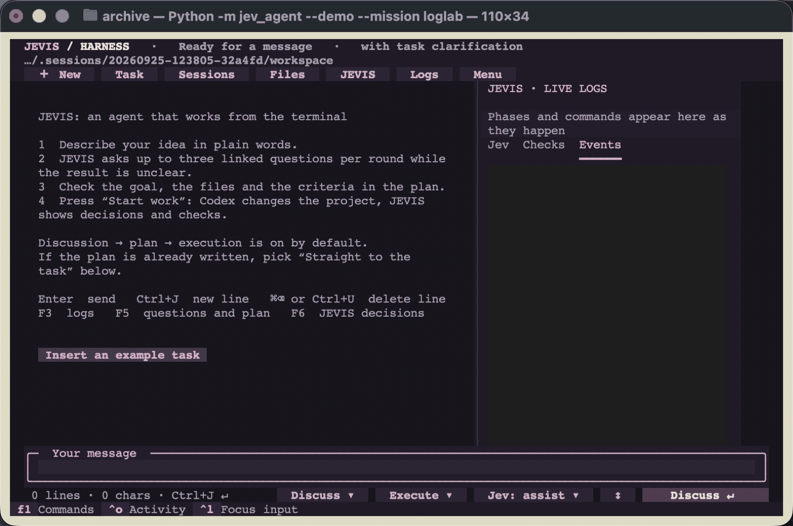

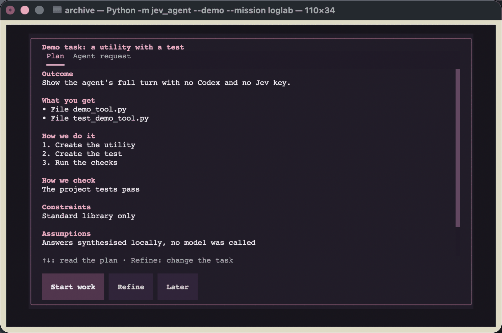

It asks a few questions, writes a plan, and waits. Work starts when you press the button, and every check and decision is on screen while it runs.

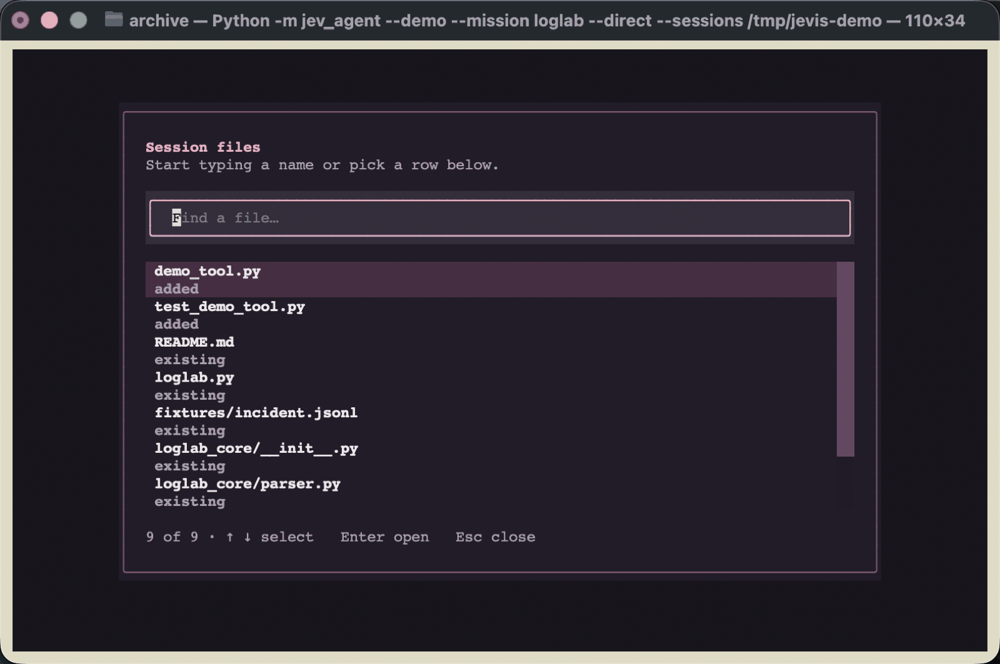

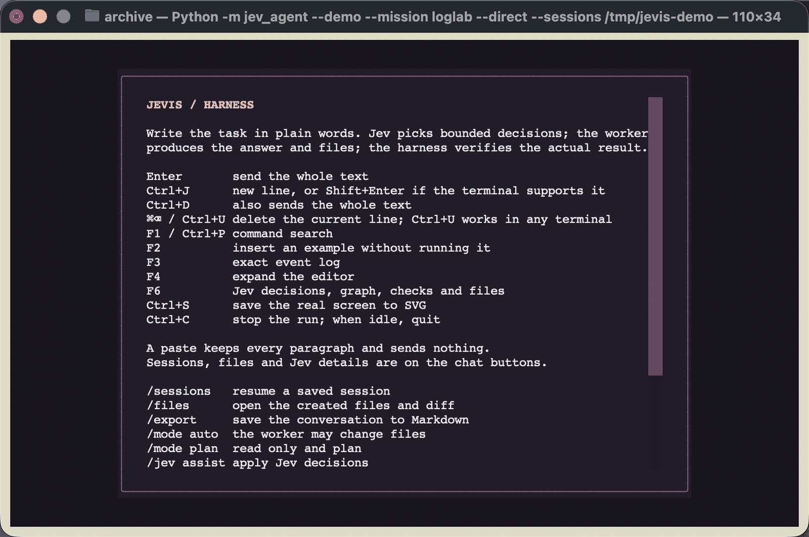

The files it touched are separated from the files that were already there, and every key is listed in one place.

Everything else sits next to this text: [code and instructions](./jev-harness-lab/README.md), [the first call](./first_call.py), [first steps](./START-HERE.md), [source verification](./source-check.md), [results gallery](./verification/evidence-gallery.en.html), [VALIDATION.md](./VALIDATION.md), [GitHub Actions](https://github.com/Archive228/jev-harness-engineering/actions).
