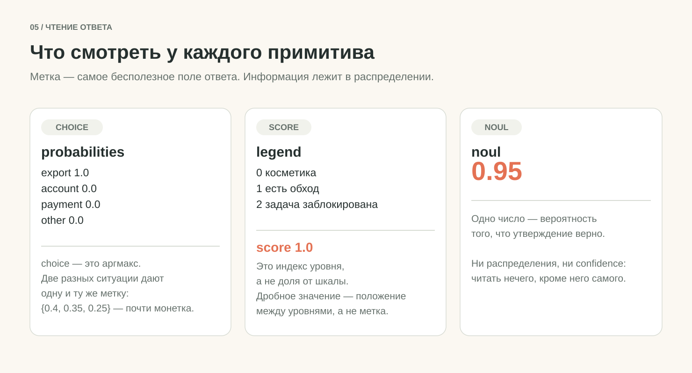
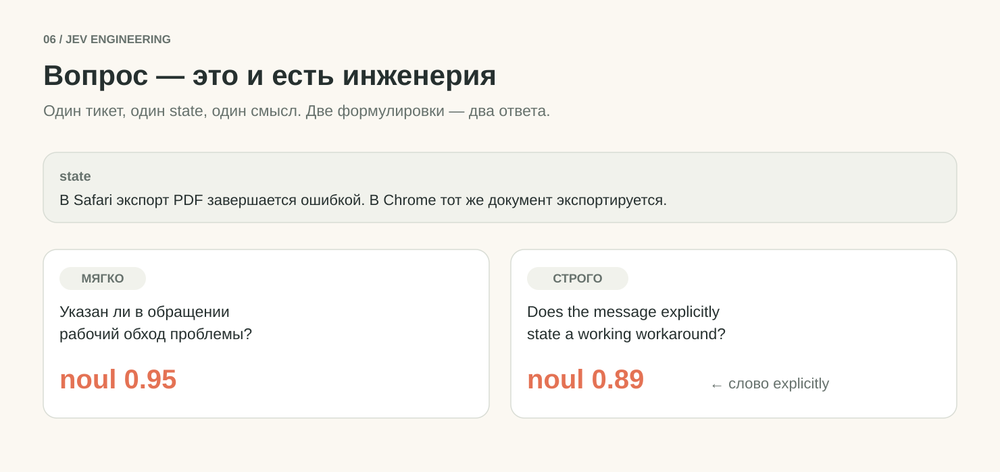
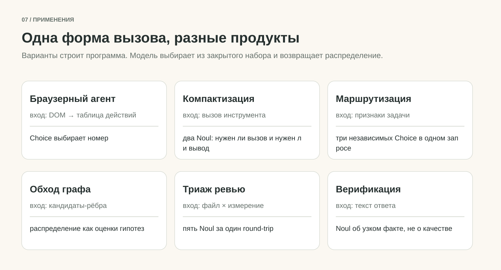

# Агент сказал «готово». Проверяет это код, а не модель

**Три сборки на Jev: отчёт по требованиям, выбор диагностики, ограниченный цикл исправления. Живой код, реальные прогоны, 28 правильных решений из 28 на двух размеченных наборах.**

20 сентября 2026 · Python · код и сохранённые прогоны в комплекте

Агент написал код, запустил тест и сообщил: «Готово». Тест действительно зелёный.

Только требование было «поиск по заголовку **или описанию**», а тест проверял один заголовок.

Дальше нужен не пересказ, а следующий шаг: найти недостающее подтверждение, выполнить проверку, передать агенту воспроизводимый сбой. Это работа для Jev – модели TypeSafe, которая возвращает решения заранее заданной формы.

Сначала разберём интерфейс на одном обращении в поддержку. Потом перенесём его в три сборки: **отчёт по требованиям → выбор проверки → ограниченный цикл исправления**. Каждую можно использовать отдельно.

В [репозитории](https://github.com/Archive228/jev-harness-engineering) лежит весь код, учебное приложение и сохранённые прогоны.

В статье есть успешное исправление, остановка из-за неуверенного ответа и проверенный способ продолжить работу.

Без ключей всё запускается в режиме `demo`: тесты выполняют настоящий код, ответы модели взяты из заготовок. [Маршрут первого запуска за 10 минут](./START-HERE.md).

## Jev возвращает решение, а не текст

Представьте обращение:


> В Safari экспорт PDF завершается ошибкой. В Chrome тот же документ экспортируется. Сейчас пользуюсь Chrome, но хочу вернуть экспорт в Safari.

Приложению нужны три вещи: категория проблемы, её влияние на работу и наличие обходного пути.

Jev получает текст и вопросы, а возвращает значения, которые программа использует дальше. Допустимые варианты и смысл критериев задаёте вы. [Интерфейс TypeSafe](https://docs.typesafe.ai/introduction).

> **Было:** модель отдаёт абзац текста, приложение его разбирает и догадывается о смысле.
> **Стало:** модель отдаёт значение из вашего списка, приложение сразу ветвится.

В запросе три основных поля:

```python
payload = {
    "model": "jev-1.13.0",
    "state": ticket,
    "questions": questions,
}
```

В `state` вы кладёте материал для оценки: сообщение, фрагмент документа, результаты инструментов или небольшой объект JSON. В `questions` перечисляете вопросы к этому материалу, в `model` указываете версию.

В статье зафиксирована `jev-1.13.0`. Алиас `jev-latest` удобен для знакомства, но однажды начнёт указывать на другую версию.

Границы запроса жёсткие: 64k токенов на весь запрос, 32k на `state` вместе с самым длинным вопросом, не более 255 вариантов в Choice и от двух до десяти уровней в Score.

Входные токены стоят $0.042 за миллион, выходные не тарифицируются. Поэтому лишний вопрос к уже отправленному `state` почти ничего не добавляет к счёту.

Сам Jev не делает ничего, кроме ответа. Браузер, shell-команда и запись в файл остаются на стороне приложения вокруг модели.

> **Суть:** Jev отдаёт не текст про решение, а само решение в форме, которую код принимает без разбора.

## Три примитива: вариант, шкала, утверждение

Какой вид вопроса брать, решает форма нужного ответа.


**Choice** – когда вариантов несколько и порядка между ними нет. **Score** – когда ответ это положение на описанной шкале. **Noul** – когда нужно оценить одно конкретное утверждение.

Все три вопроса уходят в одном запросе:

```python
questions = {
    "category": {
        "type": "choice",
        "instructions": "К какой категории относится основная проблема?",
        "criteria": {
            "export": "Создание или скачивание экспортируемого файла",
            "account": "Вход в аккаунт и доступ к нему",
            "payment": "Списания, счета и платежи",
            "other": "Ни одна из перечисленных категорий не подходит",
        },
    },
    "impact": {
        "type": "score",
        "instructions": "Как проблема влияет на выполнение задачи?",
        "criteria": [
            "Косметический дефект; задача выполняется обычным способом",
            "Функция нарушена, но указан рабочий обходной путь",
            "Задача заблокирована; рабочего обходного пути нет",
        ],
    },
    "has_workaround": {
        "type": "noul",
        "instructions": "Указан ли в обращении рабочий обход проблемы?",
        "criteria": {
            "true": "Автор прямо сообщает, что выполняет ту же задачу другим способом",
            "false": "Рабочий обход не указан; есть лишь предположение или его нет совсем",
        },
    },
}
```

Вариант `other` в Choice даёт модели допустимый выход, если список не покрывает случай. Без него победитель всё равно найдётся, пусть и среди неподходящих.

Уровни Score задаются позициями массива: `0`, `1`, `2`. Наши уровни описывают наблюдаемые ситуации, а «плохо», «очень плохо» и «катастрофически плохо» оставили бы куда больше места для разных трактовок.

Вопросы внутри одного запроса оцениваются независимо: ответ на `category` не становится входом для `impact`. Если первый ответ определяет варианты следующего вопроса, соберите новый запрос. [Примитивы](https://docs.typesafe.ai/primitives), [официальные примеры](https://github.com/typesafe-ai/skills).

### Метка это ещё не ответ

Настоящий сохранённый ответ на обращение выше:

```json
{
  "model": "jev-1.13.0",
  "answers": {
    "category": {"type": "choice", "choice": "export", "confidence": 1.0,
                 "probabilities": {"export": 1.0, "account": 0.0, "payment": 0.0, "other": 0.0}},
    "impact":   {"type": "score", "score": 1.0, "confidence": 0.99,
                 "legend": {"0": "Косметический дефект; задача выполняется обычным способом",
                            "1": "Функция нарушена, но указан рабочий обходной путь",
                            "2": "Задача заблокирована; рабочего обходного пути нет"},
                 "probabilities": {"0": 0.0, "1": 1.0, "2": 0.0}},
    "has_workaround": {"type": "noul", "noul": 0.95}
  },
  "usage": {"input_tokens": 746, "output_tokens": 79}
}
```



У Choice главное поле это `probabilities`, а не `choice`. Метка это просто самый вероятный вариант, больше в ней ничего нет.

> `{export: 1.0, остальные: 0.0}` → метка `export`
> `{export: 0.4, account: 0.35, payment: 0.25}` → та же метка `export`, хотя это почти монетка

У Score главное поле это `legend`. Число `1.0` само по себе не значит ничего: шкала нумеруется с нуля, уровней здесь три, и `1.0` попадает на средний. Это индекс уровня в легенде, поэтому и порог по Score ставится по индексам, а не по доле от их количества.

И `score` возвращается не как метка, а как взвешенное положение: при вероятностях `{0: 0.5, 1: 0.5}` придёт `0.5`, хотя уровня с таким номером не существует.

У Noul нет ни распределения, ни `confidence`. Одно число, вероятность того, что утверждение верно.

Дешевле всего применять и опаснее всего формулировать. [Choice](https://docs.typesafe.ai/primitives/choice), [Score](https://docs.typesafe.ai/primitives/score), [Noul](https://docs.typesafe.ai/primitives/noul).

### `confidence` это то же распределение, только в одном числе

Документация связывает `confidence` с концентрацией вероятностей, но формулу не публикует, поэтому мы её измерили.

Для `n` вариантов значение совпадает с `(n × p_max − 1) / (n − 1)`. Проверено на всех 161 сохранённом в комплекте ответе Choice и Score, максимальное расхождение 0.015, то есть округление до сотых.

Практический смысл: порог `confidence = 0.60` на трёх вариантах означает ровно требование `p_max >= 0.73`. Фильтр жёстче, чем кажется на вид.

Читать `confidence` как измеренную вероятность правильного ответа на ваших данных всё равно нельзя. [Confidence](https://docs.typesafe.ai/confidence).

### Score мы показали и в сборках не применили

Дальше все решения принимаются на Choice и Noul. Score участвует только в первом вызове.

Причина не в том, что он хуже. Шкала нужна там, где ответ непрерывный и по нему ставится дробный порог: какое из падений чинить первым, насколько серьёзен дефект.

В нашей задаче каждое решение оказалось либо выбором из закрытого набора, либо проверкой одного утверждения. Натягивать шкалу на такое значит придумывать уровни, которых в предметной области нет.

И `1.5` между «работает» и «сломано» говорит о расхождении внутри ответа, а не о состоянии мира.

### Формулировка вопроса меняет ответ

Один тикет, один смысл вопроса: указан ли рабочий обход. Две формулировки:



```text
RU:  Указан ли в обращении рабочий обход проблемы?             → noul 0.95
EN:  Does the message explicitly state a working workaround?   → noul 0.89
```

Дело не в языке, а в слове **explicitly**. Пользователь пишет «сейчас пользуюсь Chrome»: обход рабочий, но названный вскользь, и требование явности честно снижает число.

В размеченных наборах используется третья версия, ещё строже. Она перечисляет, что обходом не считается:

```text
Does this customer's message explicitly report an alternative method that they have
actually used successfully to accomplish the affected task? Advice, an untried
suggestion, a question, and a failed alternative do not count.
```

Шесть сотых это немного. Но порог вы ставите один, и при отсечке на 0.9 эти две формулировки отправят одни и те же данные по разным ветвям программы.

Отсюда практика: формулировку закрепляйте вместе с порогом и версионируйте как одно целое.

> **Суть:** примитив выбирают по форме нужного ответа, а решение принимает не метка, а распределение под ней и та формулировка, которой вы задали вопрос.

## Варианты строит программа, а не модель

Одинаковая форма вызова даёт разные продукты. Меняются материал, вопросы и действие после ответа.



- **Поддержка.** Сообщение → Choice категории и Score влияния → очередь обращений с понятным приоритетом.
- **Поиск по документам.** Запрос и найденный фрагмент → Noul о том, отвечает ли фрагмент условию → порядок результатов. Поиск кандидатов остаётся отдельной частью приложения: [cookbook reranking](https://docs.typesafe.ai/cookbooks/rerank_typesafe).
- **Действия в браузере.** DOM превращается в пронумерованную таблицу действий, Choice выбирает номер, а не селектор и не код: [browser-use/jev-ultrafast](https://github.com/browser-use/jev-ultrafast).
- **Выбор модели или инструмента.** Задача и описания исполнителей → Choice → вызов выбранного: [материал LangChain](https://www.langchain.com/blog/building-a-harness-with-jev).
- **Проверка coding agent.** Требование и результаты работы → оценка связи свидетельства с требованием, затем выбор диагностики. Эту ветку мы соберём полностью.

Ещё четыре продукта на той же форме вызова, из открытого кода тех, кто уже собрал это у себя.

**Компактизация контекста.** На каждый вызов инструмента два Noul: нужен ли сам вызов и нужен ли его вывод дословно. Что осталось, остаётся без пересказа.

**Обход графа знаний.** Распределение используется целиком: вероятности становятся оценками гипотез в лучевом поиске, аргмакс не берётся вообще.

**Триаж код-ревью.** Матрица «файл × измерение» спрашивается пятью Noul в одном обращении. Пять вероятностей ценой одного round-trip.

**Верификация завершённости.** Вопрос звучит как «заявляет ли сообщение, что работа сделана», а не «сделана ли работа». Узкий факт о тексте вместо суждения о качестве.

Общее во всех случаях: **варианты строит программа.** Jev выбирает из закрытого набора, который собрали вы, и всё, что модель физически не может предложить, в набор не попадает.

Дальше три правила про сами числа, каждое я узнал, наступив на него.

**Низкая уверенность означает отсутствие мнения.** Мы получили `improve` с уверенностью 0.26 при пороге 0.6 и написали правило, которое прочитало это как сигнал «что-то не так».

> Было: 0.26 при пороге 0.6 читается как «что-то не так».
> Стало: 0.26 читается как «модель не знает», решает что-то другое.

**Отсутствующая оценка не равна согласию.** В коде легко написать «если ответа нет, считаем уверенность максимальной», и получить систему, где недоступность Jev повышает шанс автоматического завершения.

Участие судьи должно быть явным состоянием: спросили и ответил, не спрашивали вовсе, спросили и недоступен. Третий случай обязан отличаться от первого.

**Совету нужны два порога.** Подсказка применяется, только если уверенность выше 0.55 и вероятность выбранной категории выше 0.65. Один порог пропустит «уверенно выбрал из двух почти равных», другой пропустит «распределение острое, но модель сама себе не верит».

> **Суть:** продукт получается не из умной модели, а из закрытого набора вариантов, который вы построили сами, и из честного чтения числа, которое к нему приложено.

## Стенд: поиск, где подтверждена половина требований

Нужны macOS или Linux и Python 3.9+, внешних пакетов нет. Ключ для живого запроса берётся на странице [TypeSafe API Keys](https://console.typesafe.ai/keys) и передаётся через `TYPESAFE_API_KEY`, вопросы можно проверить руками в [Playground](https://console.typesafe.ai/playground).

Первый вызов:

```bash
python3 run.py inspect --mode live --case export-ticket --out runs/inspect-live
python3 ../first_call.py     # русские формулировки из статьи
```

Команда сохранит `decisions.json` и полный запрос к модели. Для повторного запуска берите новый `--out`.

Живой вызов это один POST на стандартной библиотеке:

```python
request = Request(
    "https://api.typesafe.ai/v1/systemone",
    data=json.dumps(payload, ensure_ascii=False).encode("utf-8"),
    headers={
        "Authorization": "Bearer " + os.environ["TYPESAFE_API_KEY"],
        "Content-Type": "application/json",
    },
    method="POST",
)
with urlopen(request, timeout=30) as response:
    result = json.load(response)
```

`first_call.py` действительно выполнился и напечатал `export`, `1.0`, `0.95`.

Запрос занял около 0,98 секунды, API сообщил 746 входных и 79 выходных токенов. Это наблюдение одного запроса, а не обещание задержки. [Полный контракт API](https://docs.typesafe.ai/api), [сохранённый ответ](./verification/jev-live-2026-09-20/first-call-ru/response.json).


*Локальный просмотр сохранённого API-ответа, значения прочитаны из JSON.*

Без ключа тот же интерфейс изучается в `demo`. Он явно записывает `SYNTHETIC-DEMO-NOT-JEV` вместо имени модели, и его заготовки в измерения ниже не входят.

### Приложение, где ошибка спрятана на стыке слоёв

Теперь само учебное приложение. Контракт короткий:

```text
R1. Запрос «milk» находит карточку «Buy milk»: слово есть в заголовке.
R2. Запрос «carton» находит ту же карточку: слово есть только в описании.
```

Весь поиск помещается на экран:

```python
ITEMS = [
    {"id": 1, "title": "Buy milk", "description": "Remember the blue carton"},
    {"id": 2, "title": "Prepare slides", "description": "Explain the export feature"},
]

def api_search(query, fields):
    query = query.casefold()
    return [item for item in ITEMS
            if any(query in item.get(field, "").casefold() for field in fields)]

def ui_request(query):
    return {"query": query, "fields": ["title"]}

def search(query):
    request = ui_request(query)
    return api_search(request["query"], request["fields"])
```

> backend умеет: искать по `title` и по `description`
> интерфейс просит: только `title`

Исходная ситуация: worker утверждает, что поиск готов, а в журнале есть только успешная проверка R1.

Реестр проверок делит их на обязательные и диагностические:

```text
R1  требование            поиск находит карточку по слову из заголовка
R2  требование            поиск находит карточку по слову только из описания
C1  обязательная проверка search("milk")   ожидает карточку 1
C2  обязательная проверка search("carton") ожидает карточку 1
D1  диагностика           зовёт backend напрямую по обоим полям
D2  диагностика           показывает, какие поля передал интерфейс
```

C1 и C2 запускает код сам: их связь с требованиями известна заранее. D1 и D2 ещё нужно выбрать, и вот здесь появляется место для Choice.

Если ваш проект покрыт дешёвыми точными тестами, Jev тут не нужен, запустите их. Смысл стенда в том, чтобы получить место для подключения смысловой оценки и проверить, нужна ли она на ваших материалах.

> **Суть:** стенд собран так, что обязательные проверки решает код, и на модель остаётся ровно один выбор: какую диагностику спросить.

## Три сборки: отчёт, выбор проверки, цикл


Процесс разбит на три инструмента, у каждого свой вход и выход. Так видно, что именно сломалось: ошибочная связь факта с требованием это первый инструмент, бесполезная диагностика второй, неверное завершение третий. Улучшать всё это одним длинным prompt труднее, потому что меняются сразу несколько неизвестных.

### Сборка 1: факт отделён от заявления

Вход: требования, версия кода, результаты проверок и отдельно сообщение worker. Выход: `evidence-report.json` для программы и `evidence-report.md` для человека.

```bash
python3 run.py evidence --mode demo --case missing-evidence --out runs/evidence-demo
```

Статусов три: `passed` (свежая проверка подтверждает критерий), `failed` (свежая проверка обнаружила нарушение), `unverified` (подтверждения недостаточно). Сообщение worker «всё готово» сохраняется как утверждение автора изменений, а не как результат теста.

У каждого факта есть происхождение: ID проверки, команда, код завершения, вывод, время и снимок проекта. Настоящая запись провалившейся C2:

```json
{
  "check_id": "C2",
  "snapshot": "d8fd8d95…fc7408",
  "snapshot_after": "d8fd8d95…fc7408",
  "exit_code": 1,
  "stdout": "{\"check_id\": \"C2\", \"kind\": \"assertion_failure\", \"detail\": \"description-only search: expected [1], got []\"}"
}
```

Снимок берётся дважды, до и после запуска: проверка не должна менять проект, и равенство двух хешей это подтверждает. Если после проверки изменился код, зелёный результат нельзя перенести на новую версию.

Логика статуса целиком программная, Jev не просят сравнивать строки или определять, равен ли exit code нулю:

```python
def requirement_status(current_snapshot, latest_check):
    if latest_check is None:
        return "unverified"
    if not is_fresh(latest_check, current_snapshot):
        return "unverified"
    if latest_check["exit_code"] == 0:
        return "passed"
    if latest_check["exit_code"] == 1:
        return "failed"
    return "unverified"   # код 2, таймаут, упавший runner
```

Сломавшийся инструмент не считается ни подтверждением, ни опровержением.

Смысловая оценка нужна там, где к требованию относятся материалы без точной привязки: описание чужого теста, фрагмент отчёта, наблюдение из ручного прогона. Мы спрашиваем узко, одной парой «критерий и описание свидетельства», а не «задача выполнена правильно?».

В живых прогонах бесспорная пара C1 → R1 получала Noul 0.88–0.91: единицу модель не ставит даже там, где спорить не о чем.

Главное ограничение: такая аннотация остаётся аннотацией и не поднимает критерий до `passed`. Допуск к завершению даёт только явная карта приёмки.

Отсюда разная цена отказа API:

> **Необязательный вызов:** API недоступен во время Noul-аннотации, отчёт сохраняет `scope_annotation_error`, приёмку продолжают определять свежие результаты C1/C2.
> **Обязательный вызов:** ошибка Choice-маршрутизатора останавливает цикл.

Отчёт не придумывает рассуждения от имени Jev: модель вернула число, а текст вроде «C2 не выполнялась на текущей версии» пишет программа по журналу. Этот отчёт уже самостоятельный продукт, его открывают перед review, даже если исправлять будет человек.

### Сборка 2: диагностику выбирают по ожидаемой информации

Вход: неполный или неуспешный отчёт. Выход: `next-check.json` с конкретным ID проверки и основанием решения.

```bash
python3 run.py next-check --mode demo --case missing-evidence --out runs/router-demo
```

Обязательную и ещё не выполненную C2 назначает код. А вот когда C2 упала и причину надо локализовать, выбор передаётся модели:

```python
next_check_question = {
    "type": "choice",
    "instructions": ("Какая доступная диагностика даст наиболее полезный новый факт "
                     "для локализации наблюдаемого сбоя?"),
    "criteria": {
        "D1": "Выполнить поиск по описанию напрямую через backend",
        "D2": "Посмотреть, какие поля поиска передаёт интерфейс",
        "none_suitable": "Ни одна доступная проверка не даст полезного нового факта",
    },
}
```

Формулировка решает исход:

> **Плохо:** «выбери лучший тест» с названиями `test_1` и `test_2`. Модель не знает, что внутри этих команд.
> **Хорошо:** каждое описание сообщает, какой вопрос разрешает эта проверка.

Приложение читает `choice`, сохраняет распределение и сверяет ID с разрешённым реестром. Команду оно берёт из своей конфигурации, текст ответа модели никогда не исполняется как shell:

```python
selected = answer["choice"]
if selected == "none_suitable":
    action = "stop_for_review"
elif selected not in allowed_check_ids:
    action = "stop_invalid_answer"
else:
    action = "run_registered_check"
```

У маршрутизатора есть простой конкурент: выполнить все проверки. Когда D1 и D2 стоят миллисекунды, конкурент вполне может выиграть. Selector интереснее при дорогих или многочисленных диагностиках.

### Сборка 3: остановка всегда имеет причину

Вход: требования и текущее состояние прогона. Выход: завершение по контракту либо остановка с названной причиной.


Правила словами:

1. Обязательное подтверждение отсутствует или устарело: выполнить соответствующую проверку.
2. Проверка обнаружила нарушение: добрать при необходимости дополнительный факт и передать worker воспроизводимый сбой.
3. Все обязательные критерии подтверждены для текущей версии: завершить по этому контракту.
4. Изменений нет, подходящей диагностики нет либо исчерпан лимит: сохранить состояние и остановиться с причиной.
5. Обязательный Choice недоступен, невалиден или недостаточно уверен: остановиться с причиной. Ошибка API никогда не подтверждает готовность.

Высокая модельная оценка не отменяет провал C2. Решение `complete` означает ровно выполнение описанного контракта приёмки: два теста не доказывают отсутствие всех возможных дефектов.

Worker получает не «попробуй ещё раз», а минимальный пакет, где каждый факт ссылается на запись инструмента:

```text
Критерий: R2 – поиск находит запись по описанию.
Воспроизведение: зарегистрированная проверка C2.
Результат: ожидаемая запись не найдена.
Дополнительное наблюдение D2: запрос содержит fields=["title"].
Область исправления: код приложения; контракт приёмки сохраняется.
После изменения: повторить C1 и C2 на новом снимке.
```

После изменения берётся новый снимок. Старые PASS и FAIL остаются историей, текущую готовность определяют свежие результаты. Если worker вернул громкий отчёт, но файлы не изменились, цикл не должен бесконечно перепроверять одно и то же.

Похожую архитектуру строят и рядом: [Foreman](https://github.com/thruwire/foreman) тоже отделяет worker от управляющих решений.

> **Суть:** готовность определяют свежие результаты зарегистрированных проверок, а модель отвечает только на узкие вопросы, ответ на которые нельзя вывести из журнала.

## Что показали живые прогоны

Worker у нас Codex CLI: получает задачу, фактический провал и диагностику, читает `app.py`, вносит изменение. Проверки потом повторяет сам код, ответ агента на итог приёмки не влияет.

Рабочая копия ограничена каталогом прогона, менять разрешено только `app.py`.

Адаптер работает в `workspace-write`, запрещает повышение прав и отключает веб-поиск. Таймаут попытки 90 секунд, политика допускает до двух исправлений и 300 секунд на цикл. У нас была CLI `0.155.0-alpha.9`. [Документация неинтерактивного Codex](https://developers.openai.com/codex/noninteractive).

```bash
python3 run.py loop --mode live --selector fixed \
  --case missing-evidence --task task.md \
  --worker-config worker-config-codex.json \
  --policy policy-codex.json \
  --out runs/my-codex-run
```

С другим исполнителем меняется адаптер, протокол остаётся: stdin принимает один JSON с `task`, `project`, `feedback`, `iteration`, stdout возвращает `{"claim": "..."}`. Ненулевой exit code, невалидный ответ или таймаут дают остановку с причиной.

**Сначала фиксированный выбор диагностики.** Три исходных дефекта зафиксировали до запуска и по очереди отдали живому Codex:

- Только интерфейс: запрос терял поле `description`. 15,17 секунды.
- Только backend: интерфейс передавал оба поля, backend читал лишь заголовок. 17,02 секунды.
- Оба дефекта сразу. 20,43 секунды.

Каждый случай закрылся одним настоящим изменением кода: одно исправление, пять проверок, финальная независимая приёмка пройдена.

После остановки отдельный процесс проверил ещё четыре запроса, которых worker не видел. Ложных `complete` не было. [Протокол опыта](./verification/codex-worker-2026-09-19/evaluation.md).

**Потом тот же набор с выбором от Jev.** Код и входы зафиксированы в manifest до первого вызова:

```bash
python3 worker_eval.py --selector jev --out runs/my-jev-worker-evaluation
```

- Дефект интерфейса: выбран D2, одно исправление, пять проверок, приёмка PASS, 20,98 секунды.
- Дефект backend: снова D2, но `confidence=0.52` ниже зафиксированного порога `0.60`. Остановка после двух обязательных проверок, worker не запускался, дефект независимой проверкой подтверждён, 2,17 секунды.
- Оба дефекта: D2, одно исправление, пять проверок, PASS, 21,57 секунды.

> было (`fixed`): три подготовленных дефекта, три исправления.
> стало (`jev`): **два автоматических завершения и одна остановка**.


*Распределения по трём прогонам: D2 0.85 при `confidence` 0.77, D2 0.80 при 0.70, D2 0.68 при 0.52. Последнее и есть остановка. Кандидаты при этом не были близки, D1 получил всего 0.26: распределение стало площе там, где дефект сидел в backend и прямой вызов через D1 годился не хуже осмотра интерфейса через D2. [Результаты всех трёх запусков](./verification/jev-live-2026-09-20/codex-matrix/evaluation.md).*

Ложных `complete` снова нет. Преимущество Jev на этих примерах не установлено, и это честнее обещания, что добавленный judge сам по себе улучшает любой workflow.

Ограничение общее: в запросе нет ни `seed`, ни `temperature`, тот же запрос может вернуть другие вероятности. Запас до порога всего восемь сотых, одна перевыборка его съедает. Прежде чем ставить порог в свой код, прогоните один запрос десяток раз и посмотрите разброс.

### Остановка нужна вместе со способом продолжить

Неуспешный опыт сохранили, состояние скопировали и явно выбрали `all`: выполнить обе доступные диагностики, затем передать факты worker. Порог Jev не менялся.

Новый запуск: четыре проверки, одно исправление, независимая приёмка прошла, дополнительных запросов Jev ноль.

```bash
cp -Rf runs/my-jev-worker-evaluation runs/my-jev-worker-recovery
python3 run.py loop --mode live --selector all \
  --state runs/my-jev-worker-recovery/backend-title-only/state.json \
  --out runs/my-recovery-result \
  --worker-config worker-config-codex.json --policy policy-codex.json
```

Состояние содержит относительную ссылку на проект и записи выполненных проверок. Поэтому две свежие обязательные проверки прошлого запуска читаются как есть, а после изменения кода выполняются заново. [Протокол восстановления](./verification/jev-live-2026-09-20/backend-recovery/recovery.json).

Заранее решите, что делать при неуверенном выборе. Две дешёвые локальные диагностики разумно запустить обе, для дорогого внешнего действия может требоваться человек.

### Размеченные наборы: 28 из 28, дважды

Работающий код отвечает, собрали ли мы систему. Польза Jev требует отдельного сравнения, и начинать его стоит с одного узла.

```bash
python3 live_eval.py --out runs/my-jev-evaluation
```

Первый набор: 18 состояний и 28 решений. Десять состояний это обращения на русском и английском, каждому задан один Choice и один Noul; оставшиеся восемь это диагностические ситуации для D1/D2/`none_suitable`. Эталонные метки модели не передавались.

**28 правильных ответов из 28**: категория 10/10, рабочий обход 10/10, следующая диагностика 8/8. Политика приняла все, два верных были `none_suitable`. 18 запросов без ошибок API, 17,10 секунды, 9 322 входных и 1 024 выходных токена. [Первый протокол](./verification/jev-live-2026-09-20/primary-eval/report.md).

Второй набор из 18 новых случаев собран без просмотра будущих ответов и без правки вопросов и порогов: отрицания, непроверенные советы, ключевые слова в названиях карточек, попытки переопределить категорию текстом, устаревшие snapshot, уже исполненные диагностики. [Методика составления](./jev-harness-lab/challenge-method.md).

Снова **28 из 28**, все приняты политикой, три верных `none_suitable`, без ошибок API. 17,26 секунды, 10 824 входных и 1 026 выходных токенов. [Второй протокол](./verification/jev-live-2026-09-20/challenge-eval/report.md).


Наборы небольшие и подобраны авторами: они говорят про перечисленные случаи, а не про ваш трафик, калибровку и произвольную текстовую инъекцию.

И точность на наборе не равна завершённой задаче:

> **на размеченном состоянии:** один явно полезный шаг
>
> **в реальном loop при провале C2:** полезны обе диагностики, и один неуверенный выбор остановил ремонт

Поэтому считайте всю цепочку. Сначала качество: ложные завершения, неподтверждённые требования, независимая итоговая приёмка. Потом издержки: лишние вмешательства, число проверок, попытки worker, полное время и расходы.

Финальная оценка идёт после остановки, её тесты и экспертные ответы не попадают к worker и selector внутри запуска. Иначе вы дадите подсказку, по которой потом объявите систему успешной.

Ошибка самого кода даёт ложный успех не хуже ошибки модели, поэтому тестами покрыт и он: всего 83 проверки, включая отказ необязательного judge, неполный учёт токенов и перенос сохранённого проекта. CI гоняет их на Python 3.9, 3.12, 3.13 и 3.14.

```bash
python3 -m unittest discover -s tests -v
python3 run.py replay --run runs/first-loop --policy policy.json
```

Replay читает сохранённые входы и ответы, заново считает действия policy и модели не вызывает. Уменьшите в копии настроек бюджет проверок, и он покажет первое действие, которое отличается. Но после расхождения выдавать старую запись за новый эксперимент нельзя: если другая policy выбрала D1 вместо D2, дальнейшие исправления в старом журнале относятся уже к другой истории.

Документация Jev 1.13 перечисляет девять слабых мест, и четыре касаются нашей сборки прямо: буквальное прочтение условий, ошибки на точном счёте и сравнении дат, ухудшение при лишнем контексте, влияние вводящих в заблуждение материалов. Ещё два важны потому, что наш Noul-критерий построен на отрицании. [Описанные ограничения](https://docs.typesafe.ai/model-jaggedness/jev-1.13).

Отсюда правило: вопрос о смысловой связи узкий, точные вычисления и инварианты в коде.

> **Суть:** размеченный набор показывает, что модель отвечает правильно, а не что цепочка доходит до результата.

## Как перенести это к себе

Три ошибки, на которых спотыкаются первыми.

`confidence` это не второй сигнал рядом с `probabilities`, а то же распределение в другой форме. Выбирайте нужный `p_max` первым и переводите его в `confidence` руками, а распределение всё равно кладите в журнал целиком: остановку объясняет не победитель, а тот, кто был вторым.

Смысловая аннотация Noul дорастает до приёмки. Сначала она попадает в отчёт, потом на неё ставят гейт, потом зелёного ответа модели хватает, чтобы закрыть работу. Проверяется одним движением: выключите модель, и если конвейер по-прежнему рапортует успех, он и раньше не опирался на свидетельства.

Порог, зафиксированный по одному прогону. Восемь сотых меньше, чем разброс, которого вы ещё не измеряли.

Перенос начинается с одного требования. Возьмите одно, например «при изменении поискового запроса сохраняется выбранный фильтр». Дайте ему ID, опишите обязательную проверку и решите, какие дополнительные наблюдения помогут локализовать сбой.

Вопросы Jev формулируются после этого, а не до. В `state` положите короткие материалы по требованию, их происхождение и текущую версию. В Noul спросите о конкретной связи, в Choice опишите, какой новый факт приносит каждая диагностика, и оставьте `none_suitable`.

На файлах это согласованная правка `task.md`, `CRITERIA` в `evidence.py`, записей `checks.json`, исполняемых проверок в `check_runner.py` и независимой приёмки. Один новый текст в `--task` проверочный контракт не создаёт.

```text
jev-harness-lab/
  run.py                  команды и соединение этапов
  judge.py                вопросы, TypeSafe HTTP API, demo-ответы
  evidence.py             факты, снимки, отчёты по требованиям
  policy.py               допустимые действия и остановка
  worker.py               протокол исполнителя
  checks.json             реестр проверок
  policy.json             пороги и лимиты
  task.md                 задача и контракт приёмки
  demo-project/           маленькое приложение с поиском
  adapters/codex_cli.py   проверяемый live-адаптер Codex
  worker_eval.py          три реальных опыта с coding agent
  live_eval.py            размеченная проверка решений Jev
  evaluate.py             offline-матрица трёх политик
  tests/                  проверки самого harness
```

Начинайте с той сборки, которая нужна сейчас. **Отчёт** пригодится перед ручным review, **роутер** организует диагностику, **цикл** свяжет их с исполнителем и сохранит причину остановки.

Ничего из этого не специфично для Jev. И всё это дешевле выучить на игрушечном поиске, чем на своей продуктовой очереди.

> **Суть:** прежде чем класть число от модели в `if`, выясните, что это за число и во что обойдётся ошибка.

Откройте последний упавший прогон своего агента, вытащите из него `state` и задайте один узкий вопрос Jev. Сравните ответ с решением по простому правилу: на руках останутся запрос, фактический результат и внятный критерий полезности.

**Типизированный ответ остаётся мнением. Готовность определяет проверка.**

---

Если нужен не стенд, а готовый агент из этих же трёх сборок, он лежит рядом: [терминальный JEVIS](./terminal-agent/README.md), ставится одной командой и запускается без ключей.

Всё остальное рядом с текстом: [код и инструкции](./jev-harness-lab/README.md), [первый вызов](./first_call.py), [первые шаги](./START-HERE.md), [проверка источников](./source-check.md), [галерея результатов](./verification/evidence-gallery.html), [VALIDATION.md](./VALIDATION.md), [GitHub Actions](https://github.com/Archive228/jev-harness-engineering/actions).
