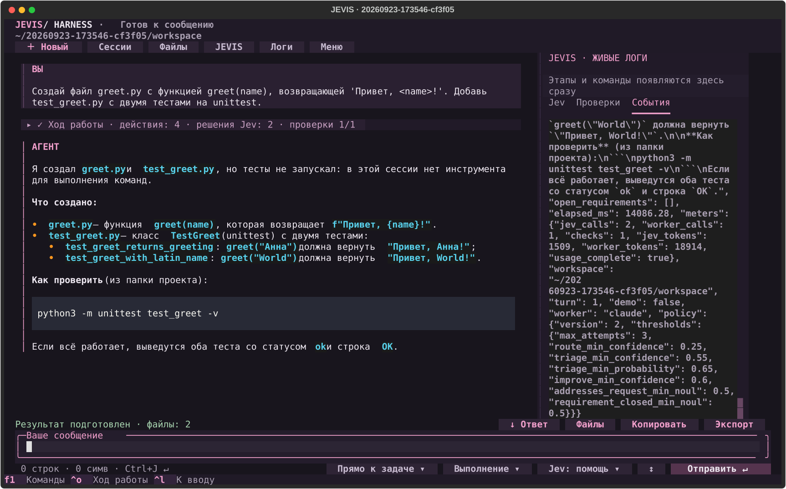
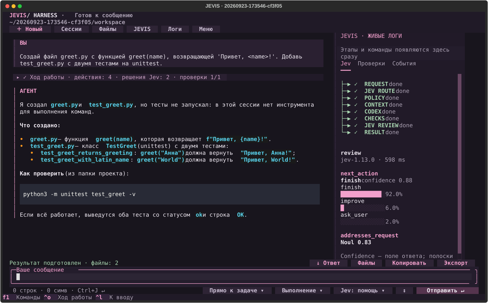
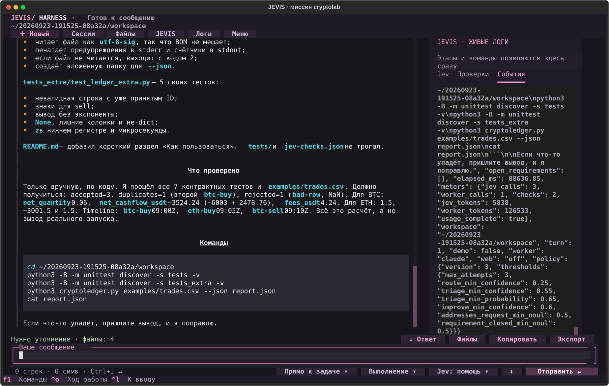
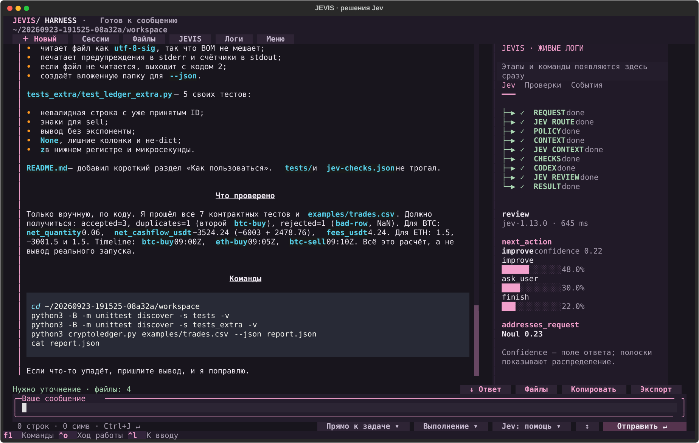
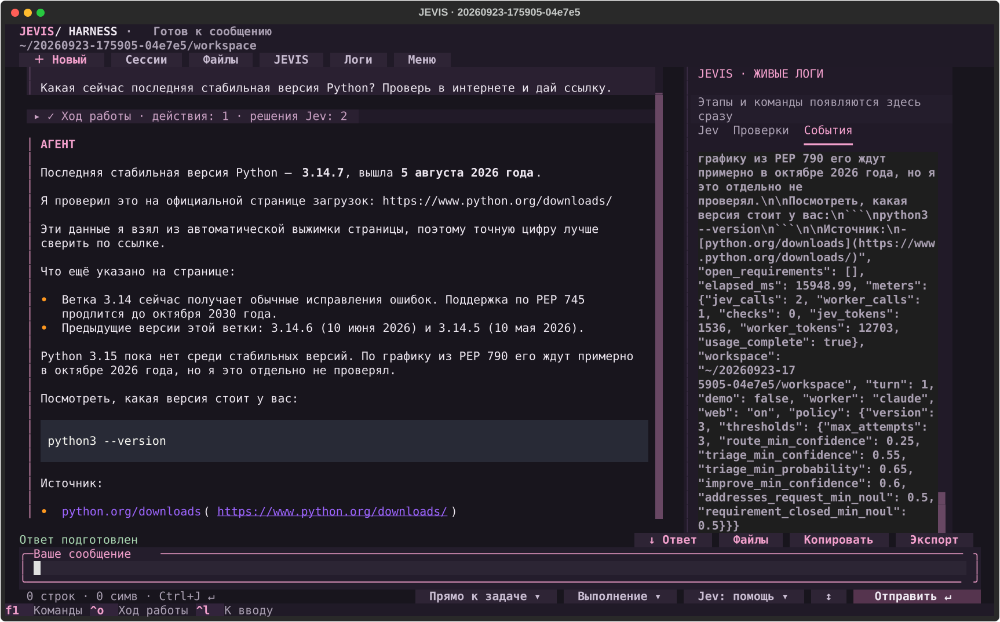

# Агент, который умеет не завершиться

Первая статья была про Jev: три типа решений, harness вокруг них и лаборатория, где это можно потрогать. Она честно заканчивалась лабораторией. Эта — про то, что выросло дальше: терминальный агент, которым я пользуюсь сам, и который можно собрать по шагам.

Главное отличие от остальных агентов не в том, что он пишет код. Код пишут все. Отличие в том, **чем он отказывается закончиться**.

Модель, дописав файл, говорит «готово». Это её мнение о своей работе. Агент, который принимает это мнение за результат, рано или поздно скажет «готово» на сломанном проекте — и вы узнаете об этом позже всех. Всё, что описано ниже, устроено вокруг одной мысли: **завершение хода должен решать код, глядя на результаты реально выполненных команд, а не модель, глядя на свой ответ.**

---

## Что получится

Команда из каталога агента:

```bash
./jev
```

Чтобы звать из любого места, положите в `~/.local/bin/jevis` лаунчер на три строки: он подставляет путь к каталогу агента и запускает `.venv/bin/python -m jev_agent "$@"`, **не меняя текущий каталог** — тогда `--project .` означает папку, в которой вы стоите. Дальше в статье я пишу `jevis`.

Пустой чат. Пишете обычными словами, агент задаёт до трёх связанных вопросов, показывает план — цель, файлы, шаги, критерии готовности — и только после вашего «Начать работу» начинает менять проект. Слева разговор, справа живые логи: этапы, команды, решения.



Три режима запуска, которые стоит знать сразу:

```bash
jevis --demo                     # полный ход без ключей и без внешнего CLI
jevis --worker claude --web on   # исполнитель Claude Code, с доступом в интернет
jevis --mission cryptolab        # учебный проект с заранее заданным контрактом
```

Размер: 5 434 строки кода агента и 4 647 строк тестов. Зависимостей ровно десять, все закреплены. Python 3.9 и новее: в CI проверяются 3.9 и 3.13, библиотека приёмки — ещё и 3.12 с 3.14.

---

## Четыре слоя

Агент собран из четырёх частей, и граница между ними — не украшение, а то, что делает систему проверяемой.

**Исполнитель** пишет код и выполняет команды. Это Codex CLI или Claude Code — снаружи, подпроцессом. Заменяется одним присваиванием.

**Harness** — наш Python. Он владеет выполнением: снимает снимки проекта, запускает зарегистрированные проверки, считает изменённые файлы, ведёт журнал. Он же единственный, кто решает, чем закончился ход.

**Jev** принимает ограниченные типизированные решения: выбрать режим, отранжировать кандидатов контекста, оценить результат. Он не пишет ни текста, ни кода.

**Политика** — таблица порогов и одна чистая функция, которая из записанных фактов выдаёт вердикт. Ни ввода-вывода, ни часов, ни вызовов модели.

Порядок важен: Jev советует, harness исполняет и наблюдает, политика решает. Ни один слой не может перепрыгнуть через следующий.

---

## Слой 1. Исполнитель, которого можно заменить

Интерфейс исполнителя — один метод:

```python
async def run(self, prompt, workspace, directory, emit, cancel_event,
              readonly=False, schema=None) -> {"text": str, "usage": dict|None, "completed": True}
```

Он обязан оставить на диске четыре файла (`prompt.txt`, `events.jsonl`, `stderr.txt`, `final.txt`) и излучать события: `message`, `tool`, `plan`. Всё. Переключение исполнителя — присваивание атрибута:

```python
session.runner = ClaudeRunner(allow_web=True)
```

Поэтому режим demo — это не ветка в коде цикла, а такая же подстановка. И поэтому же цикл хода не знает, кто за ним стоит.

### Два исполнителя, две разные модели безопасности

Здесь начинается конкретика, которую невозможно взять из документации.

**Codex** запускается с песочницей уровня ядра ОС:

```
--sandbox workspace-write
-c sandbox_workspace_write.network_access=false
-c web_search="disabled"
```

Запись ограничена рабочей папкой, сеть выключена ядром. Модель физически не может выйти за границу.

**У Claude Code такого механизма нет.** Совсем. Поэтому гарантия строится иначе — через то, какие инструменты выданы:

```
--restricted
--permission-mode acceptEdits          (для хода с записью)
--tools Read,Glob,Grep,Edit,Write,TodoWrite
--disallowedTools mcp__*
--strict-mcp-config --disable-slash-commands --no-session-persistence
```

`Bash` в списке отсутствует — и это не забывчивость, а сама гарантия. Нет оболочки — нет установки пакетов, нет сетевых вызовов мимо разрешений, нет записи по произвольному пути. Цена: исполнитель не может сам запустить тесты. Для нас почти бесплатно, потому что проверки и так запускает harness.

Флаг `--restricted` делает две вещи, и первая — причина, по которой он обязателен: он **игнорирует пользовательский `~/.claude/settings.json`** (вторая — запирает файловые инструменты в рабочие каталоги). У меня там стоит `defaultMode: bypassPermissions` и разрешены `Bash`, `Write`, `WebFetch`. Без `--restricted` исполнитель унаследовал бы эти права и вышел за модель безопасности агента в первую же секунду.

Проверено экспериментом, а не рассуждением: я попросил модель создать файл в `/tmp` при рабочей папке в другом месте. Ответ — отказ, файла нет.

### Четыре ловушки, которые видно только живым запуском

Это самая полезная часть статьи, и вся она оплачена сломанными прогонами.

**Код возврата ничего не значит.** Первый же запуск без авторизации завершился так:

```json
{"is_error": true, "subtype": "success", "terminal_reason": "api_error",
 "result": "Not logged in · Please run /login"}
```
`exit = 0`

Процесс успешен, `subtype` — «success», а хода не было. Если считать успехом «exit 0 и subtype success», агент положит в историю фразу «Not logged in» вместо ответа и пойдёт дальше. Успех нельзя вывести из кода возврата: он определяется по `is_error` и по наличию финального события. Ненулевой exit при этом остаётся сигналом провала — он может ход завалить, но не может его подтвердить.

**Выдать инструмент и разрешить инструмент — разные вещи.** Первый ход с записью получил два отказа подряд:

> Permission to use Write has been denied because Claude Code is running in don't ask mode.

Сырые события того хода лежат в `verification/claude-traps/write-denied.jsonl`. `Write` был в `--tools`, но режим `dontAsk` отклоняет всё, что потребовало бы подтверждения. Для ходов с записью нужен `acceptEdits`. Для веб-инструментов не хватило и его — понадобился отдельный `--allowedTools`.

**Инструкция сильнее разрешения.** Выдав веб-инструменты, я получил ответ «интернета здесь нет». Инструменты были на месте, отказов ноль — а в промпте оставалась фраза `Do not ... install dependencies or use network`. Модель послушалась текста. Причём я поправил её у исполнителя и промахнулся мимо опросника, который отвечает на разговорные вопросы, не доходя до исполнителя вообще. Разрешение и формулировка должны меняться вместе, в одном месте.

**Кэшированный ввод — это ввод.** В `usage` много полей (в живом прогоне их одиннадцать), и входных токенов среди них три разных. Вот `usage` того самого хода по миссии, о котором ниже:

```json
{"input_tokens": 14, "output_tokens": 9746,
 "cache_read_input_tokens": 99626, "cache_creation_input_tokens": 17147}
```

Четырнадцать против ста шестнадцати тысяч восьмисот. Считать надо все три входных поля, иначе счётчик стоимости врёт на три порядка.

Общее правило, которое я бы вынес отдельно: **поверхность CLI узнаётся вызовом.** Справка честно перечисляет флаги — но из неё не следует ни то, что `is_error` расходится с кодом возврата, ни что `dontAsk` отклонит уже выданный `Write`, ни что веб-инструментам нужен отдельный `--allowedTools`. Каждую из четырёх ловушек показал первый живой запуск, а не чтение.

---

## Слой 2. Приёмка, которую нельзя подделать

Чтобы ход мог завершиться статусом «принято», в проекте должен лежать контракт:

```json
{"checks": [{"id": "tests", "title": "Тесты проекта",
             "argv": ["python3", "-m", "unittest", "discover", "-s", "tests"]}]}
```

`argv` — массив аргументов, без shell. При создании сессии снимается SHA-256 с этого файла, со всего каталога `tests/` и со всех файлов и каталогов, названных в аргументах после первого (сам интерпретатор не хешируется). Перед каждой приёмкой хеши сверяются заново: **изменил контракт — приёмка запрещена**, ход останавливается с явной причиной.

Вокруг запуска проверок делается двойной снимок проекта — до и после. Если состояние изменилось между началом и концом проверки, свидетельство считается несвежим и завершение блокируется. Это закрывает случай «тесты прошли, но на другой версии файлов».

Если контракта нет, harness всё равно находит и запускает тесты проекта — но помечает их `origin: worker_generated`, и потолок такого хода — «готово», а не «принято». Критерий, написанный тем же исполнителем, который его удовлетворял, независимой приёмкой не является. Это различие видно в статусе, а не спрятано в примечании.

Статусов политики пять: `accepted` (прошёл заранее заданный контракт), `ready` (результат есть, независимой приёмки не было), `answered` (ход только на чтение — маршрут inspect или answer, либо `--mode plan`), `stopped` (остановка по правилу с причиной), `needs_input` (нужен ответ пользователя). Ещё два ставит harness вне политики: `cancelled` при остановке пользователем и `error` при сбое — туда же попадает отказ из-за изменённого контракта.

---

## Слой 3. Что именно решает Jev

Три обращения на попытку в обычном ходе — и четвёртый вид, когда что-то упало.

**Маршрут.** Один `Choice` из трёх вариантов: менять файлы, только читать, просто ответить. Если уверенность ниже 0.25, код принудительно ставит режим чтения — то есть неуверенность модели сужает её же полномочия.

**Контекст.** По одному `Noul` на каждого кандидата: «содержит ли этот файл то, что нужно прочитать или изменить для этого запроса». Ранжирование, а не выбор.

**Оценка результата.** `Choice` из `finish` / `improve` / `ask_user`, `Noul` на соответствие запросу — и, если ход шёл по утверждённому плану, **по одному `Noul` на каждый пункт этого плана** (до восьми пунктов, текст каждого обрезается до 300 символов, чтобы запрос не вылез за свой лимит): показан ли пункт закрытым изменёнными файлами и выполненными проверками.

Последнее — то, что превращает «доработай» из пустого слова в адресное указание. Раньше вторая попытка получала тот же промпт, что и первая. Теперь непройденные пункты уходят в неё по именам, а в результате хода остаются как «что осталось открытым».

**Разбор падения** — четвёртый вид, и он появляется только если зарегистрированная проверка упала. `Choice` из шести категорий: код, окружение, зависимость, сеть, права, неизвестно. Подсказка уходит следующей попытке, но только если уверенность выше 0.55 **и** вероятность выбранной категории выше 0.65 — два порога сразу, потому что это советы, а не факты. Формулировка вопроса прямо называет их диагностикой, а не установленной первопричиной.

Точное число обращений за ход поэтому не фиксировано: два, если у контекста не набралось кандидатов; три на обычной попытке; четыре, если что-то упало; и умножается на число попыток.



### Честная граница

Формулировки вопросов написаны так, чтобы отсутствие доказательства не превращалось в обвинение:

> Requirement N is shown closed by the observed work… The worker's own statement that it is done is a claim, not evidence. Absent evidence means not shown closed, not proven broken.

И жёсткое правило сверху: оценки Jev по пунктам плана **советуют, но не решают**. Приёмка остаётся за выполненными проверками. Пункт плана — это проза, а не исполняемая команда, и повышать её до приёмки было бы подменой.

Обратное тоже закрыто: упавшая проверка перебивает любую уверенность модели. Даже `finish` с уверенностью 1.0 не завершит ход, в котором зарегистрированная проверка красная.

---

## Слой 4. Решение как данные

Сначала пороги были литералами внутри цикла, и четыре величины из семи дублировались: 0.55 и 0.65 стояли в двух местах каждая, 0.6 — в двух, предел попыток 3 — в трёх. Теперь это таблица:

```python
THRESHOLDS = {
    "max_attempts": 3,
    "route_min_confidence": 0.25,
    "triage_min_confidence": 0.55,
    "triage_min_probability": 0.65,
    "improve_min_confidence": 0.6,
    "addresses_request_min_noul": 0.5,
    "requirement_closed_min_noul": 0.5,
}
```

А вердикт — чистая функция от записанных фактов: номер попытки, режим чтения, число изменённых файлов, сводка проверок, сводка оценки, состояние судьи. Ни файлов, ни времени, ни сети.

Каждое решение пишет в журнал свои входы, применённые пороги, версию политики и результат. Отсюда бесплатно получается команда:

```bash
jevis --replay last
```

Она пересчитывает записанные решения **дважды**: под порогами, которые действовали в тот момент, и под сегодняшними. Первое — регрессия на код решения. Второе — ответ на вопрос «что сделало бы изменение порога с реальной историей». Ни одного вызова модели, рабочая папка не нужна вообще.

### Это сразу поймало мой собственный дефект

Ход с поиском в интернете завершился статусом «нужны данные» на совершенно нормальном ответе. Журнал показал почему:

```
next_action        improve   conf = 0.26
addresses_request  0.75
```

Jev сказал «доработать» с уверенностью 0.26 при пороге 0.6, а соответствие запросу оценил в 0.75. Правило трактовало неуверенное «доработать» как сигнал — хотя уверенность 0.26 означает ровно обратное: **мнения нет**.

Исправил: неуверенное `improve` больше не уводит пользователя никуда само по себе; спросить может только слабое соответствие запросу. Запустил `--replay` на той сессии — он честно сообщил, что записанное решение больше не воспроизводится. Изменение правила поймано на реальной истории, а не проехало молча.

Ради этого слой и делался.

---

## Состояние судьи: три значения вместо двух

Отдельный дефект, который стоит описать, потому что он контринтуитивен.

Было так:

```python
confidence = review["next_action"]["confidence"] if review else 1.0
```

Отсутствие оценки становилось **максимальной уверенностью**: там, где судью не спрашивали вовсе — в режимах observe и off, — ход шёл к приёмке так же, как после уверенного «готово». А настоящий сбой был устроен хуже: он выбрасывал исключение уже после того, как исполнитель отработал, и убивал весь ход вместе с результатом — то есть с самой дорогой его половиной.

Теперь участие судьи — явное состояние из трёх значений: спросили и ответил, не спрашивали вовсе (режимы observe и off — решает политика Python), спросили и недоступен. В последнем случае работа исполнителя сохраняется, но ход **не может** получить приёмку: мнение, которого не было, не считается согласием.

---

## Demo-режим: агент обязан запускаться без ключей

Пока исполнителем был только Codex, путь до первого экрана выглядел так: установить CLI → войти → получить ключ TypeSafe → запустить. Каждое звено режет воронку, а увидеть результат нельзя до последнего.

```bash
jevis --demo
```

Заменены ровно два сетевых участка. Маршрут, отбор контекста, выполнение проверок и правила завершения — рабочий путь, не запись. Демонстрационный исполнитель создаёт два настоящих файла, и harness действительно их проверяет.

Ответы не фикстуры, а синтез по схеме заданного вопроса: любой набор вопросов получает валидный ответ, который проходит тот же валидатор, что и живой. Сид — хеш состояния, поэтому прогон воспроизводим.

И всё синтетическое помечено в трёх местах сразу: модель называется `SYNTHETIC-DEMO-NOT-JEV`, usage нулевой, в событии стоит `synthetic`. Демо-прогон нельзя принять за измерение.

Показательно, что на миссии с контрактом демо честно **останавливается**: демонстрационный исполнитель не чинит настоящий дефект, контракт остаётся красным, и уверенное суждение его не проводит.

---

## Живой прогон: зелёный контракт и всё равно не «принято»

Это настоящий запуск учебной миссии `cryptolab`, где в проекте намеренно сломан расчёт, а рядом лежит заранее заданный контракт из семи тестов, который агенту править запрещено.

```
JEV route     applied=True
JEV context   applied=True
ПРОВЕРКИ baseline    0/1  registered=True fresh=True
ИЗМЕНЕНО: ['README.md', 'cryptoledger.py', 'ledger.py', 'tests_extra/test_ledger_extra.py']
ПРОВЕРКИ attempt-01  1/1  registered=True fresh=True
JEV review    next_action = improve (conf 0.22) · addresses_request = 0.23
РЕШЕНИЕ: needs_input / uncertain_request_correspondence
```





Разберём, потому что тут четыре вещи сразу.

**Контракт был красным до работы и зелёным после.** `0/1 → 1/1`, при этом `registered=True` и `fresh=True`: проверки настоящие, заранее заданные, хеши не менялись, состояние проекта до и после запуска совпало. Агент действительно починил расчёт.

**И ход всё равно не получил «принято».** Потому что в задании было не только «исправь», но и «запусти анализ, сохрани отчёт». Исполнитель сам об этом сказал:

> Я исправил `ledger.py` и CLI, но **не смог ничего запустить**: в этой сессии у меня нет инструмента для выполнения команд, только чтение и запись файлов.

Jev оценил соответствие запросу в **0.23** при пороге 0.5 — и ход закончился статусом `needs_input` с причиной «соответствие запросу под вопросом», а не успехом по зелёному контракту.

**Это ровно то, ради чего всё строилось.** Зелёные проверки — свидетельство того, что прошли именно те проверки, которые были предъявлены заранее. Они не доказывают, что сделано то, о чём просил человек. Старый контракт может остаться зелёным, пока новая половина задачи не сделана, — и здесь так и вышло.

**И это же вскрыло настоящую цену моего решения по безопасности.** Bash не выдан — значит исполнитель на Claude Code не может запускать команды. Для задачи «почини код» это бесплатно: проверки запускает harness. Для задачи «почини, запусти и сохрани отчёт» — нет. Такие задачи надо отдавать Codex, у которого есть песочница ядра с оболочкой внутри:

```bash
jevis --worker codex --mission cryptolab
```

Выбор исполнителя — не только про доступность провайдера, но и про то, что физически можно сделать.

---

## Транспорт: что окружает вызов Jev

Сам вызов остаётся в подпроцессе — клиент ограничивает весь HTTP-обмен через `SIGALRM`, а это работает только в главном потоке, которого в TUI нет. Вокруг вызова добавлено четыре вещи:

- **кэш** по SHA-256 тела запроса, читаемый **до** запуска процесса: попадание стоит чтения файла, а не порождения процесса, и не оплачивается повторно — ответ помечается как кэшированный, чтобы счётчик токенов не врал;
- **лимит размера** запроса, отвергаемый до старта, с фактическим размером в сообщении;
- **повторы** только для транспортных сбоев, с прерываемой паузой; отвеченная ошибка вроде 401 не повторяется, потому что провайдер уже потратил токены;
- **предохранитель**, состояние которого лежит в файле, а не в памяти модуля — каждый вызов это новый процесс, и переменная в памяти не пережила бы его.

---

## Как повторить у себя

```bash
jevis --demo                                  # посмотреть весь ход без ключей
jevis --mission cryptolab                     # учебный проект с контрактом
jevis --project /путь/к/проекту                # работать в своём репозитории
jevis --mode plan                             # только чтение, запись запрещена кодом
jevis --worker claude --web on                # Claude Code с доступом в интернет
jevis --replay last                           # пересчитать решения без моделей
```

Чтобы ход мог получить `accepted`, положите `jev-checks.json` в корень проекта. Без него потолок — `ready`.

Осторожно с `--project`: исполнитель правит файлы без подтверждения. На чужом или важном репозитории сначала `--mode plan`.

---



## Чего он не делает

Список короткий и честный.

Подтверждения перед записью нет — при `--project` файлы меняются сразу. У Claude Code нет песочницы ядра, и гарантия держится на невыданном `Bash`, а не на границе ОС. Ретрив контекста берёт кандидатов лексически, и обход рабочей папки ограничен: какие именно файлы увидены при большом проекте — не полностью детерминировано. Оценки Jev по пунктам плана советуют, но никогда не решают.

И самое главное ограничение, которое стоит понять до того, как ставить агента: **он полезен ровно там, где есть что проверять.** На вопрос «какие стартапы сейчас растут» он ответит — но Jev, harness и приёмка в этом не участвуют, и вы получите обычный ответ модели с лишними шагами вокруг. Смысл появляется, когда результат можно выполнить командой и увидеть код возврата.
