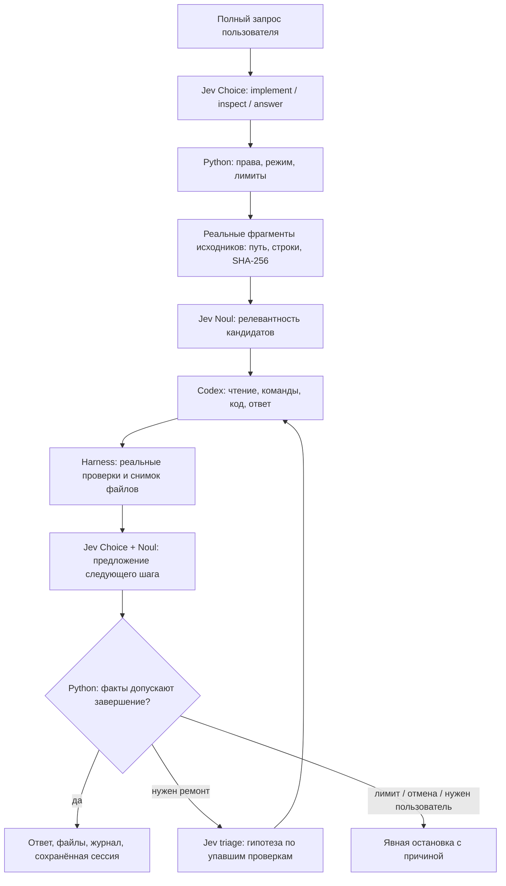

# Jev + harness: агент, которому пишешь в терминале

Результат этой сборки — запускаемый чат. Вводишь задачу, видишь реальные команды,
открываешь созданные файлы и продолжаешь разговор. Jev принимает ограниченные
решения, Codex пишет код и ответы, Python запускает проверки и управляет циклом.
Эти три роли видны в журнале отдельно.

```bash
cd terminal-agent
./setup.sh
./jev
```

Для Jev нужен ключ TypeSafe, для исполнителя — авторизованный Codex CLI.
Настройка без записи ключа в shell history описана в [README](./README.md).
Проверить установку можно командой `./jev --doctor`: она не вызывает модели.

После запуска агент ждёт твоего сообщения. **Enter** или кнопка **«Отправить»**
отправляет весь текст; **Ctrl+J** добавляет строку. Shift+Enter также добавляет строку,
если его поддерживает терминал. **Ctrl+D** остаётся дополнительным способом отправки.
Кнопка **«↕»** или **F4** раскрывает большой редактор. Вставленный текст виден целиком,
сохраняет абзацы и ничего не отправляет автоматически.


## Первое дело: исправить учёт крипто-сделок

```bash
./jev --mission cryptolab
```

Нажми **«Вставить пример задачи»** или **F2**: появится редактируемое задание. После **Enter**
агент начнёт исправлять отдельную копию Crypto Ledger. Это небольшой CSV-инструмент
на Python, который должен учитывать комиссии, дубли trade_id, временные зоны и
точную десятичную арифметику. Данные синтетические, внешних запросов к биржам нет.

В исходной копии проходит один из семи заранее написанных тестов. Остальные
обнаруживают реальные дефекты: ошибка float, потерянные комиссии, неверный порядок
времени, дубли и отсутствие валидации. Хеши tests/ и конфигурации фиксируются до
работы worker. Если он изменит их вместо исправления программы, harness остановит
приёмку.

Цель — получить `report.json`, исполняемый CLI и повторяемую команду запуска.
`net_cashflow_usdt` означает денежный поток с комиссиями; это не PnL и не совет
торговать. Такое точное определение результата позволяет написать проверяемый
контракт до обращения к модели.

## Что происходит после отправки



Диаграмма описывает обычный путь `auto + assist`; отсутствие подходящих файлов,
разговорный запрос или ошибка API меняют его. Интерфейс рисует только наблюдаемые
этапы. Для беседы проверки кода не выдумываются. Triage вызывается после реального
провала проверок, а не для украшения графа.

Jev **не сочиняет код и текст ответа**. Пример его контракта в нашем Python-коде:

```python
questions = {
    "next_action": {
        "type": "choice",
        "instructions": "Use observed results. A worker's claim is not independent proof. Python determines acceptance.",
        "criteria": {
            "finish": "The request is addressed; observed evidence permits completion.",
            "improve": "A concrete repair is still needed.",
            "ask_user": "A user decision or missing information is required."
        }
    },
    "addresses_request": {
        "type": "noul",
        "instructions": "Does the observed result address the current request?"
    }
}
```

Это сокращённая иллюстрация формата. Полные инструкции находятся в
[`core.py`](./jev_agent/core.py); запросы и ответы каждого живого вызова сохраняются
в `turn-NNN/jev-NN/`. Значение Noul и confidence — ответы модели. Они не превращают
упавшую команду в прошедшую проверку.

## Зачем Jev читать исходники

В первой версии Jev видел преимущественно запрос, имена файлов и итог worker.
Теперь программа сначала ищет настоящие фрагменты, а уже затем просит Jev оценить
их релевантность. Модель не может добавить выдуманный файл в эту подборку.

Поиск ограничен: до 512 подходящих файлов, 4 МиБ чтения, пять кандидатов, до трёх
фрагментов для worker. Каждый кандидат содержит путь, номера строк и хеш целого
прочитанного файла. Ключи, скрытые и служебные папки, бинарные файлы и symlink
исключаются. Поиск понимает буквальные Unicode-токены, в том числе кириллицу;
переводить русский запрос в английские имена функций он пока не умеет.

Если Noul-ранжирование недоступно, приложение явно использует лексический порядок.
Пустая подборка остаётся пустой. Подсказка из нескольких файлов не является полным
аудитом репозитория: worker может читать другие разрешённые файлы самостоятельно.

## Логи, которые можно проверить

Управление видно сразу: **«Новый»**, **«Сессии»**, **«Файлы»**, **«Jev»**, **«Логи»** и
**«Меню»** находятся над разговором. Рядом с редактором выбираются режим исполнения
и роль Jev. Во время работы появляется **«Стоп»**.

Команды, решения и проверки одного хода собраны под заголовком **«Ход работы»**.
Пока идёт выполнение, группа раскрыта. После успешного завершения она сворачивается,
а итог остаётся отдельным ответом. Клик или **Ctrl+O** снова раскрывает последнюю
группу; при ошибке или отмене подробности остаются открытыми.

Один tool call — одна раскрываемая карточка. События старта, обновления и завершения
сопоставляются по ID, а повтор одной команды в следующей попытке остаётся отдельным
вызовом. Ошибка и exit code видны без раскрытия; под заголовком — число строк и начало
вывода. В подробностях сохраняется исходная команда. Внутреннее мышление модели не
добавляется; показываются сообщения и события, которые действительно прислал CLI.


**«Jev»** или **F6** открывает решения Jev, граф этапов и проверки. **«Логи»** или **F3** — журнал событий;
длинные записи на экране сокращаются, полный JSONL сохраняется на диске.
**«Файлы»** позволяет открыть текст результата и сохранённый diff. Diff ограничен
размером и сохраняется во время попытки; если исходного текста нет, приложение
сообщает об этом вместо реконструкции вымышленного изменения.

У результата есть кнопки **«↓ Ответ»**, **«Файлы»**, **«Копировать»** и **«Экспорт»**.
Копирование зависит от поддержки буфера терминалом; экспорт сохраняет Markdown
с перепиской, проверками и событиями в папку сессии.


**«Сессии»** открывает поиск по сохранённым разговорам, а **«Новый»** создаёт отдельный
чат с новой рабочей папкой. Черновик переживает выход и смену сессии.
Для продолжения из shell:

```bash
./jev --resume last
./jev --list
./jev --resume last --export
```

## Проверить, что именно делает Jev

Режимы исполнения и Jev доступны кнопками у редактора, а также через **«Меню»** или
**F1**. Их можно менять между ходами:

- `/mode plan` — worker получает только чтение; harness не запускает команды
  проверок, которые сами могут создавать файлы. `/mode auto` возвращает выполнение.
- `/jev assist` — решения Jev применяются с ограничениями Python.
- `/jev observe` — Jev вызывается, ответы видны, но не управляют выбором.
- `/jev off` — вызовов Jev нет; действует явно заданная политика Python и реальные
  проверки. Ключ TypeSafe для этого режима не нужен.

Observe и off сами по себе не означают только чтение: это отдельная настройка
`plan`. Режимы помогают исследовать вклад Jev, но один удачный запуск не доказывает,
что он ускоряет или улучшает любые задачи. Для такого вывода нужны одинаковые
контракты, сопоставимые проекты и несколько повторов.

## Что мы взяли из других агентов

Из Pi — события и обновляемые карточки инструментов; из PiJev — подбор контекста,
типизированную диагностику и assist/observe/off; из OpenCode — удобный доступ к
командам, сессиям и деталям. Crush послужил визуальным референсом. Реализация на
Python/Textual написана для нашего harness; это не заявление, что весь код четырёх
проектов перенесён в маленький репозиторий.

В [исследовании исходников](./research/upstream-audit.md) закреплены версии и
показаны конкретные пути в коде. [Происхождение и лицензии](./research/ATTRIBUTION.md)
сохранены отдельно. [Протокол проверок v2](./verification/v2/README.md) содержит
тесты нашего агента, реальные вызовы и результаты Crypto Ledger. По нему можно
отделить исследовательскую идею, автоматический тест и фактически выполненную
работу агента.

Розовая тема, навигация кнопками и сворачиваемый ход работы — обновление интерфейса
того же агента. [Отдельный протокол](./verification/ui-pink/README.md) описывает
проверку нового управления и снимки экранов. Показ прежней живой сессии в новом
оформлении не выдаётся за новый прогон моделей.
