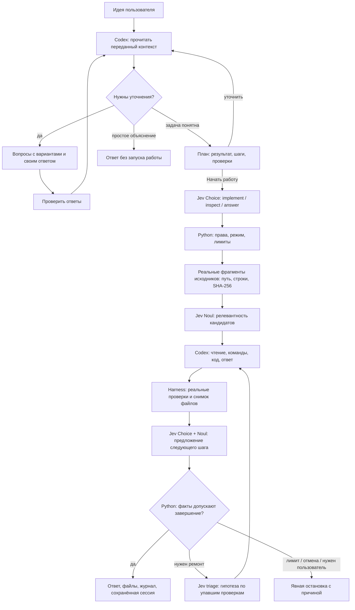

# Jev + harness: агент, которому пишешь в терминале

Результат этой сборки — запускаемый агент, которому не обязательно приносить
готовое техническое задание. Пишешь идею, отвечаешь на несколько полезных вопросов,
получаешь план и запускаешь работу. Потом открываешь созданные файлы, проверяешь
команды и продолжаешь разговор. Jev принимает ограниченные решения, Codex пишет
вопросы, план, код и ответы, Python управляет переходами и проверками.

```bash
cd terminal-agent
./setup.sh
./jev
```

Для Jev нужен ключ TypeSafe, для исполнителя — авторизованный Codex CLI.
Настройка без записи ключа в shell history описана в [README](./README.md).
Проверить установку можно командой `./jev --doctor`: она не вызывает модели.

После запуска агент ждёт твоего сообщения. **Enter** или кнопка **«Обсудить»**
отправляет весь текст; **Ctrl+J** добавляет строку. Shift+Enter также добавляет строку,
если его поддерживает терминал. **Ctrl+D** остаётся дополнительным способом отправки.
Кнопка **«↕»** или **F4** раскрывает большой редактор. Вставленный текст виден целиком,
сохраняет абзацы и ничего не отправляет автоматически.

## Можно начать с одной фразы

Например:

```text
Хочу что-нибудь полезное про крипту, чтобы потом пользоваться самому.
```

По этой фразе нельзя честно угадать нужный продукт: это может быть объяснение,
отчёт по сделкам или инструмент для обработки CSV. Поэтому первый шаг — уточнить
результат. Агент предлагает варианты с короткими объяснениями; можно выбрать
вариант или написать собственный ответ. В одной форме от одного до трёх вопросов.
Информация из проекта и прошлых ответов передаётся планировщику, чтобы не начинать
каждую реплику с нуля.


После вопросов есть экран проверки ответов. Можно вернуться и поменять выбор.
Выделенная рекомендация сама по себе не считается ответом; Escape сохраняет
черновик и возвращает к разговору. Продолжить можно через **«Задача»**, **F5**,
`/brief` или `/plan`.

Когда результат понятен, появляется план: что получишь, какие шаги предстоят,
как проверим работу и какие предположения остаются. Во вкладке **«Запрос агенту»**
виден точный текст, который уйдёт исполнителю. Нажми **«Уточнить»** и напиши,
например, «хочу HTML-отчёт вместо Markdown», — агент подготовит новую версию.
**«Начать работу»** запускает именно просмотренную версию плана.


Это отдельный этап harness: Codex возвращает структурированный JSON с вопросами,
планом или простым ответом; Python проверяет формат и сохраняет состояние.
Планировщику доступны только переданный контекст и режим чтения. На этом этапе
Jev не вызывается, файлы проекта не меняются, а будущие проверки не выдаются за
уже прошедшие тесты. Незавершённый опрос переживает перезапуск без запуска работы.

Опрос нужен не всегда. На «объясни, что такое комиссия» агент может ответить сразу.
Подробное задание может сразу стать планом. Для прямого выполнения есть явные
`./jev --direct` и `/direct`; `/guided` возвращает обсуждение перед работой.

## Первое дело: исправить учёт крипто-сделок

```bash
./jev --mission cryptolab
```

Нажми **«Вставить пример задачи»** или **F2**: появится редактируемое задание. **Enter**
отправляет его на обсуждение. У этой миссии уже есть ясный результат и контракт,
поэтому планировщик может сразу показать план. После **«Начать работу»** агент
начнёт исправлять отдельную копию Crypto Ledger. Это небольшой CSV-инструмент
на Python, который должен учитывать комиссии, дубли trade_id, временные зоны и
точную десятичную арифметику. Данные синтетические, внешних запросов к биржам нет.

В исходной копии проходит один из семи заранее написанных тестов. Остальные
обнаруживают реальные дефекты: ошибка float, потерянные комиссии, неверный порядок
времени, дубли и отсутствие валидации. Хеши tests/ и конфигурации фиксируются до
работы worker. Если он изменит их вместо исправления программы, harness остановит
приёмку.

Цель — получить `report.json`, исполняемый CLI и повторяемую команду запуска.
`net_cashflow_usdt` означает денежный поток с комиссиями; это не PnL и не совет
торговать. Такое точное определение результата позволяет написать проверяемый
контракт до обращения к модели.

## Что происходит после отправки



Диаграмма описывает обсуждение и последующее исполнение в `auto + assist`.
В прямом режиме запрос сразу попадает в исполнительный цикл. Отсутствие
подходящих файлов или ошибка API меняют путь. Интерфейс рисует только наблюдаемые
этапы. Triage вызывается после реального провала проверок.

План не подменяет проверяемый контракт. Его критерии передаются Codex как задание;
заранее зарегистрированные проверки harness остаются отдельным источником фактов.
План, версия и ответы лежат в `brief.json`; подготовка — в `intake/round-NNN/`,
исполнение — в `turn-NNN/`. Можно проследить переход от исходной фразы до точного
запроса и результата. Если после подготовки изменился проект, старый план нельзя
незаметно исполнить: приложение попросит обновить его.

Jev **не сочиняет код и текст ответа**. Пример его контракта в нашем Python-коде:

```python
questions = {
    "next_action": {
        "type": "choice",
        "instructions": "Use observed results. A worker's claim is not independent proof. Python determines acceptance.",
        "criteria": {
            "finish": "The request is addressed; observed evidence permits completion.",
            "improve": "A concrete repair is still needed.",
            "ask_user": "A user decision or missing information is required."
        }
    },
    "addresses_request": {
        "type": "noul",
        "instructions": "Does the observed result address the current request?"
    }
}
```

Это сокращённая иллюстрация формата. Полные инструкции находятся в
[`core.py`](./jev_agent/core.py); запросы и ответы каждого живого вызова сохраняются
в `turn-NNN/jev-NN/`. Значение Noul и confidence — ответы модели. Они не превращают
упавшую команду в прошедшую проверку.

## Зачем Jev читать исходники

В первой версии Jev видел преимущественно запрос, имена файлов и итог worker.
Теперь программа сначала ищет настоящие фрагменты, а уже затем просит Jev оценить
их релевантность. Модель не может добавить выдуманный файл в эту подборку.

Поиск ограничен: до 512 подходящих файлов, 4 МиБ чтения, пять кандидатов, до трёх
фрагментов для worker. Каждый кандидат содержит путь, номера строк и хеш целого
прочитанного файла. Ключи, скрытые и служебные папки, бинарные файлы и symlink
исключаются. Поиск понимает буквальные Unicode-токены, в том числе кириллицу;
переводить русский запрос в английские имена функций он пока не умеет.

Если Noul-ранжирование недоступно, приложение явно использует лексический порядок.
Пустая подборка остаётся пустой. Подсказка из нескольких файлов не является полным
аудитом репозитория: worker может читать другие разрешённые файлы самостоятельно.

## Логи, которые можно проверить

Главное место занимает разговор. Компактная строка навигации открывает задачу,
сессии, файлы, детали Jev и меню. У редактора есть одно действие по текущему этапу:
обсудить запрос, отправить уточнение или остановить работу. Режим исполнения и
роль Jev доступны через элементы управления и поиск команд.

Команды, решения и проверки одного хода собраны под заголовком **«Ход работы»**.
Пока идёт выполнение, группа раскрыта. После успешного завершения она сворачивается,
а итог остаётся отдельным ответом. Клик или **Ctrl+O** снова раскрывает последнюю
группу; при ошибке или отмене подробности остаются открытыми.

Один tool call — одна раскрываемая карточка. События старта, обновления и завершения
сопоставляются по ID, а повтор одной команды в следующей попытке остаётся отдельным
вызовом. Ошибка и exit code видны без раскрытия; под заголовком — число строк и начало
вывода. В подробностях сохраняется исходная команда. Внутреннее мышление модели не
добавляется; показываются сообщения и события, которые действительно прислал CLI.

**«Jev»** или **F6** открывает решения Jev, граф этапов и проверки. **«Логи»** или **F3** — журнал событий;
длинные записи на экране сокращаются, полный JSONL сохраняется на диске.
**«Файлы»** позволяет открыть текст результата и сохранённый diff. Diff ограничен
размером и сохраняется во время попытки; если исходного текста нет, приложение
сообщает об этом вместо реконструкции вымышленного изменения.

У результата есть кнопки **«↓ Ответ»**, **«Файлы»**, **«Копировать»** и **«Экспорт»**.
Копирование зависит от поддержки буфера терминалом; экспорт сохраняет Markdown
с перепиской, проверками и событиями в папку сессии.


**«Сессии»** открывает поиск по сохранённым разговорам, а **«Новый»** создаёт отдельный
чат с новой рабочей папкой. Черновик переживает выход и смену сессии.
Для продолжения из shell:

```bash
./jev --resume last
./jev --list
./jev --resume last --export
```

## Проверить, что именно делает Jev

Режимы исполнения и Jev доступны кнопками у редактора, а также через **«Меню»** или
**F1**. Их можно менять между ходами:

- `/guided` — вопросы и план перед работой; `/direct` — прямое выполнение
  следующих запросов. Переключение само ничего не запускает.
- `/brief` или `/plan` — открыть вопросы и текущий план. Это просмотр задачи,
  а не изменение прав исполнения.
- `/mode plan` — worker получает только чтение; harness не запускает команды
  проверок, которые сами могут создавать файлы. `/mode auto` разрешает исполнение
  принятого плана.
- `/jev assist` — решения Jev применяются с ограничениями Python.
- `/jev observe` — Jev вызывается, ответы видны, но не управляют выбором.
- `/jev off` — вызовов Jev нет; действует явно заданная политика Python и реальные
  проверки. Ключ TypeSafe для этого режима не нужен.

Observe и off сами по себе не означают только чтение: это отдельная настройка
`plan`. Режимы помогают исследовать вклад Jev, но один удачный запуск не доказывает,
что он ускоряет или улучшает любые задачи. Для такого вывода нужны одинаковые
контракты, сопоставимые проекты и несколько повторов.

## Что мы взяли из других агентов

Здесь есть конкретный перенос исходников:

- Из **OpenCode** адаптированы переходы состояния опроса: выбор, свой ответ,
  возврат, проверка ответов и смена запроса. Наш вариант всегда показывает
  проверку ответов перед составлением плана.
- Из **Hermes** адаптированы функции, которые добавляют отметку рекомендации для
  показа и сохраняют чистое значение выбранного ответа.
- Из открытого **Codex** адаптированы инструкции планирования: сначала факты
  проекта, затем важные решения пользователя, затем цель и проверяемый результат.

Оригинальные файлы с закреплёнными коммитами и лицензиями сохранены в `vendor/`.
Runtime использует небольшие адаптации в Python и собственный интерфейс Textual.
Это позволяет проверить, что было взято и что изменено.

Из Pi и PiJev взяты архитектурные и интерфейсные подходы: события, карточки
инструментов, подбор контекста, типизированная диагностика и assist/observe/off.
Crush остаётся визуальным референсом без переноса кода. Claude Code изучен по
официальной документации и инженерному описанию вопросов; его закрытый интерфейс
не выдаётся за полученный исходный код.

[Разбор взаимодействия](./research/interaction-intake.md) показывает проблемы
предыдущего интерфейса и выбранные решения. Исходники и границы переноса описаны
в [атрибуции](./research/ATTRIBUTION.md), отдельно разобраны
[Hermes](./research/hermes-intake.md) и [Codex](./research/codex-intake.md).

[Протокол нового процесса](./verification/guided/README.md) отделяет тесты
интерфейса от фактических вызовов моделей. Исторические
[проверки v2](./verification/v2/README.md) и [первой розовой версии](./verification/ui-pink/README.md)
сохранены отдельно. Скриншот прежней сессии в новой оболочке не означает, что
модели заново выполнили работу.
