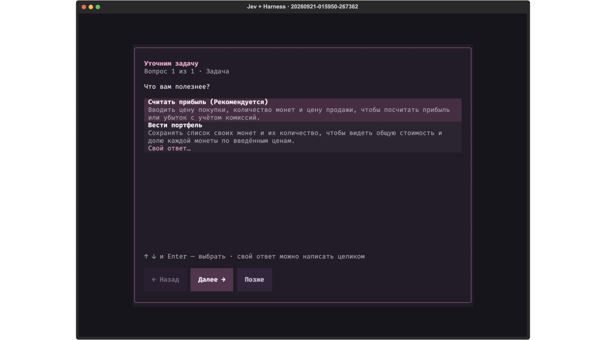
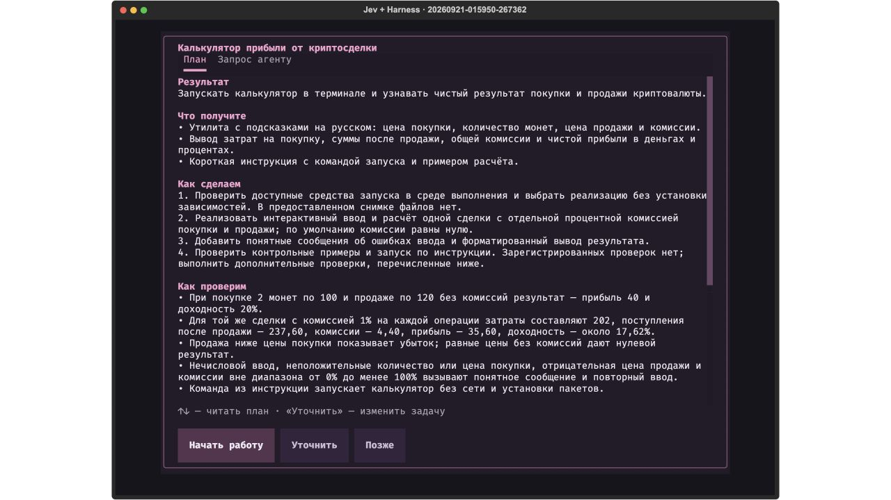
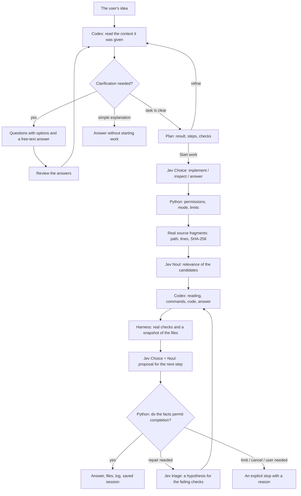
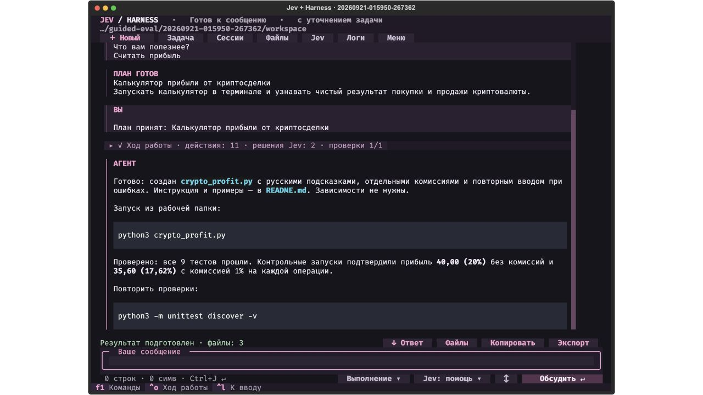

# Jev + harness: the agent you write to in the terminal

What this build produces is a runnable agent that does not need a finished
specification handed to it. You write an idea, answer a few useful questions,
get a plan and start the work. Then you open the files it created, check the
commands and carry on the conversation. Jev makes bounded decisions, Codex writes
the questions, the plan, the code and the answers, and Python governs the
transitions and the checks.

```bash
cd terminal-agent
./setup.sh
./jev
```

Jev needs a TypeSafe key, and the worker needs an authorised Codex CLI.
Setting that up without writing the key into your shell history is described in the [README](./README.md).
You can check the installation with `./jev --doctor`: it calls no models.

After it starts, the agent waits for your message. **Enter** or the **Discuss**
button sends the whole text; **Ctrl+J** adds a line. Shift+Enter also adds a line
if the terminal supports it. **Ctrl+D** remains an additional way to send.
The **↕** button or **F4** opens the large editor. Pasted text is visible in full,
keeps its paragraphs and sends nothing automatically.

## You can start with a single sentence

For example:

```text
Хочу что-нибудь полезное про крипту, чтобы запустить прямо в терминале.
```

("I want something useful about crypto, to run right in the terminal.") This run was
done in Russian, so the recorded request, the saved session artefacts and the
screenshots below are in Russian; the interface has since been translated, so the
button names quoted in this article are the English ones the application shows now.

That sentence is not enough to tell which product you actually want: it could be an
explanation, a report on trades or a tool for processing CSV. So the first step is
to settle the result. The agent offers options with short explanations; you can pick
an option or write your own answer. One form holds between one and three questions.
Information from the project and from earlier answers is passed to the planner, so that
no message has to start from nothing.



After the questions there is a review screen for your answers. You can go back and
change a choice. A highlighted recommendation is not an answer by itself; Escape saves
the draft and returns you to the conversation. You can carry on through **Task**, **F5**,
`/brief` or `/plan`.

Once the result is clear, a plan appears: what you will get, which steps are coming,
how the work will be checked and which assumptions remain. The **Agent request** tab
shows the exact text that will go to the worker. Press **Refine** and write,
for example, "I want an HTML report instead of Markdown", and the agent prepares a new version.
**Start work** runs exactly the version you reviewed.



This is a separate stage of the harness: Codex returns structured JSON with questions,
a plan or a plain answer; Python validates the format and saves the state.
The planner has access only to the context it was given, and only in read mode. At this stage
Jev is not called, project files are not changed, and future checks are not presented as
tests that have already passed. An unfinished round of questions survives a restart without starting work.

The questions are not always needed. Asked to "explain what a fee is", the agent can answer straight away.
A detailed task can become a plan at once. For direct execution there are the explicit
`./jev --direct` and `/direct`; `/guided` brings back the discussion before the work.

## The first job: fix the accounting of crypto trades

```bash
./jev --mission cryptolab
```

Press **Insert an example task** or **F2**: an editable task appears. **Enter**
sends it for discussion. This mission already has a clear result and a contract,
so the planner can show a plan immediately. After **Start work** the agent
starts repairing its own copy of Crypto Ledger. This is a small Python CSV tool
that has to account for fees, duplicate trade_id values, time zones and
exact decimal arithmetic. The data is synthetic, and there are no external requests to exchanges.

In the starting copy one of the seven prewritten tests passes. The rest
find real defects: a float error, lost fees, the wrong ordering by
time, duplicates and missing validation. The hashes of tests/ and of the configuration are recorded before
the worker runs. If it changes them instead of repairing the program, the harness stops
acceptance.

The goal is to get `report.json`, a runnable CLI and a repeatable command to run it.
`net_cashflow_usdt` means cash flow including fees; it is not PnL and not advice to
trade. Defining the result that precisely is what lets you write a verifiable
contract before any call to a model.

## What happens after you send



The diagram describes the discussion and the execution that follows it in `auto + assist`.
In direct mode the request goes straight into the execution loop. Missing suitable
files or an API error changes the path. The interface draws only the stages that can be
observed. Triage is called after a real failure of the checks.

The plan does not replace the verifiable contract. Its criteria are passed to Codex as the task;
the checks registered with the harness in advance remain a separate source of facts.
The plan, its version and the answers sit in `brief.json`; the preparation is in `intake/round-NNN/`,
the execution in `turn-NNN/`. You can follow the path from the original sentence to the exact
request and the result. If the project changed after the preparation, an old plan cannot be
executed unnoticed: the application asks you to update it.

Jev **does not write code or the text of the answer**. An example of its contract in our Python code:

```python
questions = {
    "next_action": {
        "type": "choice",
        "instructions": "Use observed results. A worker's claim is not independent proof. Python determines acceptance.",
        "criteria": {
            "finish": "The request is addressed; observed evidence permits completion.",
            "improve": "A concrete repair is still needed.",
            "ask_user": "A user decision or missing information is required."
        }
    },
    "addresses_request": {
        "type": "noul",
        "instructions": "Does the observed result address the current request?"
    }
}
```

This is a shortened illustration of the format. The full instructions are in
[`core.py`](./jev_agent/core.py); the request and the answer of every live call are saved
in `turn-NNN/jev-NN/`. A Noul value and a confidence are answers from the model. They do not turn
a failed command into a passing check.

## Why Jev reads the source files

In the first version Jev mostly saw the request, the file names and the worker's result.
Now the program first searches for real fragments, and only then asks Jev to judge
how relevant they are. The model cannot add an invented file to that selection.

The search is bounded: up to 512 eligible files, 4 MiB of reading, five candidates, up to three
fragments for the worker. Every candidate carries the path, the line numbers and a hash of the whole
file that was read. Keys, hidden and service directories, binary files and symlinks are
excluded. The search understands literal Unicode tokens, including Cyrillic;
it cannot yet translate a Russian query into English function names.

If Noul ranking is unavailable, the application falls back explicitly to lexical order.
An empty selection stays empty. A hint made of a few files is not a full
audit of the repository: the worker can read other permitted files on its own.

## Logs you can check

The conversation takes the main space. A compact navigation row opens the task, the
sessions, the files, the Jev details and the menu. The editor has one action for the current stage:
discuss the request, send a clarification or stop the work. The execution mode and
Jev's role are available through the controls and through the command search.

The commands, decisions and checks of one turn are collected under the **Activity** heading.
While execution is running, the group is expanded. After a successful finish it collapses,
and the result stays as a separate answer. A click or **Ctrl+O** expands the last
group again; on an error or a cancellation the details stay open.

One tool call, one expandable card. The start, update and finish events are
matched by ID, and repeating the same command in the next attempt stays a separate
call. The error and the exit code are visible without expanding; under the heading are the number of lines and
the start of the output. The details keep the original command. The model's internal reasoning is not
added; what is shown is the messages and events the CLI actually sent.

**JEVIS** or **F6** opens Jev's decisions, the graph of stages and the checks. **Logs** or **F3** opens the event log;
long entries are shortened on screen, and the full JSONL is saved to disk.
**Files** lets you open the text of the result and the saved diff. The diff is limited in
size and is saved during the attempt; if the original text is missing, the application
says so instead of reconstructing an imaginary change.

The result has the buttons **↓ Answer**, **Files**, **Copy** and **Export**.
Copying depends on the terminal supporting the clipboard; the export saves Markdown
with the conversation, the checks and the events into the session directory.



**Sessions** opens a search across saved conversations, and **New** creates a separate
chat with a new workspace. A draft survives exiting and switching sessions.
To carry on from the shell:

```bash
./jev --resume last
./jev --list
./jev --resume last --export
```

## Checking what Jev actually does

The execution modes and Jev's role are available from the buttons next to the editor, and also through **Menu** or
**F1**. You can change them between turns:

- `/guided` gives questions and a plan before the work; `/direct` runs any
  later request straight away. Switching by itself starts nothing.
- `/brief` or `/plan` opens the questions and the current plan. This views the task,
  it does not change execution permissions.
- `/mode plan` gives the worker read access only; the harness does not run check
  commands that could themselves create files. `/mode auto` allows the accepted
  plan to be executed.
- `/jev assist` applies Jev's decisions within the limits set by Python.
- `/jev observe` calls Jev and shows the answers, but they do not drive the choice.
- `/jev off` makes no Jev calls; the explicitly stated Python policy and the real
  checks decide. This mode needs no TypeSafe key.

Observe and off do not by themselves mean read-only: that is the separate
`plan` setting. The modes help you study what Jev contributes, but one successful run does not prove
that it speeds up or improves any task. A conclusion like that needs identical
contracts, comparable projects and several repeats.

## What we took from other agents

There is a specific transfer of source code here:

- From **OpenCode** we adapted the state transitions of the question flow: selecting, writing your own answer,
  going back, reviewing the answers and changing the request. Our version always shows the
  answer review before the plan is built.
- From **Hermes** we adapted the functions that add the recommendation marker for
  display and keep the clean value of the chosen answer.
- From the open **Codex** we adapted the planning instructions: the facts of the
  project first, then the user's important decisions, then the goal and the verifiable result.

The original files, with pinned commits and licences, are kept in `vendor/`.
The runtime uses small adaptations in Python and our own Textual interface.
That makes it possible to check what was taken and what was changed.

From Pi and PiJev we took architectural and interface approaches: events, tool
cards, context selection, typed diagnostics and assist/observe/off.
Crush remains a visual reference with no code transferred. Claude Code was studied from the
official documentation and from an engineering description of its questions; its closed interface
is not presented as source code we obtained.

[The interaction review](./research/interaction-intake.md) shows the problems of the
previous interface and the solutions chosen. The sources and the limits of the transfer are described
in the [attribution](./research/ATTRIBUTION.md), with
[Hermes](./research/hermes-intake.md) and [Codex](./research/codex-intake.md) covered separately.

[The protocol of the new process](./verification/guided/README.md) separates tests of the
interface from actual calls to models. The historical
[v2 checks](./verification/v2/README.md) and those of the [first pink version](./verification/ui-pink/README.md)
are kept separately. A screenshot of an earlier session in the new shell does not mean the
models did the work again.
