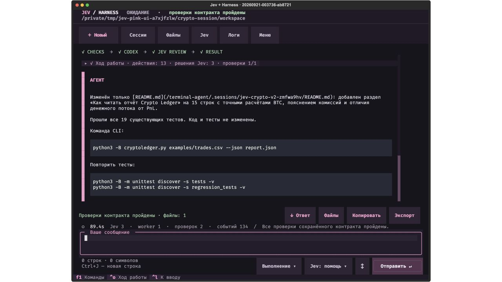
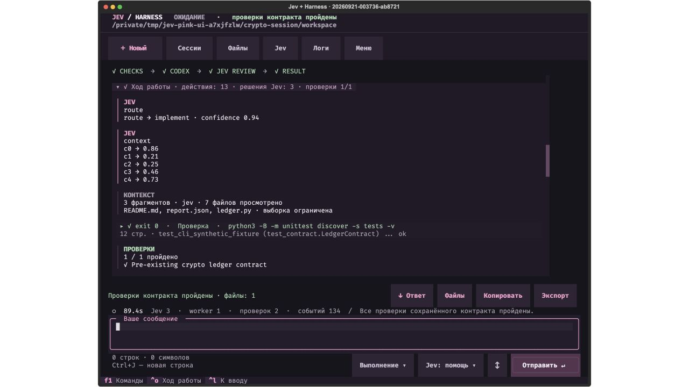
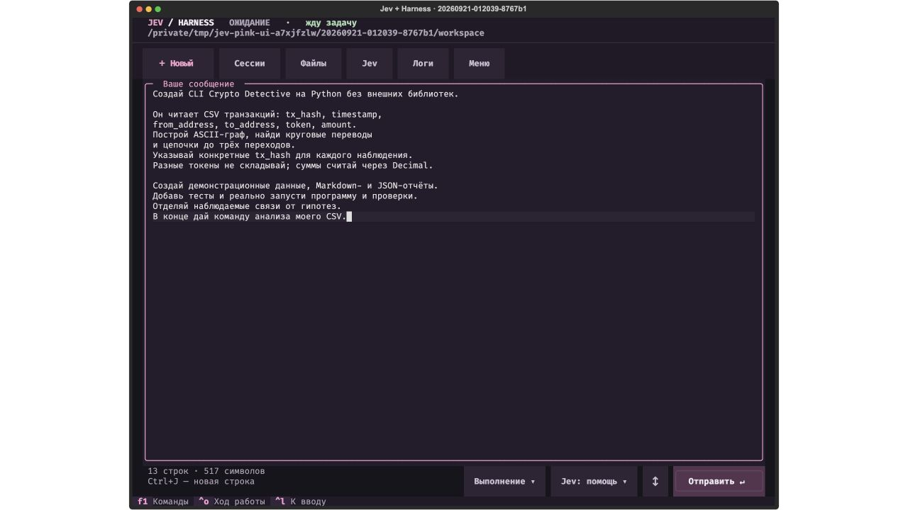

# Jev + Harness — агент в твоём терминале

Пишешь задачу обычным языком — агент читает проект, создаёт и исправляет файлы, выполняет команды и отвечает в том же чате. Видно, какое решение принял Jev, что запустил исполнитель и что подтвердили проверки. Разговор, результаты и протокол сохраняются локально; следующая реплика продолжает работу в той же папке.

Это запускаемый продукт к статье **Jev + Harness Engineering**. Обычный запуск открывает пустой чат и ждёт твоего сообщения. **Enter** или кнопка **«Отправить»** отправляет весь текст. **Ctrl+J** добавляет новую строку; Shift+Enter тоже работает, если терминал передаёт это сочетание. Вставка сохраняет все абзацы и ничего не отправляет автоматически. Ctrl+D остаётся дополнительным способом отправки.

## Первый запуск

Нужны macOS/Linux, Python 3.9+, установленный и авторизованный [Codex CLI](https://developers.openai.com/codex/cli/) и ключ [TypeSafe](https://console.typesafe.ai/keys). Скачай весь комплект репозитория: терминальный агент использует также клиент из соседнего каталога `jev-harness-lab`.

Из каталога `terminal-agent`:

```bash
./setup.sh
./jev --doctor
./jev
```

`setup.sh` создаёт `.venv` и устанавливает закреплённые зависимости. `--doctor` проверяет версии, наличие ключа и путь к Codex, не вызывая модели. Если окружение уже установлено, достаточно `./jev`.

Для авторизации исполнителя выполни `codex login`. Если бинарник лежит вне `PATH`, его можно указать в `CODEX_WORKER_BIN`. На macOS поддерживается также Codex, включённый в приложение ChatGPT.

Ключ TypeSafe можно передать без записи его значения в историю shell:

```bash
read -s TYPESAFE_API_KEY
export TYPESAFE_API_KEY
./jev --doctor
./jev
```

После `read` вставь ключ и нажми Enter; ввод не отображается. Альтернатива — локальный `.env.live` уровнем выше `terminal-agent`: читается только строка `TYPESAFE_API_KEY=…`, файл не исполняется как shell-код. Ключ не входит в репозиторий и не передаётся процессу Codex через окружение.

Codex использует твою текущую модель и авторизацию CLI. Jev закреплён на `jev-1.13.0`. Работа расходует доступные лимиты этих сервисов. Для режима `off` ключ TypeSafe не нужен; авторизация Codex остаётся необходимой.

## Начать с крипто-задачи

Самый понятный первый прогон — **Crypto Ledger**: небольшой CLI для учёта сделок из CSV с заранее известным контрактом. Агент получает рабочую копию проекта с дефектами. Его задача — исправить расчёты, запустить проверки и сохранить отчёт.

```bash
./jev --mission cryptolab
```

1. Нажми **«Вставить пример задачи»** или **F2**: в редактор вставится задание именно этой миссии.
2. Прочитай его и нажми **Enter** или **«Отправить»**.
3. Смотри реальные команды и результаты; карточки инструментов раскрываются по клику или Enter.
4. Нажми **«Файлы»**, чтобы прочитать исправленный код, сохранённый diff и `report.json`.

Программа обрабатывает синтетические сделки: покупки и продажи, комиссии в USDT, точные суммы через `Decimal`, повторы ID, разные часовые пояса и повреждённые строки. Она считает денежный поток и остаток количества. Это не PnL и не торговая рекомендация; ключи бирж и реальные деньги не нужны.

Семь тестов заданы **до запуска агента**, исходная версия проходит только один. Существующие `tests/` и `jev-checks.json` фиксируются хешами: их нельзя переписать, чтобы получить зелёный результат. В панели harness это одна команда проверки; подробный stdout показывает результаты семи тестов внутри неё. Ожидаемый результат миссии — исправленный CLI, отчёт и точная команда его запуска, подтверждённые сохранёнными проверками.

Исходное задание и проект: [examples/crypto-ledger](./examples/crypto-ledger/). Этот запуск не является записью: модель действительно работает с новой копией файлов. При ошибке будет показана ошибка, а не подставлен заранее подготовленный успех.

После выполнения можно написать: «Объясни, откуда в отчёте взялся денежный поток по BTC» или «Добавь фильтр по символу и отдельные тесты на него». Новое требование может выходить за пределы исходных семи тестов — старый контракт сам по себе не доказывает его выполнение.

## Можно дать свою задачу

```bash
./jev
```

Например, вставь целиком:

```text
Создай CLI Crypto Detective на Python без внешних библиотек.

Он читает CSV транзакций с полями tx_hash, timestamp,
from_address, to_address, token, amount. Построй ASCII-граф,
найди круговые переводы и цепочки до трёх переходов.
Для каждого наблюдения укажи конкретные tx_hash.
Разные токены не складывай; суммы считай через Decimal.

Создай явно помеченные демонстрационные данные,
Markdown- и JSON-отчёты, тесты. Реально выполни программу
и проверки. Отделяй наблюдаемые связи от гипотез:
переводы не доказывают общего владельца кошельков.
В конце дай команду анализа моего CSV.
```

Здесь агент создаёт программу с нуля. Написанные им же тесты полезны, но отличаются от заранее заданного независимого контракта Crypto Ledger. Интерфейс показывает это различие в итоговом статусе.

Работа с существующим проектом:

```bash
./jev --project /absolute/path/to/project
```

Этот режим разрешает изменение выбранного проекта. Для первого знакомства без прав записи:

```bash
./jev --project /absolute/path/to/project --mode plan
```

## Разговор, инструменты и детали

Основное место занимает разговор на тёмном фоне с розовым акцентом. Сверху доступны кнопки **«Новый»**, **«Сессии»**, **«Файлы»**, **«Jev»**, **«Логи»** и **«Меню»**. «Новый» создаёт отдельную сессию с новой рабочей папкой; прежний разговор и черновик остаются сохранёнными. Переключение сессий и режимов доступно между ходами.

Решения Jev, команды и проверки собраны в **«Ход работы»**. После успешного завершения эта группа сворачивается, а итоговый ответ остаётся отдельно. Клик по заголовку или **Ctrl+O** раскрывает последнюю группу. Если ход завершился ошибкой, отменой или запросом к пользователю, подробности остаются открытыми.

Ответы поддерживают Markdown и блоки кода. Кнопка **«↓ Ответ»** возвращает к концу разговора. Рядом доступны **«Файлы»**, **«Копировать»** и **«Экспорт»**. Копирование использует буфер терминала и зависит от его поддержки; экспорт сохраняет Markdown на диск.



Каждый инструмент имеет одну раскрываемую карточку: начало и завершение одного вызова обновляют её. Заголовок показывает понятный тип действия и фактический код завершения; ниже видны число строк и начало вывода. Клик по карточке открывает полную сохранённую команду и ограниченное превью stdout. Короткая полоса сверху показывает наблюдаемые этапы.



**«Jev»** или **F6** открывает детали: граф и ответы Jev с распределениями вероятностей, проверки и файлы, журнал событий. Панель скрыта при старте. В узком окне она занимает область разговора, сохраняя доступ к редактору. **«Логи»** или **F3** сразу открывает вкладку событий: это ограниченное экранное превью, до 4000 строк; длинные payload сокращаются. Полная сохранённая последовательность событий находится в `events.jsonl` на диске. «ОЖИДАНИЕ» означает отсутствие активной задачи; «РАБОТАЕТ» появляется во время исполнения. При восстановлении явно указано, что это сохранённая история.

Поле сообщения растёт при вставке текста, переносит длинные строки и прокручивается. Кнопка **«↕»** или **F4** разворачивает его почти на весь экран. Лимит сообщения и черновика — 20 000 символов; слишком длинный запрос остаётся в редакторе. Черновик сохраняется отдельно для каждой сессии и восстанавливается без отправки. Пока агент работает, рядом с редактором доступна кнопка **«Стоп»**. Режимы выполнения и Jev выбираются соседними кнопками со стрелкой.

- **Enter** — отправить сообщение целиком; **Ctrl+J** — новая строка. Shift+Enter добавляет строку, если терминал его поддерживает. **Ctrl+D** также отправляет.
- **F1 / Ctrl+P** — найти команду; **F2** — вставить пример без запуска.
- **F3** — события; **F4** — большой редактор; **F6** — открыть или закрыть детали.
- **Ctrl+O** — раскрыть или свернуть последний «Ход работы».
- **Ctrl+S** — сохранить настоящий текущий экран в SVG.
- **Ctrl+C** — остановить активную задачу; в ожидании — выйти.



Команды также вводятся в редакторе и отправляются Enter:

- **`/new`** — новый чат с отдельной рабочей папкой.
- **`/sessions`** — найти сохранённую задачу и продолжить её. Текущий черновик сохранится, а черновик выбранной задачи восстановится.
- **`/files`** — открыть файлы рабочей папки и сохранённые изменения. Исторический diff показывается только там, где он действительно был записан; актуальный файл может уже отличаться.
- **`/export`** — сохранить разговор в Markdown внутри папки сессии.
- **`/status`** — параметры, вызовы и счётчики; **`/help`** — справка.
- **`/stop`** — остановить выполнение; **`/clear`** — очистить экран, сохранив историю на диске; **`/bottom`** — перейти к концу разговора; **`/quit`** — выйти.

Токены Jev и исполнителя доступны через `/status` и события `meters`. Это счётчики провайдеров, а не денежная стоимость. При отмене или отсутствии данных использование помечается как неполное.

## Как работает Jev внутри агента

**Jev принимает ограниченные решения. Codex пишет текст и код. Python-harness управляет исполнением и проверками.** Jev не является генератором разговорных ответов и не управляет каждой отдельной shell-командой внутри вызова Codex.

Обычный ход с настройками `auto` + `assist` проходит так:

1. **Jev route.** Choice выбирает `implement`, `inspect` или `answer`. Это определяет, может ли исполнитель менять файлы. При confidence ниже 0.25 Python выбирает чтение.
2. **Контекст из настоящих файлов.** Локальный поиск выделяет до пяти фрагментов с путями, номерами строк и SHA-256. Если кандидатов хотя бы два, Jev получает их текст и отвечает на Noul-вопрос о релевантности каждого. В `assist` порядок этих ответов влияет на выбор трёх фрагментов для Codex. При пустой рабочей папке такой вызов Jev не нужен.
3. **Codex.** Получает запрос, последние сообщения, выбранные фрагменты и результаты предыдущих проверок. Читает актуальные файлы, создаёт ответ, запускает инструменты. Терминал отображает поступающие события.
4. **Проверки Python.** Заранее зарегистрированный контракт запускается перед изменениями и после попытки. Без контракта harness может обнаружить и выполнить unittest-тесты проекта. Он проверяет код завершения, неизменность контракта и актуальность снимка файлов.
5. **Jev review.** Choice предлагает `finish`, `improve` или `ask_user`; Noul оценивает соответствие результата запросу. На входе — заявление Codex, список изменений и наблюдаемые проверки, а не автоматически весь исходный код.
6. **Повтор или завершение.** Упавшая проверка блокирует успех независимо от мнения Jev. Если есть возможность продолжить, Jev triage классифицирует фактический провал, и следующая попытка получает ограниченную диагностическую подсказку. Это гипотеза о категории ошибки, не доказанная первопричина.

Вероятности относятся к конкретным вопросам Jev. Они не означают «весь код правильный с вероятностью 99%». В интерфейсе нет выдуманного мышления или нарисованного прогресса: визуальные состояния происходят из сохранённых событий.

## Режимы, которые действительно меняют поведение

Режимы можно выбрать при запуске или изменить командами после завершения текущего хода. Они сохраняются вместе с сессией.

**`/mode auto`** — обычное выполнение. В `assist` права зависят от Jev route: `implement` использует `workspace-write`, `inspect` и `answer` — `read-only`.

**`/mode plan`** — всегда `read-only`: изучить проект, объяснить или составить план. Решение Jev не может разрешить запись. Harness не запускает приёмочные команды этого проекта в таком ходе. Чтобы перейти к реализации, явно переключи `/mode auto` и отправь задание.

**`/jev assist`** — применять ответы Jev: маршрутизацию, ранжирование контекста, оценку результата и подходящие диагностические подсказки. Это значение по умолчанию.

**`/jev observe`** — вызывать Jev и сохранять его ответы, но не использовать их для маршрута, порядка контекста, повторов и triage-подсказок. В ленте отмечено «решение не применяется». Python использует локальный порядок контекста и правила проверок. В `auto` worker получает права записи, но должен менять файлы только по запросу пользователя; для жёсткого запрета записи выбери `plan`.

**`/jev off`** — не делать API-вызовов Jev. Остаются Codex, локальный поиск, проверки, история и интерфейс; правила Python те же, что в `observe`. Так можно сравнить поведение или работать без ключа TypeSafe.

```bash
./jev --mode plan --jev-mode assist
./jev --jev-mode observe
./jev --jev-mode off
```

В `assist` ошибка обязательных route/review останавливает ход. Ранжирование контекста и triage — необязательные подсказки: при их недоступности показана причина и применяется политика Python. В `observe` ошибка Jev также не отключает исполнителя. Ответы модели никогда не подменяются синтетическим успехом.

## Что считается готовым результатом

**«Ответ подготовлен»** — завершён ход чтения или объяснения. **«Результат подготовлен»** — создан артефакт, но независимого зарегистрированного контракта нет. Даже если собственные тесты worker прошли, это не независимая приёмка.

**«Проверки контракта пройдены»** — заранее зарегистрированные проверки прошли на актуальном снимке. Это утверждение ограничено их требованиями: оно не доказывает отсутствие любых ошибок и не покрывает автоматически последующие пожелания.

Для своего проекта можно заранее добавить `jev-checks.json`:

```json
{
  "checks": [
    {
      "id": "regressions",
      "title": "Существующие регрессионные тесты",
      "argv": ["python3", "-B", "-m", "unittest", "discover", "-s", "tests", "-v"]
    }
  ]
}
```

Это доверенная конфигурация пользователя. Аргументы запускаются без shell-интерполяции. При создании сессии фиксируются команды и хеши существующих файлов `tests/`, конфигурации и файловых аргументов. Изменение этих файлов запрещает приёмку; для намеренной смены контракта создай новую сессию.

Без контракта harness ищет `tests/test*.py` или `test*.py` в корне и запускает unittest с пометкой, что тесты мог создать worker. Результат `Ran 0 tests` не принимается как успешная проверка.

## История и результаты на диске

Каждый новый запуск создаёт отдельную сессию; без `--project` внутри неё появляется рабочая папка:

```text
.sessions/<session-id>/
  workspace/                созданные и исправленные файлы
  session.json              история, режимы, контракт
  draft.txt                 неотправленный черновик
  events.jsonl              реальные события по порядку
  screenshots/              снимки Ctrl+S
  turn-001/
    request.json            запрос и режимы этого хода
    context.json            кандидаты, фрагменты и выбор контекста
    jev-*/                  запросы и ответы Jev
    worker-*/               задание, JSONL Codex, финальный ответ
    *-checks.json           фактическое выполнение проверок
    attempt-*-diffs.json     сохранённые изменения и хеши
    result.json             итог и счётчики
```

Папка проекта указана в шапке и `/status`. Сессии, ключи и `.venv` не включаются в Git. Журнал содержит твои запросы, вывод команд и фрагменты кода; экспортируй именно те материалы, которыми хочешь поделиться.

```bash
./jev --resume last                 # продолжить последнюю сессию
./jev --resume SESSION-ID           # выбрать сессию по ID
./jev --list                        # список сессий в JSON, без моделей
./jev --resume last --export        # экспорт в Markdown, без моделей
./jev --prompt 'Изучи этот проект'  # заполнить редактор, не отправлять
```

`--resume` не сочетается с `--mission` или `--project`: у сессии уже есть рабочая папка. Для интеграций предусмотрен явно неинтерактивный `./jev --run 'задание'`: он сразу выполняет один ход и выводит JSONL. Обычный `./jev` всегда ждёт ввода.

## Границы выполнения

Один ход ограничен пятнадцатью минутами и тремя попытками Codex. Одна попытка — восемью минутами; одна команда проверки — тридцатью секундами. HTTP-запрос Jev ограничен двадцатью секундами, его процесс — двадцатью пятью. Отмена завершает группу дочерних процессов; уже сделанные изменения остаются на диске.

Контекст — ограниченная начальная выборка: до 512 файлов и 4 МиБ чтения, файл до 64 КиБ, до пяти фрагментов по 1600 байт; исполнителю передаются три. Скрытые, игнорируемые, подозрительные на секреты файлы и символические ссылки исключаются. Отсутствие совпадения не доказывает отсутствие нужного кода: Codex может читать проект дальше. Снимок проекта ограничен 5000 файлами; для большого монорепозитория выбери более узкую папку.

Превью файла ограничено 64 КиБ. Diff сохраняется для ограниченного набора безопасных текстовых файлов: до десяти изменений на попытку, до 64 КиБ на diff и 256 КиБ суммарно. Если исходного текста нет или хеш не совпал, интерфейс сообщает о недоступном diff и не восстанавливает его предположениями.

Пороги route 0.25, review 0.60 и Noul 0.50 — настройки этого harness, не универсальные гарантии. Диагностическая подсказка triage применяется в `assist` только при confidence не ниже 0.55 и вероятности выбранной категории не ниже 0.65.

У Codex отключены сетевые инструменты, веб-поиск и повышение прав; запрос к исполнителю также запрещает публикации, установку зависимостей и изменения вне выбранного проекта. Локальные проверки запускает harness отдельно, поэтому регистрируй только доверенные команды. Ограничения контекста и фильтры секретов не являются общей гарантией безопасности произвольного чужого проекта.

## Дополнительный пример и проверка комплекта

`./jev --mission loglab` создаёт анализатор инцидентов с четырьмя дефектами: часовые пояса, повторы событий, повреждённые строки и severity. Кнопка «Вставить пример задачи» или F2 вставляет его задание; Enter отправляет. Внешний oracle содержит шесть проверок и не копируется в рабочую папку; исходный проект проходит одну.

Проверить сам терминальный агент:

```bash
.venv/bin/python -B -m unittest discover -s tests -v
```

В автоматических тестах модели подменяются явно; проверки subprocess запускают настоящие процессы и проверяют отмену потомков. [Верификация v2](./verification/v2/README.md) сохраняет исторические живые вызовы и результаты Crypto Ledger. [Проверка розового интерфейса](./verification/ui-pink/README.md) описывает новое управление и снимки. Восстановление прежнего живого прогона в новом интерфейсе не означает повторного вызова моделей.

Архитектура и источники первой версии: [RESEARCH.md](./RESEARCH.md). Подробный аудит PiJev, Pi, OpenCode и Crush с закреплёнными коммитами: [upstream-audit.md](./research/upstream-audit.md). Исследование конкретных потоков интерфейса и границы переноса: [ui-upstream.md](./research/ui-upstream.md).
